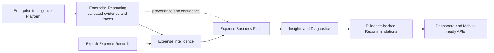

# Expense Intelligence Architecture

| Document control | Value |
|---|---|
| Status | Business Capability Architecture |
| Capability | Enterprise Expense Intelligence |
| Platform dependency | OpenGrit Enterprise Intelligence Platform Core |
| Authority | Expense Intelligence owns expense Business Facts only |
| Governing overview | [OpenGrit Enterprise Intelligence Platform](OpenGrit-Enterprise-Intelligence-Platform.md) |

## 1. Purpose

Expense Intelligence transforms approved platform reasoning and explicit
expense records into explainable financial Business Facts. It answers where,
why, on what, and for whom money was spent; how observed spending changed; and
which evidence-backed actions deserve human review.

It is a business capability, not platform infrastructure. It does not parse
documents, modify enterprise knowledge, write the graph, publish learning, or
change Enterprise Reasoning.

## 2. Architecture

The receipt API composition root may attach an empty or request-derived
`expenseIntelligence` result after `enterpriseReasoning`. The platform
orchestrator itself is unchanged.

## 3. Responsibilities

| Component | Responsibility |
|---|---|
| Expense Engine | Coordinate business-capability evaluation over immutable inputs. |
| Expense Classifier and Category Engine | Apply extensible expense categories without changing Product or Merchant Knowledge. |
| Spending Engine | Produce daily, weekly, monthly, quarterly, yearly, rolling, household, person, store, and category aggregations. |
| Merchant Engine | Rank merchants and describe frequency, average spend, loyalty, and comparisons. |
| Trend Engine | Describe observed change only; never predict. |
| Budget Engine | Track definitions, remaining amount, utilization, warnings, and exceeded status without forecasting. |
| Recurring Engine | Detect repeated merchants and purchases with cadence and confidence. |
| Anomaly Engine | Identify large and duplicate expenses and expose diagnostics without correction. |
| Savings Engine | Compare observed evidence for potential savings. |
| Recommendation Engine | Turn governed findings into human-decision recommendations with evidence. |
| Insights Engine | Produce explainable summary facts such as monthly spending and largest category. |
| Confidence Engine | Aggregate Product, Knowledge, Cross-Document, Reasoning, Learning, and Expense confidence without overwriting sources. |
| Explanation Engine | Connect every summary and insight to evidence, documents, reasoning traces, and confidence. |
| Expense Repository | Optional capability-owned persistence boundary for immutable Expense records. |

## 4. Inputs and outputs

### Inputs

- serialized `enterpriseReasoning` response;
- immutable Expense records with amount, currency, time, category, merchant,
  person, household, products, documents, evidence, and confidence;
- explicit Budget definitions.

Raw OCR and parser payloads are not Expense Intelligence inputs.

### Outputs

- Expense and category Business Facts;
- monthly, yearly, merchant, category, and household summaries;
- observational trends;
- recurring-expense candidates;
- budget state;
- anomaly diagnostics;
- savings opportunities and recommendations;
- confidence, explanation, evidence, and reasoning trace;
- additive `expenseIntelligence` response contract.

## 5. Business facts

Expense Intelligence owns:

- amount spent by period, category, merchant, person, household, and product;
- average, frequency, share, rank, utilization, and observed change;
- detected recurrence and anomaly classifications;
- evidence-backed savings and recommendation candidates.

It does not own extracted receipt fields, canonical Products, Merchant
Blueprints, graph identities, learning approval, or platform reasoning.

## 6. APIs

The REST family is available under `/expense-intelligence` and
`/api/expense-intelligence`.

| Endpoint | Result |
|---|---|
| `POST /dashboard` | Complete Expense Intelligence result |
| `POST /summary` | Executive expense summary |
| `POST /merchants` | Merchant summaries |
| `POST /categories` | Category summaries |
| `POST /monthly` | Monthly summaries |
| `POST /yearly` | Yearly summaries |
| `POST /budgets` | Budget status |
| `POST /savings` | Evidence-backed savings |
| `POST /recommendations` | Human-decision recommendations |
| `POST /recurring` | Recurring-expense candidates |
| `POST /anomalies` | Anomaly diagnostics |

All requests require `enterprise_reasoning`. This prevents callers from using
raw OCR or parser guesses as business truth. The same versioned contracts can
support future mobile clients without creating mobile-specific business logic.

## 7. Extension points

- new expense categories through classifier rules;
- new summary dimensions through Spending Engine projections;
- merchant and category comparison policies;
- new observational trend and anomaly detectors;
- capability-owned repository adapters;
- new evidence-backed recommendation types;
- future Budget Intelligence through an explicit capability contract;
- dashboard and mobile representations over the same APIs.

Extensions must preserve immutable models, deterministic evaluation,
provenance, confidence, explanation, human-decision recommendations, and
platform isolation.

## 8. Operational and governance boundaries

- Expense APIs are stateless unless an explicit Expense Repository adapter is
  configured.
- Recommendations do not execute purchases, cancel subscriptions, or modify
  budgets.
- Anomalies never correct records.
- Trends never forecast.
- Sensitive financial and household identifiers require tenant authorization,
  retention, privacy, and audit controls at deployment.
- A new Business Fact or authority change requires capability review and
  documentation; a platform-boundary change additionally requires an ADR.

## 9. Testing and conformance

Tests cover categorization, summaries, merchants, trends, recurring detection,
budgets, anomalies, savings, recommendations, confidence, explanations,
serialization, repository isolation, APIs, dashboard drill-down, and the
constitutional guarantee that no platform service or parser is modified.
