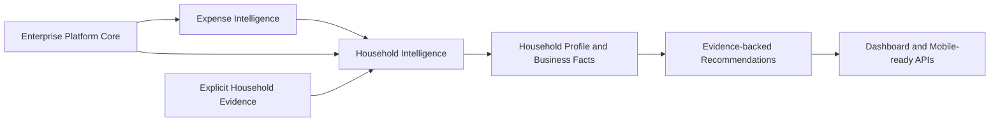

# Household Intelligence Architecture

| Document control | Value |
|---|---|
| Status | Business Capability Architecture |
| Capability | Household Intelligence |
| Business ownership | Household and Personal Intelligence |
| Platform dependencies | Enterprise Reasoning, Learning, Cross-Document Intelligence, EKG, Product Intelligence, Merchant Knowledge |
| Business dependency | Expense Intelligence |
| Governing overview | [OpenGrit Enterprise Intelligence Platform](OpenGrit-Enterprise-Intelligence-Platform.md) |

## Purpose

Household Intelligence connects people, relationships, responsibilities,
ownership, consumption, preferences, goals, assets, vehicles, properties, pets,
expenses, and recommendations into explainable Household Business Facts. It is
not authentication, identity management, CRM, or a user-profile service.

## Architecture

The API composition root attaches `householdIntelligence` after
`expenseIntelligence`. Neither the platform orchestrator nor Expense
Intelligence is modified.

## Responsibilities and business facts

| Area | Responsibility and owned facts |
|---|---|
| Members | Household membership, descriptive roles, evidence, and history without authentication. |
| Relationships | Extensible family, dependent, roommate, caregiver, and pet-owner relationships. |
| Ownership | Purchased, owned, shared, gifted, inherited, assigned, temporary, lost, and disposed states without changing receipt evidence. |
| Responsibilities | Budget, warranty, property, vehicle, bill, pet, medication, shopping, and maintenance assignments. |
| Consumption | Household, shared, pet, inventory, medical, food, and travel consumption observations. |
| Preferences | Evidence-backed brand, store, food, dietary, shopping, travel, entertainment, product, and lifestyle preferences. |
| Goals | Informational savings, health, fitness, budget, travel, education, and household goals; no prediction. |
| Assets | Property, vehicles, electronics, appliances, furniture, jewelry, equipment, subscriptions, and warranty items. |
| Pets | Species, breed, ownership, food, medication, supplies, expenses, veterinarian, and insurance context. |
| Profile | Members, assets, pets, monthly spending, shopping habits, descriptive health indicators, and goals. |
| Insights | Who buys groceries, who spends most, asset ownership, favorite merchants, shared purchases, and consumption observations. |
| Recommendations | Human-decision organization, assignment, inventory, warranty, subscription, maintenance, shopping, and budget suggestions. |

## Contracts and boundaries

Inputs are serialized Enterprise Reasoning and Expense Intelligence responses
plus explicit immutable household evidence. Outputs are immutable profiles,
insights, recommendations, explanations, confidence, and diagnostics.

Household Intelligence never:

- authenticates a person or manages credentials;
- changes Expense Intelligence, platform services, graph, learning, reasoning,
  parser output, extraction, or enterprise knowledge;
- diagnoses health conditions;
- predicts household behavior; or
- executes recommendations automatically.

## REST APIs

The `/household-intelligence` and `/api/household-intelligence` families expose
`dashboard`, `summary`, `members`, `relationships`, `ownership`,
`responsibilities`, `assets`, `vehicles`, `pets`, `goals`, `preferences`,
`recommendations`, and `insights`. Contracts are representation-neutral for
future mobile use.

## Extension points

- member and relationship vocabularies;
- new responsibility, ownership, consumption, preference, and goal types;
- new asset, property, vehicle, and pet metadata;
- capability-owned repository adapters;
- health, inventory, warranty, travel, and assistant integrations through
  explicit business contracts;
- evidence-backed insight and recommendation strategies.

Every extension must preserve immutability, provenance, confidence,
explainability, human approval, privacy, tenant isolation, and platform
separation.
