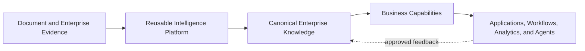
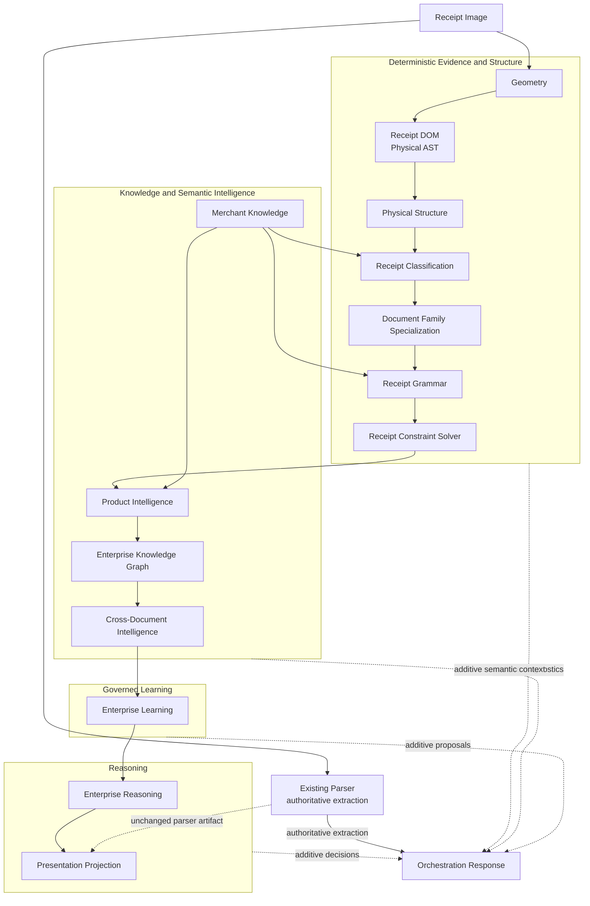
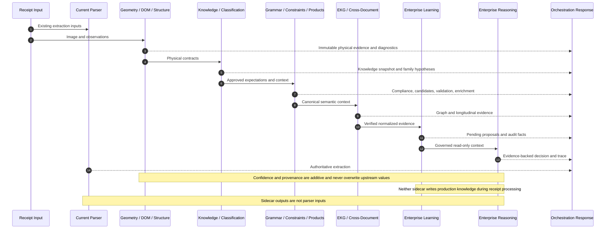
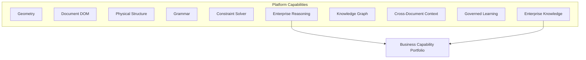
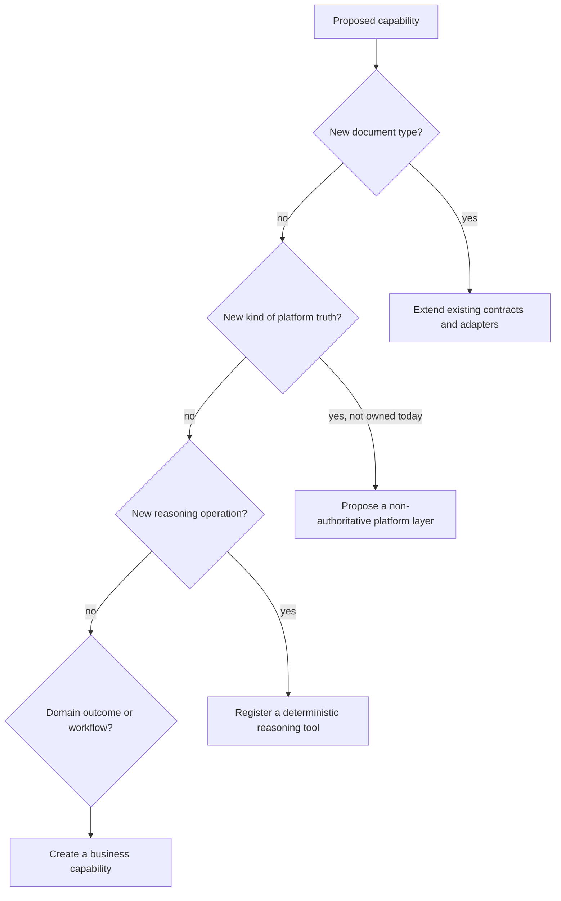
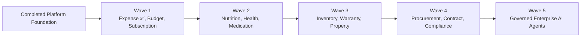

# OpenGrit Enterprise Intelligence Platform

## Architecture Overview

| Document control | Value |
|---|---|
| Status | Authoritative architectural entry point |
| Purpose | Platform orientation, extension routing, and governance navigation |
| Audience | Enterprise Architects, Solution Architects, Developers, AI Coding Assistants, and new team members |
| Scope | How the platform fits together; not a replacement for detailed specifications |
| Governing architecture | [Enterprise Architecture Specification](../Enterprise-Architecture/Receipt-Intelligence-Enterprise-Architecture.md) |
| Runtime authority | [Solution Architecture](../enterprise_receipt_intelligence_architecture.md) |
| Current baseline | Geometry through Enterprise Reasoning plus Presentation Projection, including Document Family Specialization after Classification, implemented as layered, non-authoritative intelligence around the existing authoritative parser |
| Change authority | OpenGrit Architecture Review |

---

## 1. Executive Summary

### Platform vision

OpenGrit is an Enterprise Intelligence Platform that turns documentary evidence
into governed, reusable, explainable enterprise knowledge. Receipts are the
first implemented document domain, not the platform boundary.

The platform separates physical truth, semantic expectations, deterministic
validation, canonical enterprise knowledge, longitudinal context, governed
learning, and reasoning orchestration. Each layer adds information without
silently rewriting the evidence or decisions produced by an earlier layer.

### Enterprise intelligence

Enterprise intelligence is the ability to:

- preserve evidence and provenance from source to decision;
- establish canonical identities across documents and domains;
- reason across relationships and time;
- improve knowledge through reviewed evidence;
- produce decisions that are explainable, versioned, and challengeable; and
- make the same intelligence available to applications, analytics, workflows,
  and future AI agents through stable contracts.

It is broader than document extraction. Extraction answers what one document
appears to contain. Enterprise intelligence connects that observation to
approved knowledge, other documents, historical evidence, governance, and a
specific business context.

### Deterministic AI first

The platform uses deterministic mechanisms wherever a rule, relationship,
calculation, transition, identity, or evidence chain can be represented
explicitly. Deterministic components are testable, replayable, comparable
between versions, and suitable for regulated enterprise workflows.

Probabilistic techniques remain valuable, but they operate inside bounded
contracts. An LLM may explain or synthesize validated evidence. It may not
invent the evidence, bypass constraints, erase provenance, or silently become
the source of truth.

### Enterprise-first architecture

Core layers solve reusable platform problems. Business capabilities consume
those layers without pushing domain policy back into Geometry, the Receipt DOM,
Grammar, the Constraint Solver, or the parser. This keeps the foundation stable
as OpenGrit expands from receipts to finance, healthcare, procurement,
inventory, personal records, and other enterprise domains.

---

## 2. Platform Mission

The mission is to provide a common intelligence foundation for evidence-bearing
enterprise documents and the business knowledge connected to them.

The long-term platform supports:

- receipts, invoices, purchase orders, bills, and statements;
- medical records, healthcare claims, insurance documents, and explanations of
  benefits;
- contracts, warranties, manuals, and compliance evidence;
- financial documents, tax evidence, and personal records;
- ERP, procurement, inventory, accounting, and analytical workflows;
- personal and household knowledge; and
- future document types and governed AI experiences.

The architecture therefore distinguishes reusable document intelligence from
domain-specific business intelligence:



A new domain should reuse physical evidence, immutable models, knowledge,
provenance, confidence, graph, learning, and reasoning contracts. Domain
vocabulary, ontology extensions, grammar, constraints, and business policies
may evolve independently.

---

## 3. Architectural Principles

| Principle | Architectural meaning |
|---|---|
| Evidence First | Conclusions must remain traceable to observations, documents, entities, rules, and processing versions. Missing evidence produces uncertainty, not invention. |
| Deterministic before Probabilistic | Explicit reconstruction, structure, rules, constraints, graph traversal, and validation run before optional probabilistic synthesis. |
| Immutable Data | Source and derived artifacts are immutable values. Correction creates a new annotation, proposal, decision, or version; it does not rewrite history. |
| Layered Intelligence | Each layer owns one kind of truth and consumes only contracts from lower or peer layers explicitly permitted by architecture. |
| Explainability | Every material result identifies evidence, confidence contributions, decisions, rejected alternatives, and execution trace where applicable. |
| Governance | Knowledge, Grammar, Constraints, ontology, learning, and authority changes are versioned, reviewed, auditable, and reversible. |
| Separation of Responsibilities | Physical evidence, semantic expectation, validation, enrichment, graph knowledge, memory, learning, reasoning, and business policy remain distinct. |
| Non-authoritative Sidecars | New intelligence observes and publishes additive output before any separately governed authority migration. |
| Enterprise Knowledge | Canonical identities and relationships belong in governed knowledge contracts rather than source-specific code paths. |
| Approval-driven Learning | Learning produces proposals. It does not automatically publish production knowledge or train models from unverified data. |
| LLM as a Reasoning Tool | An LLM is optional and evidence-bounded. It is neither the reasoning engine nor the system of record. |
| Backward Compatibility | The existing parser remains authoritative until explicit replacement gates and an ADR authorize a migration. |

These principles are constitutional. A change that violates them requires a new
or superseding Architecture Decision Record, impact analysis, migration plan,
and architecture approval.

---

## 4. Platform Layer Diagram

The solid path shows the order in which the current receipt domain accumulates
intelligence. The parser remains isolated from all sidecar outputs.



The dotted links are additive response artifacts, not parser inputs. They
emphasize that sidecars coexist with the parser while remaining
non-authoritative.

---

## 5. Layer Responsibilities

### 5.1 Responsibility catalog

| Layer | Purpose and responsibilities | Inputs | Outputs | Dependencies | Extension points | Ownership |
|---|---|---|---|---|---|---|
| Geometry | Establish coordinate truth: page dimensions, orientation, normalized boxes, distances, alignment, overlap, and geometric confidence. It describes where evidence exists, not what it means. | Image metadata and OCR geometry observations | Immutable normalized geometry and diagnostics | Imaging and observation contracts only | Coordinate systems, geometric features, provider adapters, quality metrics | Document Evidence / Geometry |
| Receipt DOM | Represent observed receipt content as the canonical immutable Physical AST with stable identities and relationships. | Geometry, text observations, lines, tokens, regions | Receipt Document tree, source references, physical relationships | Geometry | New physical node types, serializers, visitors, diagnostics | Document Model |
| Physical Structure | Infer generic layout organization such as regions, groups, rows, boundaries, reading order, and repetition without assigning business meaning. | Receipt DOM and Geometry | Immutable Physical Structure and structural annotations | Receipt DOM, Geometry | Domain-neutral layout detectors and structural features | Document Structure |
| Merchant Knowledge | Supply approved, versioned receipt-domain knowledge: Merchant Blueprints, Receipt Families, aliases, formatting tendencies, Grammar and Constraint references. It is the first implementation of the broader Enterprise Knowledge Repository. | Governed knowledge definitions and version requests | Immutable knowledge snapshots and repository lifecycle results | Governed repository contracts | New knowledge types, repository adapters, cache policies, approval workflows | Enterprise Knowledge |
| Classification | Rank plausible Receipt Families from physical features and approved knowledge. It classifies layout family, not merchant identity. | Physical Structure, Receipt DOM, family profiles | Ranked family hypotheses, evidence contribution, confidence, diagnostics | Physical layers, Merchant Knowledge | Feature extractors, family profiles, ranking strategies | Document Classification |
| Document Family Specialization | Activate a family profile and publish semantic zones, geometry-derived key/value relationships, and ranked entity candidates before Grammar evaluation. It is not OCR, parsing, extraction, or merchant detection. | Classification, Merchant Knowledge, Physical Structure, Receipt DOM, optional Grammar and Enterprise Knowledge evidence | Immutable `documentFamilyContext`, activated profile references, evidence, confidence, reasons, diagnostics | Classification and read-only upstream contracts | New registry profile, activation evidence rules, zone and candidate strategies | Semantic Activation |
| Grammar | Declare what semantic organization is expected for a classified family: sections, roles, relationships, transitions, rules, and cardinality. It describes receipt language; it does not parse. | Classification, Receipt DOM, Physical Structure, approved Grammar | Compiled Grammar, compliance, candidate roles, violations, suggestions | Classification, Knowledge | New declarative rules, roles, sections, repository adapters | Semantic Grammar |
| Constraint Solver | Deterministically evaluate competing interpretations using arithmetic, structure, Grammar, order, locality, knowledge, and confidence. It selects supported hypotheses but does not create authoritative Business Facts. | Grammar outputs, physical evidence, supplied candidates, approved Constraints | Ranked candidates, violations, penalties, confidence, explanations | Grammar, Knowledge, physical contracts | New constraint categories, validators, candidate sources, weighting policies | Deterministic Reasoning |
| Product Intelligence | Preserve extracted item text while adding canonical Product candidates, normalization, aliases, taxonomy, brand, manufacturer, nutrition, and pricing context. | Read-only extracted item copies, Constraint context, merchant context, Product Knowledge | Additive canonical enrichment, confidence, explanation, diagnostics, learning suggestions | Current extraction copy, Constraints, Knowledge | Matchers, taxonomies, domain enrichers, repository adapters | Product Knowledge |
| Enterprise Knowledge Graph | Create storage-neutral canonical entities and provenance-bearing relationships under a versioned ontology. It is not tied to Neo4j or any graph vendor. | Canonical semantic entities, Product Intelligence, explicit document and merchant context | Immutable graph, subgraphs, traversal results, validation, explanations | Product Intelligence, Enterprise Ontology | Entity and relationship types, ontology modules, storage adapters, query functions | Enterprise Semantics |
| Cross-Document Intelligence | Resolve identities and correlate documents, entities, events, evidence, timelines, patterns, and anomalies across time. It is deterministic enterprise memory, not LLM memory. | Enterprise Graph, document references, approved historical semantic memory | Longitudinal context, timelines, evidence, correlations, patterns, anomalies, explanations | Enterprise Knowledge Graph | Document-domain linkers, correlation types, timeline and query modules | Enterprise Context |
| Enterprise Learning | Convert verified normalized evidence and approved feedback into governed proposals with quality gates, confidence history, approvals, explanations, and immutable audit. It never activates knowledge automatically. | Cross-Document Intelligence, graph identities, verified feedback | Pending learning proposals, decisions, approvals, audit records, diagnostics | Cross-Document Intelligence, governance policy | New verified sources, proposal types, quality rules, publication adapters | Knowledge Governance |
| Enterprise Reasoning | Classify questions, plan tools, retrieve context, fuse evidence, generate and validate hypotheses, select non-authoritative decisions, and optionally request bounded LLM synthesis. | Read-only Constraint, Product, Graph, Cross-Document, Learning contracts and an explicit question | Plan, tool trace, evidence, hypotheses, rejected alternatives, decision, confidence, provenance, optional synthesis | Registered enterprise tools; optional LLM provider | New deterministic tools, query classes, planners, validators, LLM adapters | Reasoning Orchestration |

### 5.2 Ownership rule

The owning layer defines its models, invariants, repository interfaces,
diagnostics, and extension contracts. Consumers may reference published
outputs, but they may not mutate them or duplicate their logic.

---

## 6. Runtime Flow

Runtime processing has two simultaneous concerns:

1. preserve existing extraction behavior; and
2. accumulate additive intelligence in observable sidecars.



### Runtime invariants

- Every sidecar result is additive and independently diagnosable.
- Context propagation uses immutable, versioned contracts.
- Evidence accumulates; later layers do not erase earlier evidence.
- Confidence is aggregated with named contributions; upstream confidence is
  retained.
- Explanations identify rules, sources, entities, documents, tools, and rejected
  alternatives appropriate to the layer.
- Failure in a sidecar degrades that sidecar and does not change extraction.
- Learning does not publish knowledge in the request path.
- Enterprise Reasoning does not invoke an LLM by default in receipt processing.
- The current parser remains authoritative until a separately governed
  replacement decision.

---

## 7. Information Flow

Information becomes more useful as it moves upward, while lower-level evidence
remains available for verification.

```mermaid
flowchart LR
    Pixels["Pixels<br/>source evidence"]
    Geometry["Geometry<br/>coordinate truth"]
    Structure["Physical Structure<br/>what exists and where"]
    Expectations["Knowledge and Grammar<br/>what should exist"]
    Hypotheses["Candidates and Constraints<br/>what may be true"]
    Semantics["Canonical Semantics<br/>entities and relationships"]
    Context["Longitudinal Context<br/>across documents and time"]
    Governance["Learning<br/>what may improve"]
    Reasoning["Reasoning<br/>what evidence supports"]
    Intelligence["Business Intelligence<br/>domain outcomes"]

    Pixels --> Geometry --> Structure --> Expectations --> Hypotheses
    Hypotheses --> Semantics --> Context --> Governance --> Reasoning
    Reasoning --> Intelligence
```



| Information stage | Meaning | Authority |
|---|---|---|
| Pixels and observations | Original evidence and provider observations | Source evidence |
| Geometry | Normalized position and spatial relationships | Physical evidence |
| Physical Structure | Domain-neutral organization | Structural evidence |
| Knowledge and Grammar | Approved expectations and vocabulary | Versioned enterprise knowledge |
| Hypotheses and Constraints | Competing interpretations and deterministic validation | Non-authoritative semantic reasoning |
| Canonical Semantics | Shared identities and relationships | Governed semantic model |
| Longitudinal Context | Correlation across documents and time | Deterministic enterprise memory |
| Learning Proposals | Potential governed improvements | Pending until approved and published |
| Reasoning Decisions | Evidence-backed answers with traces | Non-authoritative unless a consuming business workflow grants explicit authority |
| Business Intelligence | Domain-specific conclusions and actions | Owned by the relevant business capability |

---

## 8. Capability Map

### 8.1 Platform capabilities

Platform capabilities are reusable foundations:



### 8.2 Business capabilities

Business capabilities apply platform evidence and semantics to a domain:

| Capability family | Examples |
|---|---|
| Financial | Expense Intelligence, Budget Intelligence, Subscription Intelligence, Tax Intelligence |
| Health | Nutrition Intelligence, Health Intelligence, Medication Intelligence |
| Asset and household | Inventory Intelligence, Warranty Intelligence, Property Intelligence, Household Intelligence |
| Enterprise operations | Procurement Intelligence, Contract Intelligence, Compliance Intelligence |
| Experience and automation | Enterprise AI Agents, Household AI Assistant, Financial AI Advisor, Healthcare AI Advisor |

New product features should generally be implemented as business capabilities
above the platform. A business feature must not modify a core layer merely to
avoid defining its own domain model, policies, services, or tests.

### 8.3 Implemented business capability

Expense Intelligence is the first implemented business capability. It consumes
Enterprise Reasoning and explicit immutable Expense records to produce
explainable spending summaries, merchant and category intelligence,
observational trends, recurring-expense candidates, budget state, anomaly
diagnostics, savings opportunities, and human-decision recommendations.

It demonstrates the required business-capability pattern:


See the [Expense Intelligence Architecture](Expense-Intelligence-Architecture.md)
and [Expense Intelligence Business Capability](../Business-Capabilities/Expense-Intelligence.md).

Household Intelligence is the second implemented business capability. It
consumes the platform core and Expense Intelligence to connect members,
relationships, responsibilities, ownership, consumption, preferences, goals,
assets, vehicles, properties, pets, and spending without becoming
authentication or identity infrastructure. See the
[Household Intelligence Architecture](Household-Intelligence-Architecture.md)
and [Household Intelligence Business Capability](../Business-Capabilities/Household-Intelligence.md).

---

## 9. Extension Guide

### 9.1 Extension routing



### 9.2 Add a new document type

1. Define document identity, source evidence, retention, privacy, and provenance.
2. Reuse Geometry and a physical DOM where the document has spatial evidence.
3. Add domain-specific physical structure only when generic structure is
   insufficient; do not add semantic labels to physical models.
4. Define versioned document-family knowledge, Grammar, and Constraints.
5. Extend ontology entities and relationships through governed contracts.
6. Add Cross-Document correlation and timeline rules with explicit evidence.
7. Add conformance, migration, and parser-isolation tests.

### 9.3 Add a new intelligence layer

A new core layer is exceptional. Demonstrate that it owns a distinct kind of
truth not already owned by an existing layer. Specify immutable inputs and
outputs, dependency direction, provenance, confidence, failure behavior,
authority, diagnostics, repository boundaries, rollout as a sidecar, migration
guide, ADR impact, and regression tests.

### 9.4 Add a new reasoning tool

Implement a storage-neutral adapter, declare its capability and deterministic
status, register it in the Enterprise Tool Registry, define eligible query
classes, return immutable provenance-bearing evidence, set timeout and retry
policy, and test unsupported or unavailable behavior. An LLM-backed tool must
execute only after deterministic validation.

### 9.5 Add a new graph entity or relationship

Extend the Enterprise Ontology first. Define identity, allowed properties,
relationship direction, cardinality, provenance requirements, validation,
confidence, versioning, and domain ownership. Do not encode ontology by
database-specific labels or traversal syntax.

### 9.6 Add a new learning source

The source must be normalized semantic evidence or explicitly approved human
feedback. Define verification, minimum quality, confirmation threshold,
conflict handling, privacy, provenance, proposal type, approval authority,
audit, and publication workflow. Raw OCR, parser guesses, and low-confidence
observations are prohibited learning sources.

### 9.7 Add a new business capability

Create a domain-owned service above platform contracts. Define its Business
Facts, policies, queries, authority, APIs, tenant and privacy model, persistence,
audit, and user experience. Consume platform evidence and reasoning without
moving business rules into core packages.

### 9.8 Add a new AI agent

An agent is an application of governed platform capabilities, not a new source
of truth. Define goals, allowed tools, authorization, tenant boundary, budgets,
human-approval gates, idempotency, audit, cancellation, and prohibited actions.
Agents consume Enterprise Reasoning responses and evidence; they may not bypass
the registry, invoke unrestricted storage, or promote sidecar results.

---

## 10. Dependency Matrix

| Layer | Consumes | Produces | Never modifies |
|---|---|---|---|
| Geometry | Image dimensions and observation boxes | Normalized coordinates, spatial metrics, geometric confidence | Pixels, OCR text, parser output |
| Receipt DOM | Geometry and source observations | Immutable Physical AST and relationships | Geometry, OCR, parser output |
| Physical Structure | Receipt DOM and Geometry | Regions, rows, groups, boundaries, reading order | DOM, semantic roles, parser output |
| Merchant Knowledge | Approved definitions and versions | Immutable Merchant Blueprints, family profiles, Grammar and Constraint references | Runtime evidence, source documents, parser output |
| Classification | Physical Structure, DOM, family profiles | Ranked Receipt Family hypotheses and confidence | Merchant identity, physical artifacts, parser output |
| Grammar | Classification, physical artifacts, approved Grammar | Compiled expectations, compliance, roles, violations | DOM, Structure, Classification, parser output |
| Constraint Solver | Grammar, candidates, physical and knowledge context | Validated and rejected hypotheses, penalties, explanations | OCR, Grammar, candidates, Business Facts, parser output |
| Product Intelligence | Read-only extracted item copies, Constraint and Product Knowledge | Canonical enrichment and confidence | Extracted text or values, Constraint results, parser output |
| Enterprise Knowledge Graph | Canonical semantics and explicit context | Immutable nodes, edges, subgraphs, validation, provenance | Product Intelligence, source documents, graph storage, parser output |
| Cross-Document Intelligence | Enterprise Graph and approved semantic history | Resolved identities, timelines, correlations, evidence, patterns | Documents, Graph, Business Facts, parser output |
| Enterprise Learning | Verified semantic evidence and approved feedback | Pending proposals, quality, confidence history, approvals, audit | Upstream knowledge, production repositories, parser output |
| Enterprise Reasoning | Read-only sidecar contracts and explicit questions | Plans, tool traces, fused evidence, hypotheses, decisions, explanations | Evidence, upstream sidecars, production knowledge, parser output |
| Existing Parser | Existing extraction inputs | Authoritative current extraction | Sidecar artifacts and governance records |

Dependency direction is deliberate. Lower physical layers must not import higher
semantic, learning, reasoning, or business-capability packages.

---

## 11. Governance

### Architecture repository

- The [Enterprise Architecture Specification](../Enterprise-Architecture/Receipt-Intelligence-Enterprise-Architecture.md)
  governs principles, information ownership, capabilities, mandatory rules,
  ADRs, and evolution.
- The [Solution Architecture](../enterprise_receipt_intelligence_architecture.md)
  governs runtime components, contracts, deployment, operations, security,
  scaling, performance, and recovery.
- This overview is the entry point and routing guide. It does not supersede
  either authoritative specification.
- Migration guides define additive rollout and rollback for individual layers.

### Decision and review process

1. Identify the capability owner and affected contracts.
2. Confirm dependency direction and source-of-truth boundaries.
3. Determine whether an existing ADR permits the change.
4. For a material deviation, create or supersede an ADR before implementation.
5. Define compatibility, migration, observability, privacy, and rollback.
6. Implement immutable models and diagnostics before runtime authority.
7. Add unit, contract, integration, regression, and architecture-conformance
   tests.
8. Update the Enterprise and Solution Architecture documents when the platform
   gains a material capability.
9. Obtain review from the owning layer and Architecture Review authority.

### Testing strategy

Every platform change should include:

- model immutability and serialization tests;
- deterministic replay and ordering tests;
- contract and version compatibility tests;
- provenance, confidence, diagnostics, and explanation tests;
- unavailable dependency and safe-degradation tests;
- tenant, privacy, and authorization tests where applicable;
- sidecar isolation and no-production-write tests;
- current parser output regression tests; and
- UI diagnostics tests for developer-visible artifacts.

---

## 12. AI Coding Assistant Guidelines

This section is the minimum architectural constitution for AI-generated code.
An AI coding assistant must inspect the authoritative architecture, relevant
migration guide, existing package contracts, and tests before changing a
platform layer.

### Mandatory rules

1. **Never bypass architecture.** Do not route around a layer because direct
   access appears easier.
2. **Never move responsibilities between layers.** Put physical logic in
   physical layers, semantic expectations in Grammar, validation in
   Constraints, canonical relationships in the Graph, governed proposals in
   Learning, orchestration in Reasoning, and domain policy in business
   capabilities.
3. **Never make sidecars authoritative.** Authority requires an explicit ADR,
   migration plan, compatibility gates, and review.
4. **Never modify parser behavior as part of a sidecar phase.** Preserve current
   extraction inputs, outputs, scoring, retries, and authority unless the task
   explicitly governs parser migration.
5. **Never remove or weaken immutable models.** New information creates new
   immutable artifacts or versions.
6. **Never break deterministic reasoning.** Preserve stable ordering, explicit
   rules, bounded execution, replayability, and testable outcomes.
7. **Never allow an LLM to bypass evidence.** LLMs receive approved evidence and
   validated hypotheses only. Raw OCR and parser guesses are not reasoning or
   learning truth.
8. **Always preserve explainability.** Emit why a result exists, why alternatives
   failed, and which rules or tools contributed.
9. **Always preserve provenance.** Retain source documents, entities, evidence
   identifiers, versions, timestamps, and processing origins.
10. **Always preserve confidence propagation.** Aggregate named contributions;
    never overwrite or disguise upstream confidence.
11. **Always fail safely.** Sidecar failure must not modify extraction,
    production knowledge, or upstream artifacts.
12. **Always update architecture documentation** when introducing or materially
    changing a platform capability.

### Required contribution checklist

Before presenting work as complete, an AI coding assistant should be able to
answer:

- Which layer owns this responsibility?
- Which immutable contracts are consumed and produced?
- Which sources of truth remain unchanged?
- Is the output authoritative or additive?
- Where are provenance, confidence, explanation, and diagnostics represented?
- What happens when dependencies are missing, slow, or invalid?
- Can the change write production knowledge or modify extraction?
- Which ADRs and architecture rules apply?
- Which tests prove parser isolation and backward compatibility?
- Which architecture and migration documents were updated?

If these questions cannot be answered from the implementation and tests, the
change is not architecture-complete.

---

## 13. Future Roadmap

### Completed platform foundation

| Platform capability | Status |
|---|---|
| Geometry | ✅ Complete |
| Receipt DOM | ✅ Complete |
| Physical Structure | ✅ Complete |
| Merchant Knowledge | ✅ Complete |
| Classification | ✅ Complete |
| Document Family Specialization | ✅ Complete |
| Grammar | ✅ Complete |
| Constraint Solver | ✅ Complete |
| Product Intelligence | ✅ Complete |
| Enterprise Knowledge Graph | ✅ Complete |
| Cross-Document Intelligence | ✅ Complete |
| Enterprise Learning | ✅ Complete |
| Enterprise Reasoning | ✅ Complete |
| Presentation Projection | ✅ Complete |

The next roadmap is a business-capability roadmap, not a sequence of new
foundational layers. Expense Intelligence is the first completed Wave 1
capability.



| Wave | Business capabilities | Architectural focus |
|---|---|---|
| 1 | Expense Intelligence ✅; Budget Intelligence and Subscription Intelligence planned | Financial Business Facts, recurring obligations, policy, user controls, and explainable aggregation |
| 2 | Nutrition Intelligence, Health Intelligence, Medication Intelligence | Sensitive-data governance, health ontology, clinical boundaries, evidence quality, and explicit non-diagnostic scope |
| 3 | Household Intelligence ✅; Inventory Intelligence, Warranty Intelligence, and Property Intelligence planned | Household context, asset identity, lifecycle, ownership, responsibility, location, maintenance, and document linkage |
| 4 | Procurement Intelligence, Contract Intelligence, Compliance Intelligence | Organizational authority, obligations, approvals, policy evaluation, audit, and enterprise integrations |
| 5 | Enterprise AI Agents, Household AI Assistant, Financial AI Advisor, Healthcare AI Advisor | Tool authorization, human approval, action safety, tenant isolation, budgets, auditability, and bounded autonomy |

Wave order may change through portfolio governance. No wave may weaken the
platform principles to accelerate delivery.

---

## 14. Appendix

### 14.1 Glossary

| Term | Definition |
|---|---|
| Annotation | Additive interpretation attached to evidence without changing the evidence. |
| Architecture Decision Record (ADR) | Reviewed record of a material architectural decision, its context, consequences, and status. |
| Business Capability | Domain-specific service or outcome built above reusable platform contracts. |
| Business Fact | A domain-owned, governed conclusion suitable for use by enterprise workflows. |
| Confidence | A normalized measure with retained upstream values and named evidence contributions. |
| Constraint | Declarative rule used to evaluate a hypothesis; it does not extract or rewrite evidence. |
| Enterprise Knowledge Graph (EKG) | Storage-neutral graph of canonical enterprise entities and provenance-bearing relationships. |
| Enterprise Memory | Deterministic, versioned longitudinal semantic context; not conversational LLM memory. |
| Evidence | Source or derived information that retains provenance and can support or reject a conclusion. |
| Grammar | Declarative expectation for semantic organization after document-family classification. |
| Hypothesis | Candidate interpretation that must be supported and validated before selection. |
| Immutable Artifact | Value that is never changed in place; evolution creates a new version or related artifact. |
| Learning Proposal | Approval-required suggested knowledge improvement generated from verified semantic evidence. |
| Non-authoritative Sidecar | Additive capability that observes or reasons without changing the current source of truth. |
| Ontology | Versioned contract defining canonical entity and relationship meaning. |
| Physical AST | Immutable document tree describing observed physical content and relationships. |
| Provenance | Trace from an artifact or decision to its documents, observations, entities, tools, rules, versions, and timestamps. |
| Reasoning Tool | Registered deterministic or explicitly bounded capability invoked by Enterprise Reasoning. |

### 14.2 Acronyms

| Acronym | Meaning |
|---|---|
| ADR | Architecture Decision Record |
| API | Application Programming Interface |
| AST | Abstract Syntax Tree |
| CDIF | Cross-Document Intelligence Framework |
| EKG | Enterprise Knowledge Graph |
| ERP | Enterprise Resource Planning |
| LLM | Large Language Model |
| OCR | Optical Character Recognition |
| PII | Personally Identifiable Information |

### 14.3 Authoritative references

- [Enterprise Architecture Specification](../Enterprise-Architecture/Receipt-Intelligence-Enterprise-Architecture.md)
- [Solution Architecture](../enterprise_receipt_intelligence_architecture.md)
- [Receipt Intelligence Pipeline](../receipt_intelligence_pipeline.md)
- [Receipt Agent Architecture](../receipt_agent_architecture.md)

### 14.4 Layer migration references

- [Receipt DOM Migration](../receipt_dom_migration.md)
- [Physical Structure Migration](../receipt_structure_migration.md)
- [Merchant Intelligence Migration](../merchant_intelligence_migration.md)
- [Receipt Classification Migration](../receipt-classification-migration.md)
- [Receipt Grammar Migration](../receipt_grammar_migration.md)
- [Constraint Solver Migration](../receipt_constraint_solver_migration.md)
- [Product Intelligence Migration](../product_intelligence_migration.md)
- [Enterprise Knowledge Graph Migration](../enterprise_knowledge_graph_migration.md)
- [Cross-Document Intelligence Migration](../cross_document_intelligence_migration.md)
- [Enterprise Learning Migration](../enterprise_learning_migration.md)
- [Enterprise Reasoning Migration](../enterprise_reasoning_migration.md)
- [Expense Intelligence Migration](../expense_intelligence_migration.md)
- [Expense Intelligence Architecture](Expense-Intelligence-Architecture.md)
- [Expense Intelligence Business Capability](../Business-Capabilities/Expense-Intelligence.md)
- [Household Intelligence Migration](../household_intelligence_migration.md)
- [Household Intelligence Architecture](Household-Intelligence-Architecture.md)
- [Household Intelligence Business Capability](../Business-Capabilities/Household-Intelligence.md)

These references provide detailed contracts, operational behavior, rollout, and
rollback guidance. This overview intentionally links to them rather than
duplicating their normative content.
# Receipt Intelligence Snapshot Layer

The platform persists each enterprise processing run as an immutable `ReceiptIntelligenceSnapshot` after Presentation Projection. Snapshot Projection is the stable UI boundary and automatically exposes only the intelligence capabilities recorded in that version.

```text
Classification -> Family -> Grammar -> Constraints -> Products -> Graph
      -> Cross-Document -> Learning -> Reasoning -> Business Projection
      -> Immutable Snapshot -> Snapshot Projection -> UI
```

Version comparison reports field, confidence, reasoning, knowledge, projection, grammar, constraint, and learning changes. Large artifacts are referenced by ID and loaded lazily from their authoritative repositories.
# Document Family Review Policy

After Business Projection, the non-authoritative review sidecar evaluates configured family semantics and resolved quality. Its result is consumed by Receipt Processing Experience and does not modify upstream intelligence or parser output.
