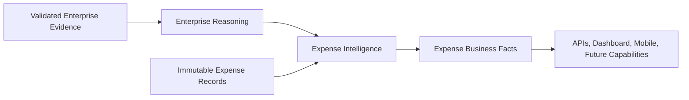

# Expense Intelligence Business Capability

## Capability definition

| Attribute | Definition |
|---|---|
| Name | Expense Intelligence |
| Type | Business Capability |
| Outcome | Explainable understanding of spending, budgets, recurrence, anomalies, trends, savings, and recommendations |
| Platform dependency | Enterprise Reasoning and read-only upstream semantic contracts |
| Authority | Expense Business Facts; no platform authority |
| Primary consumers | Household applications, finance workflows, developers, future Budget Intelligence, and governed agents |

## Business questions

Expense Intelligence answers:

- Where was money spent?
- On which categories, merchants, products, people, or households?
- Why is a summary or trend reported?
- How did observed spending change between periods?
- Which charges appear recurring or anomalous?
- Which evidence supports a possible saving or recommendation?
- How much budget remains and which thresholds have been reached?

## Capability contract

Every output retains confidence and evidence. Recommendations require a human
decision. Trends are observational. Forecasting and automatic correction are
outside the current capability.

## Measures

- spending totals and averages by time period;
- category and merchant share, rank, frequency, and change;
- budget utilization and remaining amount;
- recurring charge cadence and confidence;
- anomaly count and severity;
- potential savings supported by comparison evidence;
- evidence coverage and overall business confidence.

## Boundaries

Expense Intelligence never:

- reads raw OCR as business truth;
- changes extraction or parser output;
- changes Product, Merchant, Graph, Learning, or Reasoning artifacts;
- trains models or predicts future spending;
- corrects a receipt or Expense automatically;
- executes a recommendation.

Detailed design is defined in the
[Expense Intelligence Architecture](../Architecture/Expense-Intelligence-Architecture.md).
