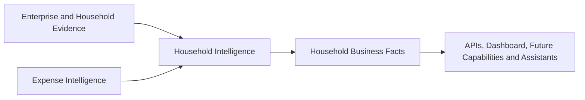

# Household Intelligence Business Capability

| Attribute | Definition |
|---|---|
| Type | Business Capability |
| Outcome | Explainable semantic context for household members, relationships, assets, responsibilities, consumption, preferences, goals, pets, and spending |
| Consumes | Enterprise Reasoning, platform semantic context, and Expense Intelligence |
| Owns | Household Business Facts only |
| Does not own | Authentication, identity management, CRM, platform knowledge, or extraction |

## Business questions

- Who belongs to a household and what descriptive role do they have?
- How are members related?
- Who owns, uses, purchased, maintains, or is responsible for an asset?
- Who purchases or consumes household products?
- Which preferences and goals have evidence?
- What assets, vehicles, properties, and pets belong to the household context?
- Who buys groceries, spends most, or owns most assets?
- Which organization, warranty, assignment, inventory, or maintenance actions
  deserve human review?

## Capability contract

All insights and recommendations retain evidence and confidence.
Recommendations require human decisions; goals are informational and household
health indicators are descriptive only.

See the [Household Intelligence Architecture](../Architecture/Household-Intelligence-Architecture.md).
