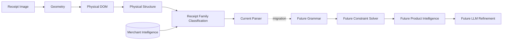
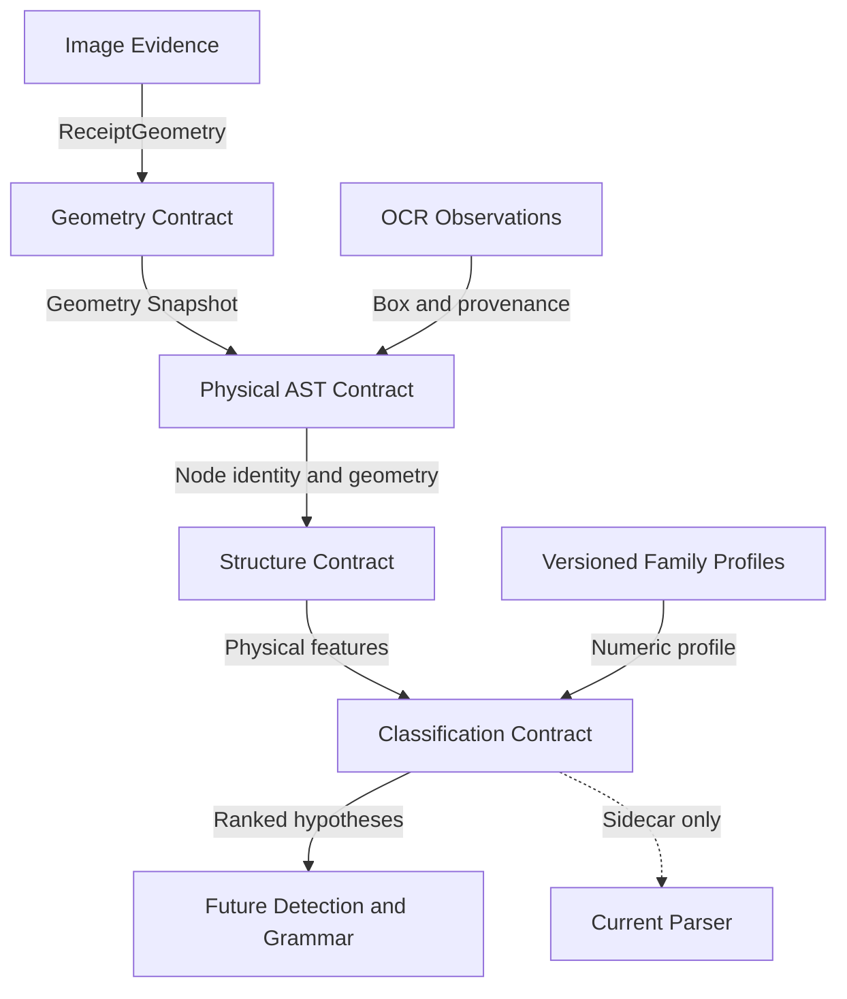
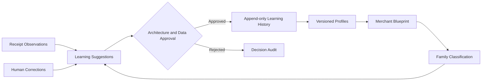
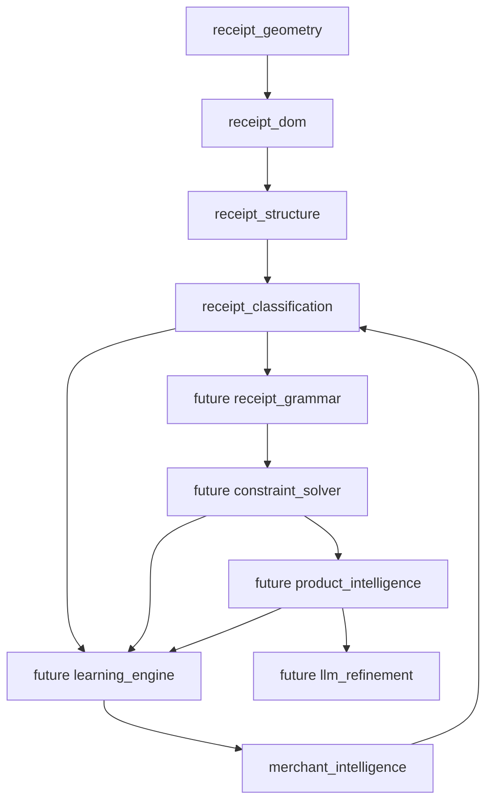
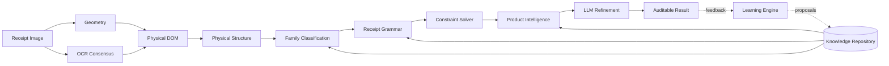
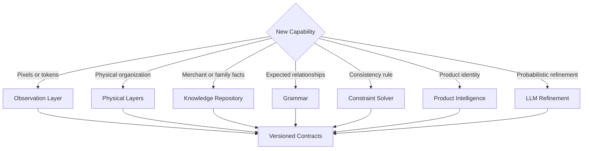
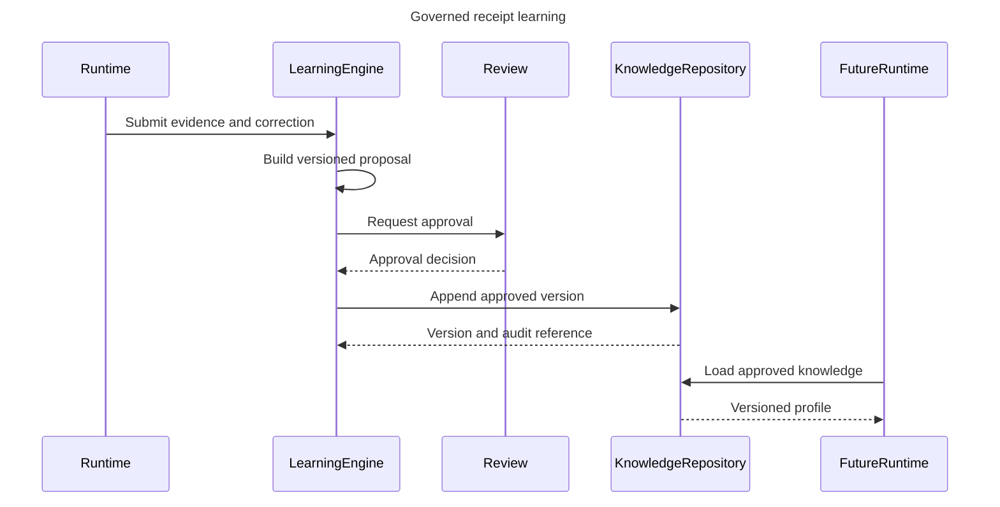

# Receipt Intelligence Platform

## Enterprise Architecture Specification

| Document control | Value |
|---|---|
| Status | Authoritative living architecture |
| Architecture domain | OpenGrit Receipt Intelligence Platform |
| Intended audience | Enterprise Architects, Principal Architects, Staff Engineers, AI Engineers, platform developers |
| Decision horizon | Multi-year |
| Current baseline | Geometry, Physical DOM, Physical Structure, Merchant Knowledge, Receipt Family Classification, legacy parser compatibility |
| Change authority | Receipt Intelligence Architecture Review |
| Review trigger | Every major platform phase or material architecture decision |

---

## 1. Purpose and authority

This specification is the architectural contract for the Receipt Intelligence
Platform. It defines why the platform is decomposed into layers, what each layer
owns, which information may cross a boundary, and how the platform may evolve.
It is intentionally independent of implementation classes, frameworks, and
deployment topology.

Future work SHALL conform to this specification. A change that violates a
mandatory rule requires an explicit Architecture Decision Record (ADR), impact
assessment, migration strategy, and architecture review. Phase-specific
implementation documentation may explain how a capability is built, but it
does not supersede this document.

The platform's long-term purpose is to transform evidence from a receipt image
into increasingly reliable understanding through explicit, explainable stages.
Each stage contributes a new kind of knowledge without erasing or silently
rewriting earlier evidence.

### 1.1 Scope

This specification governs:

- the canonical receipt information flow;
- physical, knowledge, classification, semantic, constraint, learning, and AI
  refinement boundaries;
- model ownership and immutability;
- extension and replacement rules;
- traceability, explainability, privacy, and deterministic behavior;
- coexistence with the current parser during migration.

It does not prescribe programming languages, storage vendors, service
deployment boundaries, UI frameworks, or individual algorithms.

### 1.2 Normative language

`MUST`, `MUST NOT`, `SHALL`, and `SHALL NOT` are mandatory. `MAY` identifies an
allowed extension. `SHOULD` states a strong default that requires a documented
reason to deviate.

---

## 2. Architectural vision

The platform is a document-understanding system, not an OCR wrapper and not a
collection of merchant parsers. It first establishes physical evidence, then
organizes that evidence, then compares it with learned knowledge, and only later
assigns business meaning.

The Receipt DOM is the canonical physical Abstract Syntax Tree (AST). It has
identity, hierarchy, relationships, coordinate provenance, and lifecycle. It is
not a transfer object and it is not the business result of extraction.

The target architecture separates two cooperating flows:

1. **Evidence flow** — image to geometry, physical AST, structure, classification,
   grammar, constraints, product understanding, and refined conclusions.
2. **Knowledge flow** — approved observations and corrections to versioned
   merchant-independent and merchant-associated knowledge.

The knowledge plane informs reasoning. It never retroactively changes the
physical evidence captured for a receipt.

### 2.1 Enterprise layer view



The diagram is conceptually ordered. Merchant Intelligence is a knowledge plane,
not a transformed form of the receipt. Classification consumes both physical
structure and approved family profiles.

---

## 3. Core architectural principles

### AP-01 — Physical understanding precedes semantic understanding

The platform SHALL establish where evidence exists before deciding what it
means. Geometry, DOM, and physical structure therefore contain no merchant,
product, monetary, tax, coupon, or payment meaning.

**Why:** semantic mistakes must not corrupt the physical evidence on which later
reasoning and reprocessing depend.

### AP-02 — Evidence is immutable; interpretation is additive

Every layer SHALL preserve upstream identity and provenance. Later engines add
annotations, comparisons, hypotheses, or conclusions. They SHALL NOT mutate the
upstream representation to make it fit a preferred interpretation.

**Why:** immutable evidence makes alternate interpretations, replay, debugging,
audit, and learning possible.

### AP-03 — Knowledge is data, not merchant-specific code

Merchant variation SHALL be represented through versioned blueprints, families,
profiles, vocabularies, statistics, grammars, and constraints. Adding a merchant
or receipt family SHALL NOT require a new conditional parser.

**Why:** data evolves continuously and can be approved, versioned, audited, and
learned without redeploying parsing logic.

### AP-04 — Layers own one kind of truth

Each layer SHALL own a distinct concern and SHALL expose an explicit contract.
No layer may absorb a neighboring responsibility merely because the data is
available.

**Why:** local convenience creates global coupling and makes accuracy changes
untraceable.

### AP-05 — Configuration precedes specialization

Generic engines with versioned configuration SHALL be preferred over forks,
merchant subclasses, or hardcoded rules.

### AP-06 — Learning does not require model retraining

Approved corrections and observations MAY improve profiles, distributions,
vocabularies, and constraints incrementally. Statistical or model retraining is
an optional enhancement, not the only learning path.

### AP-07 — Deterministic reasoning precedes probabilistic refinement

Geometry, layout evidence, grammar, arithmetic, and constraints SHALL establish
the deterministic envelope before probabilistic AI resolves ambiguity.

### AP-08 — LLMs refine; they do not own primary evidence

An LLM MAY propose, reconcile, or explain interpretations. It SHALL NOT replace
the physical AST, erase deterministic evidence, or become the sole source of an
extraction conclusion.

### AP-09 — Confidence is decomposable

Confidence SHALL be attributable to evidence categories and processing stages.
A single unexplained score is insufficient for architecture-level decisions.

### AP-10 — Compatibility is an explicit transition capability

New architecture SHALL be introduced as sidecars while the current parser
remains authoritative. Authority moves only through measured, reversible
migration decisions.

---

## 4. Current architecture and layer responsibilities

### 4.1 Receipt image boundary

#### Purpose

Preserve the original source evidence and its provenance.

#### Inputs

Image bytes and source metadata.

#### Outputs

An identifiable source image supplied to geometry and OCR capabilities.

#### Responsibilities

- Preserve source identity, filename, page association, and capture provenance.
- Maintain an unmodified reference suitable for replay and audit.
- Enforce privacy, retention, and access controls.

#### MAY know

- Image encoding, dimensions, source identifier, capture timestamp, page count.

#### MUST NEVER know

- Merchant identity, products, totals, tax, receipt family, or parsing outcomes.

### 4.2 Receipt Geometry Engine

#### Purpose

Establish the coordinate truth and geometric envelope of the physical receipt.

#### Inputs

Receipt image evidence.

#### Outputs

A versioned `ReceiptGeometry` containing boundary, dimensions, coordinate
systems, rotation, skew, perspective transformation, columns, whitespace,
reading zones, confidence, and diagnostics.

#### Responsibilities

- Isolate the receipt surface from its surroundings.
- Describe and correct geometric distortion.
- Provide authoritative coordinate conversions.
- Report uncertainty and diagnostics without assigning meaning.

#### MAY know

- Pixels, contours, edges, corners, skew, rotation, perspective, dimensions,
  whitespace, columns, physical regions, and image enhancement characteristics.

#### MUST NEVER know

- OCR text, merchant, products, prices, totals, tax, coupons, payment, receipt
  family, grammar, or business validation.

#### Why it exists

All later spatial reasoning requires one consistent geometric frame. Without
this layer, every consumer would implement incompatible coordinate correction
and silently disagree about where evidence exists.

### 4.3 Receipt DOM — Physical AST

#### Purpose

Represent everything physically observed on the document as a canonical,
immutable object graph.

#### Inputs

Receipt geometry and OCR observations with bounding geometry and provenance.

#### Outputs

A versioned `ReceiptDocument` containing pages, generic regions, blocks, lines,
words, reading order, relationships, coordinates, confidence, and diagnostics.

#### Responsibilities

- Preserve node identity, hierarchy, source references, and geometry.
- Express parent, child, sibling, directional, and neighborhood relationships.
- Normalize every node into supported coordinate systems.
- Provide the stable physical language used by future engines.

#### MAY know

- Observed glyph strings at line and word nodes, OCR confidence and source,
  bounding geometry, hierarchy, baseline, orientation, and physical adjacency.

#### MUST NEVER know

- Merchant identity, item identity, subtotal, tax, total, coupon, payment method,
  product category, semantic role, or parser result.

#### Why it exists

Raw OCR arrays have no durable identity or lifecycle. A physical AST enables
multiple independent engines to reference the same evidence without copying,
reordering, or replacing it.

### 4.4 Receipt Physical Structure Engine

#### Purpose

Describe how physical nodes are visually organized without deciding their
business meaning.

#### Inputs

Immutable `ReceiptDocument` and its reading order.

#### Outputs

Immutable physical annotations and `ReceiptPhysicalStructure`, including page
regions, visual groups, table candidates, alignments, density, whitespace,
separators, and structural hints.

#### Responsibilities

- Identify generic header, body, footer, and unknown zones.
- Detect table-like repetition and column geometry.
- Group nodes through spacing, alignment, indentation, and whitespace.
- Measure density and physical separation.
- Reference DOM node identities rather than replacing nodes.

#### MAY know

- Header/body/footer position, dense and sparse regions, physical table
  candidates, alignment, whitespace, separators, spacing, and reading order.

#### MUST NEVER know

- Merchant, product, item, total, tax, discount, coupon, payment method, or the
  business role of a table or region.

#### Why it exists

Physical grouping is reusable evidence. Assigning meaning during grouping would
make layout analysis merchant-dependent and prevent later engines from testing
alternate interpretations.

### 4.5 Merchant Intelligence Repository

#### Purpose

Provide a versioned, continuously evolving knowledge plane that describes what
has been learned about merchants and their receipt families.

#### Inputs

Approved knowledge, observations, corrections, and learning events.

#### Outputs

Versioned blueprints, receipt families, profiles, statistics, vocabularies,
corrections, and history.

#### Responsibilities

- Own merchant-associated knowledge and its lifecycle.
- Separate approved production knowledge from proposed learning.
- Support multiple receipt families per merchant.
- Preserve provenance, version history, confidence, and migration status.
- Make future behavior data-driven.

#### MAY know

- Merchant identity and aliases; receipt families; physical layout and visual
  profiles; OCR corrections; product vocabulary; known tax, coupon, payment, and
  footer layouts; statistics; confidence; learning metadata.

#### MUST NEVER know

- Request orchestration decisions, OCR execution, parsing algorithms, hardcoded
  merchant branches, mutable Receipt DOM nodes, or final extraction authority.

#### Why it exists

Detection without durable knowledge is guesswork. A repository allows the
platform to accumulate institutional knowledge without embedding it into source
code or requiring retraining for every correction.

### 4.6 Receipt Classification Engine

#### Purpose

Rank receipt families whose learned physical profiles resemble the current
physical receipt.

#### Inputs

Immutable Receipt DOM, immutable physical structure, and explicitly supplied
versioned family feature profiles.

#### Outputs

A versioned physical feature vector, family comparisons, confidence breakdowns,
ranked Top-N receipt-family candidates, explanations, diagnostics, and
approval-only learning suggestions.

#### Responsibilities

- Extract only physical features.
- Apply replaceable, configurable similarity strategies.
- Report feature coverage and decomposed confidence.
- Rank family candidates without promoting a candidate to merchant identity.
- Propose profile observations without writing production knowledge.

#### MAY know

- Dimensions, aspect ratio, regions, table geometry, spacing, alignment, reading
  patterns, density, whitespace, geometry confidence, and receipt-family profile
  identifiers.

#### MUST NEVER know

- OCR text meaning, merchant aliases, product meaning, totals, tax, coupons,
  payment methods, parser decisions, or detected merchant identity.

#### Why it exists

Receipt family is a layout hypothesis, not a merchant conclusion. Classification
before merchant detection narrows the hypothesis space while keeping physical
similarity distinct from business identity.

### 4.7 Current Receipt Parser — compatibility boundary

#### Purpose

Maintain current extraction behavior while the new architecture matures.

#### Inputs

Existing OCR and parser inputs, unchanged by the sidecar architecture.

#### Outputs

Current extraction results and current confidence behavior.

#### Responsibilities

- Preserve established production compatibility.
- Remain isolated from sidecar outputs until a governed migration authorizes a
  new source of evidence.
- Provide a measurable baseline for future replacement.

#### MAY know

- Existing OCR text, existing parsing rules, and current business output schema.

#### MUST NEVER do

- Mutate the Receipt DOM or physical structure.
- Treat a family classification as confirmed merchant identity.
- silently consume a new sidecar in a way that changes current output.
- become the permanent home for new merchant-specific branches.

#### Why it exists

Architecture evolution must not force a risky big-bang replacement. The parser
is a compatibility component with an explicit retirement path, not the target
architecture.

---

## 5. Layer contracts

Only contract-approved information may cross a boundary. Internal objects,
storage representations, and incidental implementation details SHALL NOT become
cross-layer dependencies.

| Boundary | Contract | Allowed information | Prohibited coupling |
|---|---|---|---|
| Image → Geometry | `ReceiptGeometry` production contract | Pixels, image metadata, boundaries, transformations, confidence | OCR meaning or business fields |
| Geometry → DOM | Coordinate and geometry snapshot contract | Page dimensions, transforms, zones, coordinates, diagnostics | Geometry algorithm internals |
| OCR observation → DOM | Physical observation contract | Text observation, box, baseline, confidence, engine provenance | OCR ordering as authoritative reading order |
| DOM → Structure | Immutable physical AST contract | Node identity, hierarchy, geometry, adjacency, reading order | DOM mutation or semantic labels |
| Knowledge → Classification | Versioned family profile contract | Numeric physical distributions, profile confidence, weights, version | Alias lookup, textual merchant inference, parser code |
| Structure → Classification | Physical feature contract | Regions, grouping, tables, spacing, alignment, density, geometry confidence | OCR text meaning or business roles |
| Classification → future detection | Ranked hypothesis contract | Family identifier, rank, decomposed confidence, evidence coverage | Automatic merchant assertion |
| Parser sidecar boundary | Compatibility contract | Independently serialized diagnostics and evidence | Changes to existing parser inputs, scoring, or output authority |
| Learning → Knowledge | Approval contract | Proposed deltas, provenance, confidence, source version | Unreviewed production writes |

### 5.1 Layer contract view



### 5.2 Contract versioning

- Every durable contract SHALL identify a schema version.
- Additive changes SHOULD preserve readers that ignore unknown fields.
- Breaking changes SHALL use a new major contract version.
- A consumer SHALL declare the versions it accepts.
- Knowledge records SHALL retain the source contract version used to derive
  them.
- Migrations SHALL be replayable and SHALL preserve provenance.

---

## 6. Immutable data flow and annotation model

The immutable pipeline protects evidentiary integrity:

```text
Source Evidence
    → Geometry Snapshot
    → Physical DOM
    → Physical Structure Annotations
    → Family Classification Hypotheses
    → Future Semantic Annotations
    → Future Business Conclusions
```

Each arrow means “derive a new artifact,” never “rewrite the previous artifact.”
A later layer may disagree with an earlier interpretation, but it cannot rewrite
the evidence that interpretation referenced.

### 6.1 Annotation versus mutation

An annotation:

- has its own identity, schema version, provenance, confidence, and lifecycle;
- references stable upstream node or document identifiers;
- can coexist with competing annotations;
- can be superseded without rewriting the source;
- can be audited and replayed.

Mutation:

- changes upstream state in place;
- destroys the distinction between observation and interpretation;
- makes alternate reasoning and reproduction unreliable;
- is prohibited across architectural layers.

Future semantic and business layers SHALL therefore create sidecar annotation
graphs. They SHALL NOT add merchant, product, tax, or total fields to physical
DOM nodes.

### 6.2 Data flow view


---

## 7. Knowledge architecture

Merchant Intelligence is an enterprise knowledge plane. It is not a parser, a
detection result, or a request-scoped receipt model.

### 7.1 Knowledge domains

| Knowledge domain | Architectural meaning |
|---|---|
| Merchant Blueprint | Aggregate, versioned knowledge boundary for a merchant |
| Receipt Family | Evolving family of receipts with shared observable characteristics |
| Layout Profile | Learned physical distributions and spatial tendencies |
| Visual Profile | Storage contract for visual characteristics and future recognition evidence |
| Statistics | Aggregated observations with sample count, confidence, and version |
| OCR Corrections | Known observation-to-correction evidence with provenance |
| Product Vocabulary | Known lexical forms, aliases, OCR variants, and units; not classification |
| Pattern Profiles | Versioned knowledge about recurring layouts or future semantic structures |
| Learning Events | Append-oriented observations and corrections awaiting or recording governance |

### 7.2 Why knowledge is data

Knowledge changes at a different rate from platform code. A receipt family may
evolve daily while the generic reasoning engine remains stable. Representing
knowledge as versioned data enables:

- correction without code deployment;
- provenance and approval;
- historical replay;
- tenant or locale variation;
- gradual confidence accumulation;
- rollback to an earlier version;
- common engines across all merchants.

Knowledge records SHALL state confidence, sample basis, version, and provenance
where those are relevant. Absence of knowledge SHALL produce uncertainty, not a
hardcoded fallback identity.

### 7.3 Knowledge flow



---

## 8. Why there are no merchant parsers

The target architecture intentionally prohibits patterns such as:

```python
if merchant == "Costco":
    parse_costco_receipt()
```

Merchant parsers combine identity detection, layout assumptions, extraction,
validation, and exception handling into one code branch. That creates five
systemic problems:

1. A mistaken merchant decision selects the wrong algorithm for the whole
   receipt.
2. Knowledge becomes invisible source code rather than reviewable data.
3. Every format change requires deployment and regression risk.
4. Shared behaviors are duplicated across merchant branches.
5. Learning cannot improve behavior without generating new code.

The replacement architecture separates:

- **knowledge**, which describes learned observations;
- **classification**, which ranks physical family hypotheses;
- **grammar**, which describes expected document relationships;
- **constraints**, which test consistency;
- **product intelligence**, which resolves product identity;
- **refinement**, which resolves remaining ambiguity.

A merchant-specific fact may exist in a blueprint, vocabulary, grammar, or
constraint record. It SHALL NOT become a merchant-specific executable parser.

---

## 9. Dependency and package ownership

Dependency direction follows the increasing meaning of evidence. Lower layers
MUST NOT import or depend on higher layers. Shared contracts SHALL be minimal and
owned by the layer that creates the truth they represent.



The apparent learning-to-knowledge return is a governed data flow, not a source
code dependency. Learning submits proposals through the repository contract.

### 9.1 Ownership rules

- `receipt_geometry` owns coordinate truth.
- `receipt_dom` owns the canonical physical AST and node identity.
- `receipt_structure` owns generic physical organization annotations.
- `merchant_intelligence` owns durable knowledge, versions, and approval state.
- `receipt_classification` owns physical family similarity hypotheses.
- Future `receipt_grammar` owns expected semantic relationships.
- Future `constraint_solver` owns consistency evaluation and candidate
  reconciliation.
- Future `product_intelligence` owns product identity evidence.
- Future `learning_engine` owns proposals and feedback orchestration, never
  unilateral production truth.
- Future `llm_refinement` owns bounded probabilistic proposals and explanations,
  never canonical physical evidence.

---

## 10. Future architecture

### 10.1 OCR Consensus

OCR Consensus will reconcile observations from multiple OCR engines. It will
produce provenance-preserving alternatives and confidence, not overwrite source
observations. The DOM builder or a future observation layer will consume the
consensus according to a versioned contract.

It may know character and token alternatives, geometry, engine provenance, and
confidence. It must not know merchant identity or business meaning.

### 10.2 Receipt Grammar

Receipt Grammar will express expectations and relationships for receipt
families. Grammar answers questions such as which physical constructs may follow
one another or which roles may coexist. It defines expectations; it does not
perform OCR and does not become an imperative parser.

Grammar produces semantic candidates and relationship annotations that
reference DOM identities and classification hypotheses.

### 10.3 Constraint Solver

The Constraint Solver will evaluate candidate interpretations for internal
consistency. It validates and ranks; it does not originate physical evidence.
Constraints may include arithmetic, cardinality, locality, temporal consistency,
and grammar compatibility.

The solver shall retain rejected candidates and reasons to preserve
explainability.

### 10.4 Product Intelligence

Product Intelligence will reconcile observed lexical and geometric evidence with
merchant-associated and general product knowledge. It will create product
annotations without changing physical words or lines.

### 10.5 Learning Engine

The Learning Engine will convert accepted corrections and high-quality
observations into versioned proposals. It will enforce thresholds, provenance,
privacy, and approval policies. Learning updates metadata, distributions,
vocabularies, grammars, or constraints—not source code.

### 10.6 LLM Refinement

LLM Refinement will receive bounded evidence, candidates, constraints, and
diagnostics after deterministic reasoning. It may reconcile ambiguous
interpretations, propose explanations, or request review. It shall not receive
unbounded authority to replace evidence or bypass constraints.

### 10.7 Target architecture



---

## 11. Extension architecture and routing rules

Every extension SHALL enter through the layer that owns its kind of truth.

| Extension | Owning layer | Required behavior | Forbidden shortcut |
|---|---|---|---|
| New OCR engine | OCR observation or future OCR Consensus | Preserve engine provenance, alternatives, geometry, and confidence | Write semantic results directly |
| New merchant | Merchant Intelligence | Add a versioned blueprint and governed knowledge | Add merchant conditional code |
| New receipt family | Merchant Intelligence | Add a family and physical/grammar profiles with version and evidence | Fork the classifier |
| New physical feature | Classification contract | Version the feature definition and profile migration | Read OCR meaning |
| New product vocabulary | Merchant Intelligence | Add versioned vocabulary with provenance | Add product parsing branch |
| New grammar | Future Receipt Grammar | Publish declarative expectations and compatibility version | Implement OCR or mutate DOM |
| New constraint | Future Constraint Solver | Declare evidence inputs, severity, and explanation | Extract missing evidence |
| New similarity method | Classification | Implement the strategy contract and benchmark calibration | Hardcode family names |
| New AI model | Future LLM Refinement | Operate within bounded evidence and policy contracts | Become primary extraction authority |
| New learning signal | Future Learning Engine | Create an auditable proposal with privacy and approval policy | Write production knowledge silently |

### 11.1 Extension architecture



---

## 12. Mandatory architecture rules

| Rule | Requirement |
|---|---|
| AR-001 | Geometry SHALL contain no business semantics. |
| AR-002 | The Receipt DOM SHALL remain the canonical immutable physical AST. |
| AR-003 | DOM node identities SHALL remain stable for the document lifecycle. |
| AR-004 | Future engines SHALL annotate the DOM; they SHALL NOT replace or semantically mutate it. |
| AR-005 | Physical Structure SHALL classify layout only, never business roles. |
| AR-006 | Merchant Intelligence SHALL contain knowledge, not executable parser logic. |
| AR-007 | No generic engine SHALL branch on a hardcoded merchant or family name. |
| AR-008 | Receipt classification SHALL rank families, not assert merchant identity. |
| AR-009 | Grammar SHALL define expectations, not execute OCR or imperative parsing. |
| AR-010 | The Constraint Solver SHALL validate candidates, not fabricate evidence. |
| AR-011 | Learning SHALL propose or update governed metadata, not source code. |
| AR-012 | Production knowledge changes SHALL be versioned, traceable, and reversible. |
| AR-013 | Confidence SHALL identify contributing evidence categories and coverage. |
| AR-014 | LLM output SHALL be treated as an annotation or proposal until validated. |
| AR-015 | Existing extraction behavior SHALL change only through an explicit migration decision. |
| AR-016 | Lower architectural layers SHALL NOT depend on higher semantic layers. |
| AR-017 | Missing knowledge SHALL result in uncertainty, not invented identity. |
| AR-018 | Every conclusion SHALL be traceable to source evidence and processing versions. |
| AR-019 | Debug and sidecar artifacts SHALL NOT influence runtime decisions implicitly. |
| AR-020 | Privacy and retention controls SHALL apply to source, derived, and learning artifacts. |

---

## 13. Architectural Decision Records

These records capture the decisions that establish the current architecture.
Future records SHALL be added here or referenced from this section without
renumbering prior decisions.

### ADR-001 — The Receipt DOM is an immutable physical AST

**Status:** Accepted

**Context:** OCR arrays lack durable identity, hierarchy, and relationships.
Business DTOs collapse evidence into one interpretation.

**Decision:** Use an immutable, identity-bearing physical AST as the canonical
in-memory representation.

**Consequences:** Engines can share evidence, annotations can coexist, and
reprocessing is reproducible. Builders and serializers must preserve identity
and provenance.

### ADR-002 — New architecture enters as sidecars

**Status:** Accepted

**Context:** Existing extraction behavior is production-sensitive and cannot be
replaced safely in one step.

**Decision:** Geometry, DOM, structure, knowledge context, and classification
are integrated as request-scoped sidecars before receiving extraction authority.

**Consequences:** Compatibility is preserved and comparisons are measurable.
Sidecars must fail open and remain excluded from existing scoring.

### ADR-003 — Merchant behavior is metadata-driven

**Status:** Accepted

**Context:** Merchant-specific parsers duplicate logic and require deployments
for routine knowledge changes.

**Decision:** Store merchant variation in versioned data consumed by generic
engines.

**Consequences:** Knowledge requires governance, migrations, provenance, and
quality controls. Source code remains merchant-independent.

### ADR-004 — Merchant Blueprint is the knowledge aggregate

**Status:** Accepted

**Context:** Aliases, families, layouts, vocabularies, statistics, and learning
history require a common lifecycle and ownership boundary.

**Decision:** Group merchant-associated knowledge beneath a versioned Blueprint
while allowing multiple receipt families.

**Consequences:** A blueprint is not a detection result. Consumers must request
or receive it explicitly and respect record versions.

### ADR-005 — Receipt family classification precedes merchant detection

**Status:** Accepted

**Context:** Physical family resemblance is useful evidence but insufficient to
establish merchant identity.

**Decision:** Rank receipt families from physical features before any future
merchant detection phase.

**Consequences:** Classification stays text-independent and produces
hypotheses. Future detection must combine, not conflate, independent evidence.

### ADR-006 — LLM refinement occurs last

**Status:** Accepted

**Context:** LLMs are strong at ambiguity resolution but can be nondeterministic
and difficult to audit as primary extractors.

**Decision:** Apply deterministic physical, grammar, and constraint reasoning
before bounded LLM refinement.

**Consequences:** LLM prompts receive structured evidence and constraints.
Outputs remain traceable proposals and cannot overwrite the AST.

### ADR-007 — Learning suggestions require approval

**Status:** Accepted

**Context:** Automatic profile updates risk feedback loops and knowledge
poisoning.

**Decision:** Runtime engines emit learning suggestions; production knowledge is
updated only through governed approval.

**Consequences:** The platform needs review policy, provenance, thresholds, and
append-oriented history.

### ADR-008 — Replace the parser progressively

**Status:** Accepted

**Context:** The current parser carries validated behavior while the target
grammar and constraint architecture is incomplete.

**Decision:** Establish shadow evaluation, parity gates, bounded authority, and
reversible cutover by output domain.

**Consequences:** New merchant-specific logic is prohibited in the legacy
parser. Retirement depends on evidence, not schedule alone.

---

## 14. Evolution strategy

The order of evolution is deliberate. A later phase depends on the evidence
integrity and contracts established by earlier phases.

### Phase 1 — Physical foundation

**Capabilities:** Geometry, Receipt DOM, Physical Structure.

**Architectural outcome:** One coordinate truth, one canonical physical AST, and
generic layout annotations.

**Why first:** Semantic reasoning cannot be reliable if physical evidence is
unstable, duplicated, or tied to OCR order.

### Phase 2 — Knowledge and physical classification

**Capabilities:** Merchant Intelligence Repository and Receipt Family
Classification.

**Architectural outcome:** Versioned knowledge replaces hardcoded merchant
behavior, and physical similarity becomes an explainable ranked hypothesis.

**Why second:** Detection and grammar need durable knowledge. Classification
must remain independent from semantic meaning to provide clean evidence.

### Phase 3 — Semantic expectations

**Capabilities:** Merchant detection evidence, Receipt Grammar, and OCR
Consensus.

**Architectural outcome:** The platform can propose semantic roles from
independent identity, lexical, physical, and grammatical evidence.

**Entry criteria:** stable physical contracts, representative family profiles,
and measurable classification calibration.

### Phase 4 — Consistency and domain intelligence

**Capabilities:** Constraint Solver and Product Intelligence.

**Architectural outcome:** Competing interpretations are validated through
arithmetic, spatial, grammar, product, and temporal consistency.

**Entry criteria:** semantic candidates retain provenance and grammar is
declarative rather than embedded in parsers.

### Phase 5 — Governed learning and refinement

**Capabilities:** Learning Engine, LLM Refinement, and progressive parser
retirement.

**Architectural outcome:** Approved feedback improves data-driven behavior,
while AI resolves residual ambiguity within deterministic guardrails.

**Entry criteria:** audit trails, privacy controls, offline evaluation, rollback,
and domain-by-domain parity with current extraction.

### 14.1 Evolution roadmap


### 14.2 Parser replacement gates

Parser authority SHALL move only when all of the following are demonstrated for
the affected output domain:

- representative offline evaluation;
- no material regression against the production baseline;
- evidence-level explainability;
- contract and schema compatibility;
- monitored shadow operation;
- reversible rollout;
- human-review behavior for uncertain cases;
- architecture approval.

---

## 15. Learning flow and governance

Learning is a controlled lifecycle, not a direct write from inference to truth.



### 15.1 Learning controls

- Training and inference data SHALL retain lawful provenance.
- Sensitive source evidence SHOULD be minimized in durable knowledge.
- A proposal SHALL record the source document, model and contract versions,
  confidence, and approval decision where policy permits.
- Rejected proposals SHALL remain auditable without contaminating active
  profiles.
- Rollback SHALL restore a prior knowledge version without code deployment.
- Automated approval MAY be introduced only for narrowly bounded, measured,
  reversible change classes.

---

## 16. Quality attributes

### 16.1 Scalability

Receipt processing SHOULD scale by independent stage execution and immutable
artifacts. Stateless engines may be replicated. Knowledge reads should support
caching by immutable version. Learning writes are separated from request-time
classification to prevent contention and feedback loops.

### 16.2 Maintainability

Single-purpose layers and explicit contracts localize change. Merchant
variations belong in data. Mandatory ADRs prevent accidental boundary erosion.
The current parser is isolated as a compatibility concern.

### 16.3 Extensibility

New engines implement stable contracts; new merchants and families add knowledge
records. Strategy extension points permit new similarity, grammar, constraint,
OCR, or AI techniques without replacing the canonical evidence model.

### 16.4 Explainability

Every hypothesis and conclusion should identify its source nodes, knowledge
versions, contributing evidence, confidence components, and rejected
alternatives. Explanation is a first-class output, not a debug afterthought.

### 16.5 Auditability

Immutable source references, versioned artifacts, append-oriented learning
history, and ADR traceability SHALL support reproduction of a decision from its
inputs and processing versions.

### 16.6 Privacy

Source images, OCR observations, product vocabularies, and correction events may
contain sensitive information. Data minimization, purpose limitation, access
control, retention, deletion, and jurisdictional policy SHALL apply across both
evidence and knowledge planes. Learning SHALL not turn transaction-specific
content into durable shared knowledge without an approved basis.

### 16.7 Offline capability

Core geometry, DOM construction, physical structure, profile comparison,
grammar, and constraints SHOULD support local deterministic execution. Remote
AI and remote knowledge access may enhance results but SHALL have defined
degraded modes.

### 16.8 Deterministic behavior

Given the same source, configuration, knowledge versions, and deterministic
engine versions, the platform SHOULD reproduce the same pre-LLM artifacts and
decisions. Sources of nondeterminism SHALL be identified in diagnostics.

### 16.9 Learning capability

The architecture supports incremental improvement through statistics,
vocabularies, profile distributions, grammars, and constraints. Learning quality
is measured by approved outcomes and held-out evaluation, not merely by the
volume of observations.

### 16.10 Reliability and resilience

Infrastructure sidecars SHALL fail open while the current parser remains
authoritative. Future authoritative stages SHALL define timeouts, retries,
idempotency, degraded behavior, and human-review thresholds.

---

## 17. Architecture conformance

A design is conformant only if it can answer:

1. Which layer owns the new information?
2. Is the information observation, annotation, hypothesis, knowledge, or
   conclusion?
3. Which stable identities and versions establish provenance?
4. Does the change preserve upstream immutability?
5. Is merchant variation represented as data?
6. Can confidence and rejection reasons be explained?
7. Can the change be replayed, audited, and rolled back?
8. Does it preserve current extraction behavior unless migration authority has
   explicitly changed?
9. Does it introduce a new cross-layer dependency?
10. Which ADR authorizes any deviation from these rules?

Architecture review SHALL reject changes that cannot answer these questions.

---

## 18. Living-document governance

This is the single authoritative enterprise architecture specification for the
Receipt Intelligence Platform.

### 18.1 Update policy

- Every major phase SHALL update this document in the same change set.
- Existing decisions SHALL not be silently rewritten. Superseded decisions
  SHALL retain their history and reference the replacing ADR.
- New layers SHALL receive purpose, input, output, responsibility, allowed
  knowledge, prohibited knowledge, contract, ownership, and quality sections.
- Diagrams SHALL be updated when a boundary, dependency, authority, or knowledge
  flow changes.
- Implementation-only changes that do not affect an architectural contract do
  not require a specification update.

### 18.2 Required change record

Each material update SHALL add:

| Field | Requirement |
|---|---|
| Date | UTC effective date |
| Architecture phase | Phase affected |
| Decision reference | New or superseding ADR |
| Contract impact | Added, additive, breaking, or none |
| Migration impact | Compatibility and rollback statement |
| Reviewer | Architecture approval identity |

### 18.3 Change history

| Date | Phase | Change | Decision references |
|---|---|---|---|
| 2026-07-27 | Phases 1–2 baseline | Established enterprise architecture constitution for physical evidence, knowledge, family classification, and future evolution | ADR-001 through ADR-008 |

---

## 19. Architecture summary

The platform's constitutional boundary is simple:

> Geometry knows the page. The DOM knows what physically exists. Structure knows
> how it is arranged. Knowledge knows what has been learned. Classification knows
> what physical families are plausible. Grammar will know what relationships are
> expected. Constraints will know what is consistent. Product Intelligence will
> know product identity. Learning will know how approved evidence changes
> knowledge. LLM refinement will resolve bounded ambiguity. No layer may claim
> another layer's authority.

That separation is the foundation for a platform that can improve continuously
without sacrificing compatibility, explainability, or architectural integrity.
