# Receipt Intelligence Platform

## Enterprise Architecture Specification

| Document control | Value |
|---|---|
| Status | Authoritative frozen enterprise architecture baseline |
| Architecture domain | OpenGrit Receipt Intelligence Platform |
| Intended audience | Enterprise Architects, Principal Architects, Staff Engineers, AI Engineers, platform developers |
| Decision horizon | Multi-year |
| Current baseline | Geometry, Physical DOM, Physical Structure, Merchant Knowledge, Receipt Family Classification, Receipt Grammar sidecar, Receipt Constraint Solver sidecar, Product Intelligence sidecar, Enterprise Knowledge Graph sidecar, Cross-Document Intelligence sidecar, Enterprise Learning sidecar, Enterprise Reasoning sidecar, legacy parser compatibility |
| Change authority | Receipt Intelligence Architecture Review |
| Review trigger | Every major platform phase or material architecture decision |

### Document Version History

| Version | Date | Major changes |
|---|---|---|
| 0.9 | 2026-07-27 | Established the initial Receipt Intelligence Enterprise Architecture Specification, including the physical, knowledge, classification, governance, and future architecture baseline. |
| 1.0 | 2026-07-27 | Completed the enterprise architecture repository with capability, traceability, context, container, information, domain, standards, glossary, evolution, and North Star artifacts; removed duplicate editorial content and froze the baseline. |
| 1.1 | 2026-07-27 | Added the implemented Receipt Grammar Framework as a Phase 3 non-authoritative sidecar while preserving current parser authority. |
| 1.2 | 2026-07-27 | Added the deterministic Receipt Constraint Solver Framework as a non-authoritative sidecar after Grammar while preserving current parser authority. |
| 1.3 | 2026-08-05 | Added explicit Document Asset roles, processing profiles, and Payment Slip Grammar while preserving parser authority. |
| 1.8 | 2026-08-05 | Added Document Family Specialization after Classification as an immutable, deterministic, non-authoritative semantic activation sidecar. |
| 1.9 | 2026-08-05 | Added Presentation Projection as the immutable migration layer between parser and enterprise intelligence for UI-specific Business Views. |

## Document Asset Architecture

A Document is the durable business record; a Document Asset is a versioned
physical representation. Storage representation and processing representation
are separate concerns. Geometry, OCR, Receipt Intelligence, and Enterprise
Intelligence SHALL consume only the current `PROCESSING` asset. They SHALL NOT
select the original asset or branch on the original media type.

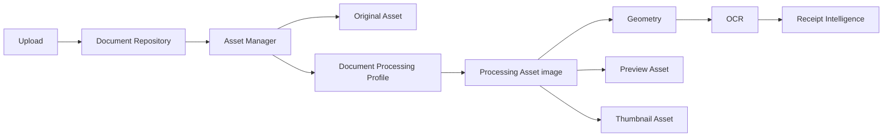

Each asset records asset type, storage key, content type, dimensions, checksum,
creation time, version, and extensible metadata. The initial profile registry
contains PDF render, JPEG/PNG normalization, HEIC decode, and TIFF render
profiles. Adding a source format changes the profile/conversion layer only.

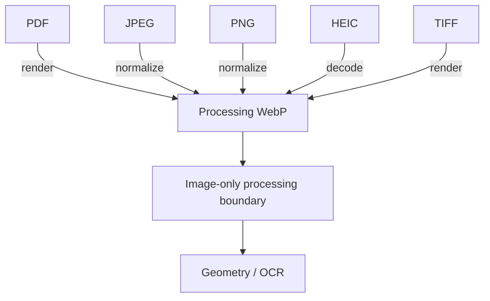

Payment Slip is an approved Receipt Grammar family whose required expectations
are merchant, date, total, payment method, approval code, and card evidence. An
item table is not required. Retail Receipt continues to require an item table.
Both definitions execute only as Grammar sidecars and do not parse, extract, or
replace the current extraction authority.

## Document Family Specialization Architecture

Document Family Specialization is the semantic activation boundary between
Classification and Grammar. It selects a registered family profile and
publishes semantic zones, geometry-based key/value relationships, ranked entity
candidates, and the Grammar and Constraint references appropriate to that
family. It never edits OCR, Receipt DOM, extraction output, or parser inputs.

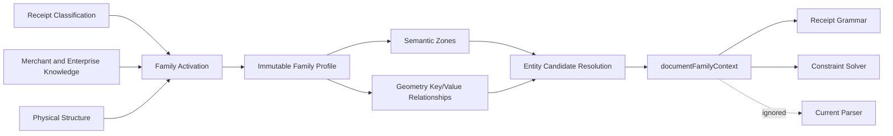

Profiles are registered by family identifier and own expected sections, zone
rules, key/value rules, entity-resolution rules, and references to approved
Grammar and Constraint definitions. Adding a future document family requires a
new profile and evidence rules, not parser logic. Supported baseline families
are Retail Receipt, Restaurant Receipt, Fuel Receipt, Payment Slip, Credit Card
Slip, Refund Receipt, Return Receipt, Invoice, Statement, Warranty, Donation
Receipt, and Unknown.

The `documentFamilyContext` contract is immutable, versioned, deterministic,
and additive. Every candidate carries evidence, confidence, and reason.
Payment identifiers such as AID, card brands, masked PANs, approval codes, and
financial labels are explicitly excluded from merchant candidacy. Semantic
zones guide downstream reasoning but never overwrite observed text.

## Presentation Projection Architecture

Presentation Projection is the final translation layer for user interfaces. It
combines an untouched legacy parser artifact with immutable Enterprise
Intelligence and emits a separate `businessProjection`. Projection chooses what
the UI displays; it is not extraction authority and cannot mutate either input.

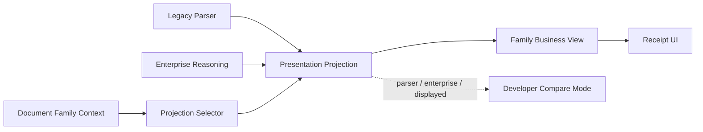

Every projected field preserves parser value, enterprise value, displayed
value, selected source, confidence components, evidence, decision, and
explanation. Parser Only, Enterprise Only, Hybrid, Shadow, and Compare modes
support feature flags plus tenant and family overrides. New document families
extend the projection registry with a profile; they do not introduce parser or
UI conditionals outside the view profile boundary.
| 1.3 | 2026-07-27 | Added Product Intelligence as a non-authoritative semantic enrichment sidecar after Constraint evaluation while preserving extracted values and parser authority. |
| 1.4 | 2026-07-27 | Added the storage-agnostic Enterprise Knowledge Graph Framework after Product Intelligence as the normalized semantic backbone for future governed learning and cross-domain intelligence. |
| 1.5 | 2026-07-27 | Added Cross-Document Intelligence as the deterministic enterprise context and longitudinal memory sidecar after the Enterprise Knowledge Graph. |
| 1.6 | 2026-07-27 | Added Enterprise Learning as the governed, deterministic, approval-driven adaptation sidecar after Cross-Document Intelligence. |
| 1.7 | 2026-07-27 | Added Enterprise Reasoning as the deterministic evidence-first orchestration sidecar after Enterprise Learning. |

---

## 1. Purpose and authority

This specification is the architectural contract for the Receipt Intelligence
Platform. It defines why the platform is decomposed into layers, what each layer
owns, which information may cross a boundary, and how the platform may evolve.
It is intentionally independent of implementation classes, frameworks, and
deployment topology.

Future work SHALL conform to this specification. A change that violates a
mandatory rule requires an explicit Architecture Decision Record (ADR), impact
assessment, migration strategy, and architecture review. Phase-specific
implementation documentation may explain how a capability is built, but it
does not supersede this document.

The platform's long-term purpose is to transform evidence from a receipt image
into increasingly reliable understanding through explicit, explainable stages.
Each stage contributes a new kind of knowledge without erasing or silently
rewriting earlier evidence.

### 1.1 Scope

This specification governs:

- the canonical receipt information flow;
- physical, knowledge, classification, semantic, constraint, learning, and AI
  refinement boundaries;
- model ownership and immutability;
- extension and replacement rules;
- traceability, explainability, privacy, and deterministic behavior;
- coexistence with the current parser during migration.

It does not prescribe programming languages, storage vendors, service
deployment boundaries, UI frameworks, or individual algorithms.

### 1.2 Normative language

`MUST`, `MUST NOT`, `SHALL`, and `SHALL NOT` are mandatory. `MAY` identifies an
allowed extension. `SHOULD` states a strong default that requires a documented
reason to deviate.

---

## 2. Architectural vision

The platform is a document-understanding system, not an OCR wrapper and not a
collection of merchant parsers. It first establishes physical evidence, then
organizes that evidence, then compares it with learned knowledge, and only later
assigns business meaning.

The Receipt DOM is the canonical physical Abstract Syntax Tree (AST). It has
identity, hierarchy, relationships, coordinate provenance, and lifecycle. It is
not a transfer object and it is not the business result of extraction.

The target architecture separates two cooperating flows:

1. **Evidence flow** — image to geometry, physical AST, structure, classification,
   grammar, constraints, product understanding, and refined conclusions.
2. **Knowledge flow** — approved observations and corrections to versioned
   merchant-independent and merchant-associated knowledge.

The knowledge plane informs reasoning. It never retroactively changes the
physical evidence captured for a receipt.

### 2.1 Enterprise layer view

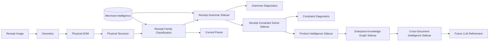

The diagram is conceptually ordered. Merchant Intelligence is a knowledge plane,
not a transformed form of the receipt. Classification consumes both physical
structure and approved family profiles.

---

## 3. Core architectural principles

The Architecture Principles in this section are constitutional. They MAY change
only through a new Architecture Decision Record, explicit impact assessment,
migration strategy, and Architecture Review approval. Editorial clarification
must not weaken, bypass, or silently reinterpret a principle.

### AP-01 — Physical understanding precedes semantic understanding

The platform SHALL establish where evidence exists before deciding what it
means. Geometry, DOM, and physical structure therefore contain no merchant,
product, monetary, tax, coupon, or payment meaning.

**Why:** semantic mistakes must not corrupt the physical evidence on which later
reasoning and reprocessing depend.

### AP-02 — Evidence is immutable; interpretation is additive

Every layer SHALL preserve upstream identity and provenance. Later engines add
annotations, comparisons, hypotheses, or conclusions. They SHALL NOT mutate the
upstream representation to make it fit a preferred interpretation.

**Why:** immutable evidence makes alternate interpretations, replay, debugging,
audit, and learning possible.

### AP-03 — Knowledge is data, not merchant-specific code

Merchant variation SHALL be represented through versioned blueprints, families,
profiles, vocabularies, statistics, grammars, and constraints. Adding a merchant
or receipt family SHALL NOT require a new conditional parser.

**Why:** data evolves continuously and can be approved, versioned, audited, and
learned without redeploying parsing logic.

### AP-04 — Layers own one kind of truth

Each layer SHALL own a distinct concern and SHALL expose an explicit contract.
No layer may absorb a neighboring responsibility merely because the data is
available.

**Why:** local convenience creates global coupling and makes accuracy changes
untraceable.

### AP-05 — Configuration precedes specialization

Generic engines with versioned configuration SHALL be preferred over forks,
merchant subclasses, or hardcoded rules.

### AP-06 — Learning does not require model retraining

Approved corrections and observations MAY improve profiles, distributions,
vocabularies, and constraints incrementally. Statistical or model retraining is
an optional enhancement, not the only learning path.

### AP-07 — Deterministic reasoning precedes probabilistic refinement

Geometry, layout evidence, grammar, arithmetic, and constraints SHALL establish
the deterministic envelope before probabilistic AI resolves ambiguity.

### AP-08 — LLMs refine; they do not own primary evidence

An LLM MAY propose, reconcile, or explain interpretations. It SHALL NOT replace
the physical AST, erase deterministic evidence, or become the sole source of an
extraction conclusion.

### AP-09 — Confidence is decomposable

Confidence SHALL be attributable to evidence categories and processing stages.
A single unexplained score is insufficient for architecture-level decisions.

### AP-10 — Compatibility is an explicit transition capability

New architecture SHALL be introduced as sidecars while the current parser
remains authoritative. Authority moves only through measured, reversible
migration decisions.

---

## 4. Current architecture and layer responsibilities

### 4.1 Receipt image boundary

#### Purpose

Preserve the original source evidence and its provenance.

#### Inputs

Image bytes and source metadata.

#### Outputs

An identifiable source image supplied to geometry and OCR capabilities.

#### Responsibilities

- Preserve source identity, filename, page association, and capture provenance.
- Maintain an unmodified reference suitable for replay and audit.
- Enforce privacy, retention, and access controls.

#### MAY know

- Image encoding, dimensions, source identifier, capture timestamp, page count.

#### MUST NEVER know

- Merchant identity, products, totals, tax, receipt family, or parsing outcomes.

### 4.2 Receipt Geometry Engine

#### Purpose

Establish the coordinate truth and geometric envelope of the physical receipt.

#### Inputs

Receipt image evidence.

#### Outputs

A versioned `ReceiptGeometry` containing boundary, dimensions, coordinate
systems, rotation, skew, perspective transformation, columns, whitespace,
reading zones, confidence, and diagnostics.

#### Responsibilities

- Isolate the receipt surface from its surroundings.
- Describe and correct geometric distortion.
- Provide authoritative coordinate conversions.
- Report uncertainty and diagnostics without assigning meaning.

#### MAY know

- Pixels, contours, edges, corners, skew, rotation, perspective, dimensions,
  whitespace, columns, physical regions, and image enhancement characteristics.

#### MUST NEVER know

- OCR text, merchant, products, prices, totals, tax, coupons, payment, receipt
  family, grammar, or business validation.

#### Why it exists

All later spatial reasoning requires one consistent geometric frame. Without
this layer, every consumer would implement incompatible coordinate correction
and silently disagree about where evidence exists.

### 4.3 Receipt DOM — Physical AST

#### Purpose

Represent everything physically observed on the document as a canonical,
immutable object graph.

#### Inputs

Receipt geometry and OCR observations with bounding geometry and provenance.

#### Outputs

A versioned `ReceiptDocument` containing pages, generic regions, blocks, lines,
words, reading order, relationships, coordinates, confidence, and diagnostics.

#### Responsibilities

- Preserve node identity, hierarchy, source references, and geometry.
- Express parent, child, sibling, directional, and neighborhood relationships.
- Normalize every node into supported coordinate systems.
- Provide the stable physical language used by future engines.

#### MAY know

- Observed glyph strings at line and word nodes, OCR confidence and source,
  bounding geometry, hierarchy, baseline, orientation, and physical adjacency.

#### MUST NEVER know

- Merchant identity, item identity, subtotal, tax, total, coupon, payment method,
  product category, semantic role, or parser result.

#### Why it exists

Raw OCR arrays have no durable identity or lifecycle. A physical AST enables
multiple independent engines to reference the same evidence without copying,
reordering, or replacing it.

### 4.4 Receipt Physical Structure Engine

#### Purpose

Describe how physical nodes are visually organized without deciding their
business meaning.

#### Inputs

Immutable `ReceiptDocument` and its reading order.

#### Outputs

Immutable physical annotations and `ReceiptPhysicalStructure`, including page
regions, visual groups, table candidates, alignments, density, whitespace,
separators, and structural hints.

#### Responsibilities

- Identify generic header, body, footer, and unknown zones.
- Detect table-like repetition and column geometry.
- Group nodes through spacing, alignment, indentation, and whitespace.
- Measure density and physical separation.
- Reference DOM node identities rather than replacing nodes.

#### MAY know

- Header/body/footer position, dense and sparse regions, physical table
  candidates, alignment, whitespace, separators, spacing, and reading order.

#### MUST NEVER know

- Merchant, product, item, total, tax, discount, coupon, payment method, or the
  business role of a table or region.

#### Why it exists

Physical grouping is reusable evidence. Assigning meaning during grouping would
make layout analysis merchant-dependent and prevent later engines from testing
alternate interpretations.

### 4.5 Merchant Intelligence Repository

The Merchant Intelligence Repository is the initial receipt-domain
implementation of the broader **Enterprise Knowledge Repository**. The current
component name and contracts remain unchanged for backward compatibility. As
the platform expands beyond receipts, the Enterprise Knowledge Repository is
the architectural umbrella for merchant knowledge, product knowledge, Grammar,
Constraints, tax rules, OCR corrections, and governed Learning Events.

#### Purpose

Provide a versioned, continuously evolving knowledge plane that describes what
has been learned about merchants and their receipt families.

#### Inputs

Approved knowledge, observations, corrections, and learning events.

#### Outputs

Versioned blueprints, receipt families, profiles, statistics, vocabularies,
corrections, and history.

#### Responsibilities

- Own merchant-associated knowledge and its lifecycle.
- Separate approved production knowledge from proposed learning.
- Support multiple receipt families per merchant.
- Preserve provenance, version history, confidence, and migration status.
- Make future behavior data-driven.

#### MAY know

- Merchant identity and aliases; receipt families; physical layout and visual
  profiles; OCR corrections; product vocabulary; known tax, coupon, payment, and
  footer layouts; statistics; confidence; learning metadata.

#### MUST NEVER know

- Request orchestration decisions, OCR execution, parsing algorithms, hardcoded
  merchant branches, mutable Receipt DOM nodes, or final extraction authority.

#### Why it exists

Detection without durable knowledge is guesswork. A repository allows the
platform to accumulate institutional knowledge without embedding it into source
code or requiring retraining for every correction.

### 4.6 Receipt Classification Engine

#### Purpose

Rank receipt families whose learned physical profiles resemble the current
physical receipt.

#### Inputs

Immutable Receipt DOM, immutable physical structure, and explicitly supplied
versioned family feature profiles.

#### Outputs

A versioned physical feature vector, family comparisons, confidence breakdowns,
ranked Top-N receipt-family candidates, explanations, diagnostics, and
approval-only learning suggestions.

#### Responsibilities

- Extract only physical features.
- Apply replaceable, configurable similarity strategies.
- Report feature coverage and decomposed confidence.
- Rank family candidates without promoting a candidate to merchant identity.
- Propose profile observations without writing production knowledge.

#### MAY know

- Dimensions, aspect ratio, regions, table geometry, spacing, alignment, reading
  patterns, density, whitespace, geometry confidence, and receipt-family profile
  identifiers.

#### MUST NEVER know

- OCR text meaning, merchant aliases, product meaning, totals, tax, coupons,
  payment methods, parser decisions, or detected merchant identity.

#### Why it exists

Receipt family is a layout hypothesis, not a merchant conclusion. Classification
before merchant detection narrows the hypothesis space while keeping physical
similarity distinct from business identity.

### 4.7 Receipt Grammar Framework — semantic expectation sidecar

#### Purpose

Describe the expected semantic organization of a classified Receipt Family
through immutable, declarative sections, roles, relationships, transitions,
rules, and expectations.

#### Inputs

Immutable Receipt DOM, immutable Physical Structure, ranked Receipt Family
classification, and the approved versioned Grammar for the selected family.

#### Outputs

Compiled Grammar diagnostics, structural compliance, matched and missing rules,
violations, warnings, candidate role expectations, and approval-only learning
suggestions.

#### Responsibilities

- Load Grammar only by classified Receipt Family and explicit version policy.
- Compile definitions and reject cycles, invalid references, transition errors,
  relationship errors, occurrence conflicts, and rule conflicts.
- Compare declarative expectations with generic physical evidence.
- Preserve candidate roles as expectations without detected values.
- Produce suggestions without automatically changing production Grammar.
- Remain an observable sidecar ignored by the current parser.

#### MAY know

- Receipt Family identifier and confidence; Grammar identity and version;
  section, role, relationship, transition, rule, and expectation definitions;
  stable Receipt DOM references; generic header, body, footer, and table
  candidate evidence; compliance and diagnostic outcomes.

#### MUST NEVER know or do

- Detect merchant identity or product identity.
- Parse receipt values or identify totals, tax, discounts, coupons, or payment
  values.
- Validate arithmetic or business facts.
- Execute OCR or mutate Geometry, Receipt DOM, Physical Structure,
  Classification, or Knowledge.
- Feed Grammar output into the current parser or change extraction authority.
- Activate learned Grammar changes without approval and versioning.

#### Why it exists

Receipt Grammar is the first layer that describes what should exist
semantically while preserving the distinction between a declarative language
and an imperative parser.

### 4.8 Receipt Constraint Solver Framework — deterministic reasoning sidecar

#### Purpose

Evaluate and rank competing semantic interpretation hypotheses using
declarative arithmetic, structural, Grammar, ordering, relationship,
transition, cardinality, locality, confidence, knowledge, and cross-reference
constraints.

#### Inputs

Immutable Receipt DOM, immutable Physical Structure, explicitly loaded
Knowledge, Receipt Classification, Receipt Grammar compliance, approved
versioned constraint set, and candidate interpretations supplied through a
governed semantic-candidate contract.

#### Outputs

Compiled constraint diagnostics, candidate evaluations, passes, warnings,
violations, penalties, category scores, normalized aggregate confidence,
ranked and rejected candidates, a best sidecar interpretation, explanations,
and approval-only learning suggestions.

#### Responsibilities

- Compile and reject duplicate, circular, conflicting, missing, or invalid
  constraint definitions.
- Evaluate only supplied numeric and semantic hypotheses.
- Consume Grammar compliance without duplicating Grammar logic.
- Rank candidates deterministically with decomposed scores and penalties.
- Explain why a candidate won and why alternatives lost.
- Preserve all upstream confidence components.
- Remain an observable sidecar ignored by the current parser.

#### MAY know

- Receipt Family and constraint-set identity and version; candidate
  interpretations; Grammar compliance and candidate roles; generic physical
  organization; supplied numeric hypotheses; constraint outcomes, penalties,
  confidence, and provenance.

#### MUST NEVER know or do

- Extract values from OCR or create candidate monetary values from parser
  output.
- Detect merchants or products.
- Modify Geometry, Receipt DOM, Physical Structure, Knowledge,
  Classification, Grammar, or candidate inputs.
- Create authoritative Business Facts.
- Feed its winning candidate into the current parser or change extraction
  authority.
- Activate learned constraints without approval and versioning.

#### Why it exists

Grammar describes what should exist. The Constraint Solver determines which of
several supplied interpretations is most internally consistent while retaining
every failed rule, penalty, and confidence contribution.

### 4.9 Current Receipt Parser — compatibility boundary

#### Purpose

Maintain current extraction behavior while the new architecture matures.

#### Inputs

Existing OCR and parser inputs, unchanged by the sidecar architecture.

#### Outputs

Current extraction results and current confidence behavior.

#### Responsibilities

- Preserve established production compatibility.
- Remain isolated from sidecar outputs until a governed migration authorizes a
  new source of evidence.
- Provide a measurable baseline for future replacement.

#### MAY know

- Existing OCR text, existing parsing rules, and current business output schema.

#### MUST NEVER do

- Mutate the Receipt DOM or physical structure.
- Treat a family classification as confirmed merchant identity.
- silently consume a new sidecar in a way that changes current output.
- become the permanent home for new merchant-specific branches.

#### Why it exists

Architecture evolution must not force a risky big-bang replacement. The parser
is a compatibility component with an explicit retirement path, not the target
architecture.

---

## 5. Layer contracts

Only contract-approved information may cross a boundary. Internal objects,
storage representations, and incidental implementation details SHALL NOT become
cross-layer dependencies.

| Boundary | Contract | Allowed information | Prohibited coupling |
|---|---|---|---|
| Image → Geometry | `ReceiptGeometry` production contract | Pixels, image metadata, boundaries, transformations, confidence | OCR meaning or business fields |
| Geometry → DOM | Coordinate and geometry snapshot contract | Page dimensions, transforms, zones, coordinates, diagnostics | Geometry algorithm internals |
| OCR observation → DOM | Physical observation contract | Text observation, box, baseline, confidence, engine provenance | OCR ordering as authoritative reading order |
| DOM → Structure | Immutable physical AST contract | Node identity, hierarchy, geometry, adjacency, reading order | DOM mutation or semantic labels |
| Knowledge → Classification | Versioned family profile contract | Numeric physical distributions, profile confidence, weights, version | Alias lookup, textual merchant inference, parser code |
| Structure → Classification | Physical feature contract | Regions, grouping, tables, spacing, alignment, density, geometry confidence | OCR text meaning or business roles |
| Classification → Grammar | Ranked hypothesis contract | Family identifier, rank, decomposed confidence, evidence coverage | Automatic merchant assertion or parser selection |
| Knowledge → Grammar | Versioned Grammar contract | Approved sections, roles, relationships, transitions, rules, expectations, version, provenance | Executable merchant parser logic or unapproved suggestions |
| DOM and Structure → Grammar | Grammar evidence contract | Stable node references and generic physical organization | DOM mutation, detected values, arithmetic, or business conclusions |
| Grammar → Current Parser | Sidecar compatibility contract | Independently serialized `receiptGrammar` context and diagnostics only | Parser input changes, scoring changes, or extraction authority |
| Grammar → Constraint Solver | Grammar compliance contract | Matched and missing rules, transitions, relationships, candidate role expectations, confidence, provenance | Re-executing Grammar logic or mutating Grammar |
| Candidate hypotheses → Constraint Solver | Candidate interpretation contract | Explicit immutable interpretations, upstream confidence, and provenance | OCR extraction, parser output mutation, or fabricated values |
| Knowledge → Constraint Solver | Versioned constraint contract | Approved rules, groups, weights, penalties, dependencies, version, provenance | Executable merchant parsers or unapproved learning |
| Constraint Solver → Current Parser | Sidecar compatibility contract | Independently serialized `receiptConstraintResult` diagnostics only | Parser input, scoring, output, or authority changes |
| Constraint Solver → Product Intelligence | Ranked interpretation contract | Candidate ranking, violations, explanations, confidence, provenance | Replacing extracted line items or asserting parser authority |
| Current Parser → Product Intelligence | Extracted line-item view | Read-only copy of original description, price, quantity, currency, and stable item position | Mutating parser objects, replacing extracted text, or changing extraction output |
| Product Knowledge → Product Intelligence | Versioned product knowledge contract | Canonical products, aliases, taxonomy, brands, nutrition and pricing metadata, version, provenance | Silent learning activation or unversioned external assertions |
| Product Intelligence → enterprise consumers | Additive enrichment contract | Original and normalized descriptions, canonical candidate, taxonomy, brand, confidence, explanation, knowledge source | Authoritative Business Facts without acceptance governance |
| Product Intelligence → Enterprise Knowledge Graph | Canonical semantic entity contract | Immutable enrichments, original descriptions, canonical identities, taxonomy, brand, nutrition, pricing, confidence, explanation, provenance | Parser mutation, receipt learning, or storage-specific graph commands |
| Enterprise Knowledge Graph → consumers | Storage-agnostic semantic graph contract | Versioned ontology, immutable entities and relationships, confidence, evidence, provenance, explanations, query results | Neo4j-specific schemas, LLM memory, hidden authority, or direct extraction feedback |
| Enterprise Knowledge Graph → future Learning Engine | Normalized semantic learning contract | Approved semantic identities, relationships, outcomes, provenance, confidence, and version history | Learning directly from raw receipts or silently changing production knowledge |
| Enterprise Knowledge Graph → Cross-Document Intelligence | Immutable semantic graph contract | Canonical entities, relationships, ontology version, evidence, provenance, confidence, and explanations | Graph mutation, graph-store commands, extraction feedback, or unsupported inference |
| Historical semantic memory → Cross-Document Intelligence | Versioned longitudinal context contract | Approved document references, resolved entities, relationships, timelines, evidence, correlations, and patterns | Raw document mutation, LLM memory, or machine-learned state |
| Cross-Document Intelligence → consumers | Additive enterprise context contract | Resolved entities, linked documents, timelines, correlations, evidence, similarities, patterns, anomalies, confidence, explanations | Automatic corrections, predictions, Business Fact mutation, or parser authority |
| Cross-Document Intelligence → future Learning Engine | Governed context learning contract | Normalized longitudinal outcomes with source evidence and version lineage | Learning from isolated documents or unapproved correlations |
| Parser sidecar boundary | Compatibility contract | Independently serialized diagnostics and evidence | Changes to existing parser inputs, scoring, or output authority |
| Learning → Knowledge | Approval contract | Proposed deltas, provenance, confidence, source version | Unreviewed production writes |

### 5.1 Layer contract view

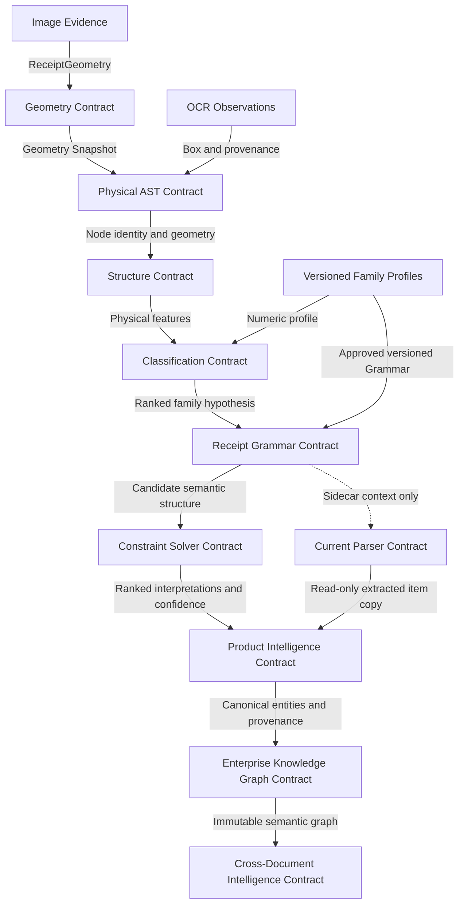

### 5.2 Contract versioning

- Every durable contract SHALL identify a schema version.
- Additive changes SHOULD preserve readers that ignore unknown fields.
- Breaking changes SHALL use a new major contract version.
- A consumer SHALL declare the versions it accepts.
- Knowledge records SHALL retain the source contract version used to derive
  them.
- Migrations SHALL be replayable and SHALL preserve provenance.

---

## 6. Immutable data flow and annotation model

The immutable pipeline protects evidentiary integrity:

```text
Source Evidence
    → Geometry Snapshot
    → Physical DOM
    → Physical Structure Annotations
    → Family Classification Hypotheses
    → Grammar Expectations and Compliance
    → Constraint Evaluations and Ranked Interpretations
    → Future Semantic Annotations
    → Future Business Conclusions
```

Each arrow means “derive a new artifact,” never “rewrite the previous artifact.”
A later layer may disagree with an earlier interpretation, but it cannot rewrite
the evidence that interpretation referenced.

### 6.1 Annotation versus mutation

An annotation:

- has its own identity, schema version, provenance, confidence, and lifecycle;
- references stable upstream node or document identifiers;
- can coexist with competing annotations;
- can be superseded without rewriting the source;
- can be audited and replayed.

Mutation:

- changes upstream state in place;
- destroys the distinction between observation and interpretation;
- makes alternate reasoning and reproduction unreliable;
- is prohibited across architectural layers.

Future semantic and business layers SHALL therefore create sidecar annotation
graphs. They SHALL NOT add merchant, product, tax, or total fields to physical
DOM nodes.

### 6.2 Data flow view

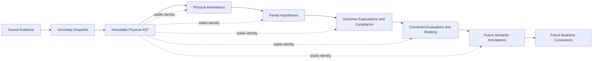

---

## 7. Knowledge architecture

Merchant Intelligence is an enterprise knowledge plane. It is not a parser, a
detection result, or a request-scoped receipt model.

### 7.1 Knowledge domains

| Knowledge domain | Architectural meaning |
|---|---|
| Merchant Blueprint | Aggregate, versioned knowledge boundary for a merchant |
| Receipt Family | Evolving family of receipts with shared observable characteristics |
| Layout Profile | Learned physical distributions and spatial tendencies |
| Visual Profile | Storage contract for visual characteristics and future recognition evidence |
| Statistics | Aggregated observations with sample count, confidence, and version |
| OCR Corrections | Known observation-to-correction evidence with provenance |
| Product Vocabulary | Known lexical forms, aliases, OCR variants, and units; not classification |
| Pattern Profiles | Versioned knowledge about recurring layouts or future semantic structures |
| Receipt Grammar | Versioned declarative sections, roles, relationships, transitions, rules, and expectations keyed by Receipt Family |
| Learning Events | Append-oriented observations and corrections awaiting or recording governance |

### 7.2 Why knowledge is data

Knowledge changes at a different rate from platform code. A receipt family may
evolve daily while the generic reasoning engine remains stable. Representing
knowledge as versioned data enables:

- correction without code deployment;
- provenance and approval;
- historical replay;
- tenant or locale variation;
- gradual confidence accumulation;
- rollback to an earlier version;
- common engines across all merchants.

Knowledge records SHALL state confidence, sample basis, version, and provenance
where those are relevant. Absence of knowledge SHALL produce uncertainty, not a
hardcoded fallback identity.

### 7.3 Knowledge flow

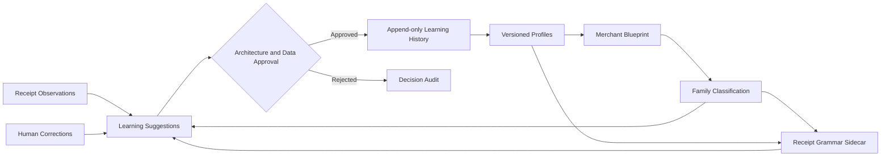

---

## 8. Why there are no merchant parsers

The target architecture intentionally prohibits patterns such as:

```python
if merchant == "Costco":
    parse_costco_receipt()
```

Merchant parsers combine identity detection, layout assumptions, extraction,
validation, and exception handling into one code branch. That creates five
systemic problems:

1. A mistaken merchant decision selects the wrong algorithm for the whole
   receipt.
2. Knowledge becomes invisible source code rather than reviewable data.
3. Every format change requires deployment and regression risk.
4. Shared behaviors are duplicated across merchant branches.
5. Learning cannot improve behavior without generating new code.

The replacement architecture separates:

- **knowledge**, which describes learned observations;
- **classification**, which ranks physical family hypotheses;
- **grammar**, which describes expected document relationships;
- **constraints**, which test consistency;
- **product intelligence**, which resolves product identity;
- **refinement**, which resolves remaining ambiguity.

A merchant-specific fact may exist in a blueprint, vocabulary, grammar, or
constraint record. It SHALL NOT become a merchant-specific executable parser.

---

## 9. Dependency and package ownership

Dependency direction follows the increasing meaning of evidence. Lower layers
MUST NOT import or depend on higher layers. Shared contracts SHALL be minimal and
owned by the layer that creates the truth they represent.

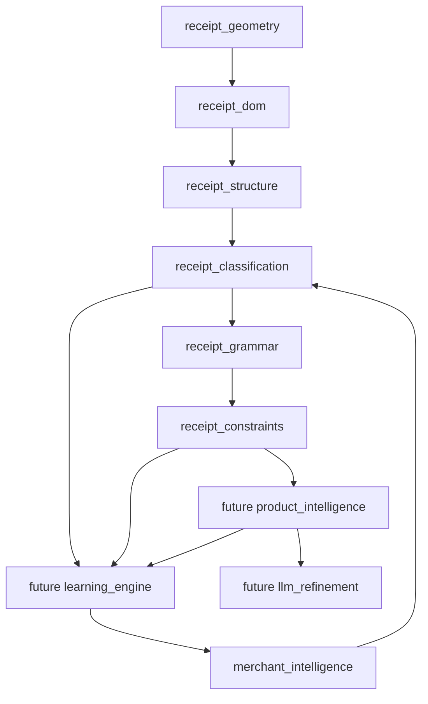

The apparent learning-to-knowledge return is a governed data flow, not a source
code dependency. Learning submits proposals through the repository contract.

### 9.1 Ownership rules

- `receipt_geometry` owns coordinate truth.
- `receipt_dom` owns the canonical physical AST and node identity.
- `receipt_structure` owns generic physical organization annotations.
- `merchant_intelligence` owns durable knowledge, versions, and approval state.
- `receipt_classification` owns physical family similarity hypotheses.
- `receipt_grammar` owns declarative semantic expectations, compilation,
  structural compliance, diagnostics, and approval-only Grammar suggestions.
- `receipt_constraints` owns deterministic constraint compilation, candidate
  evaluation, ranking, penalties, aggregate confidence, explanations, and
  approval-only constraint suggestions.
- Future `product_intelligence` owns product identity evidence.
- Future `learning_engine` owns proposals and feedback orchestration, never
  unilateral production truth.
- Future `llm_refinement` owns bounded probabilistic proposals and explanations,
  never canonical physical evidence.

---

## 10. Future architecture

### 10.1 OCR Consensus

OCR Consensus will reconcile observations from multiple OCR engines. It will
produce provenance-preserving alternatives and confidence, not overwrite source
observations. The DOM builder or a future observation layer will consume the
consensus according to a versioned contract.

It may know character and token alternatives, geometry, engine provenance, and
confidence. It must not know merchant identity or business meaning.

### 10.2 Receipt Grammar

Receipt Grammar expresses immutable, versioned expectations and relationships
for classified Receipt Families. The implemented framework compiles sections,
roles, transitions, relationships, rules, and expectations; detects invalid
definitions; measures structural compliance; and emits candidate role
expectations and approval-only suggestions.

The framework is a sidecar. It does not execute parsing, detect merchants or
products, identify business values, validate arithmetic, or change current
parser authority. The Constraint Solver consumes its compliance output only as
non-authoritative evidence; future semantic authority remains subject to parser
replacement gates.

### 10.3 Constraint Solver

The implemented Constraint Solver evaluates explicitly supplied candidate
interpretations for internal consistency. It validates and ranks without
originating physical evidence or extracted values. Constraints cover
arithmetic, structural, Grammar, ordering, relationship, transition,
cardinality, locality, confidence, knowledge, and cross-reference categories.

The solver retains rejected candidates, passes, warnings, violations,
penalties, category scores, confidence contributions, and explanations. Its
winning interpretation remains a non-authoritative sidecar decision ignored by
the current parser.

### 10.4 Product Intelligence

The implemented Product Intelligence Engine enriches a read-only copy of
authoritatively extracted line items with governed enterprise product
knowledge. It preserves the original receipt description alongside a normalized
description and optional canonical Product identity. Matching supports exact,
normalized, alias, fuzzy, merchant-specific, and historical strategies while
reserving embeddings as a future adapter.

The engine assigns extensible department, category, subcategory, brand, and
manufacturer knowledge; exposes extensible nutrition placeholders; summarizes
observed and historical pricing without forecasting; aggregates its own
confidence without overwriting upstream confidence; and explains every
enrichment and knowledge source. It never performs OCR, parses or extracts a
product, changes an extracted value, modifies upstream artifacts, or becomes
parser authority. Unmatched descriptions remain unmatched, and learning
services create approval-only suggestions.

### 10.5 Enterprise Knowledge Graph

The implemented Enterprise Knowledge Graph Framework transforms Product
Intelligence enrichments and explicit receipt context into immutable canonical
entities and evidence-bearing relationships. Its versioned Enterprise Ontology
defines entity types, relationship types, inheritance, constraints, metadata,
and governed domain extensions. Every edge records confidence, evidence,
provenance, timestamp, version, creation source, and an explanation.

The framework is storage-agnostic. Its reference repository is in memory, and
query and traversal contracts expose no database implementation. Neo4j,
Neptune, JanusGraph, Cosmos DB, or another graph store may implement the same
repository boundary without changing graph construction, ontology, validation,
or consumers. Runtime construction performs no graph persistence.

The graph is a non-authoritative sidecar. It does not parse, extract, change
Product Intelligence, mutate parser output, act as LLM memory, or become a
search engine. It establishes the normalized enterprise semantic model from
which the future Learning Engine may learn; direct learning from raw receipts
is prohibited.

### 10.6 Cross-Document Intelligence

The implemented Cross-Document Intelligence Framework correlates immutable
Enterprise Knowledge Graph entities, relationships, evidence, and independent
document references across time. It performs deterministic canonical entity
resolution, document linking, relationship and cross-domain correlation,
timeline construction, evidence aggregation, exact and bounded semantic
similarity, historical pattern detection, anomaly diagnostics, explanation,
and storage-neutral enterprise-context queries.

Its Enterprise Memory is a versioned semantic snapshot of normalized entities,
relationships, timelines, evidence, patterns, and correlations. It is not LLM
memory, graph storage, machine learning, prediction, or a source-document
repository. The runtime reads approved historical semantic memory when
available and never writes memory automatically.

Every link retains supporting documents, evidence references, source entities,
confidence, reason, timestamp, version, and provenance. Patterns are detection
only; anomalies are diagnostics only. The framework never corrects documents,
changes Business Facts, mutates the Enterprise Knowledge Graph, or influences
the current parser.

### 10.7 Learning Engine

The implemented Enterprise Learning Framework converts verified normalized
semantic evidence, cross-document confirmations, and approved human feedback
into immutable versioned proposals. Candidate generation, evidence-quality
gates, confidence calibration, conflict checks, approval states, explanations,
and append-only audit records are deterministic. It never learns from raw OCR
or parser guesses, trains a model, predicts, or activates production knowledge.

### 10.8 Enterprise Reasoning

The implemented Enterprise Reasoning Engine classifies enterprise questions,
plans deterministic tool use, retrieves approved semantic context, fuses
provenance-bearing evidence, generates and validates competing hypotheses, and
selects a non-authoritative decision with a complete execution trace. It is not
a chatbot, RAG system, prompt manager, or agent framework.

LLM synthesis is an optional registered tool after deterministic validation.
Prompts may contain only approved evidence and validated hypotheses. Raw OCR,
parser guesses, unsupported hypotheses, and unbounded LLM authority are
prohibited.

### 10.9 LLM Refinement

LLM Refinement will receive bounded evidence, candidates, constraints, and
diagnostics after deterministic reasoning. It may reconcile ambiguous
interpretations, propose explanations, or request review. It shall not receive
unbounded authority to replace evidence or bypass constraints.

### 10.10 Target architecture

```mermaid
flowchart LR
    image[Receipt Image] --> geometry[Geometry]
    image --> ocr[OCR Consensus]
    geometry --> dom[Physical DOM]
    ocr --> dom
    dom --> structure[Physical Structure]
    structure --> classification[Family Classification]
    knowledge[(Knowledge Repository)] --> classification
    classification --> grammar[Receipt Grammar]
    knowledge --> grammar
    grammar --> constraints[Constraint Solver]
    constraints --> products[Product Intelligence]
    knowledge --> products
    products --> ekg[Enterprise Knowledge Graph]
    ekg --> cdif[Cross-Document Intelligence]
    cdif --> learning[Enterprise Learning]
    learning --> reasoning[Enterprise Reasoning]
    reasoning --> refinement[LLM Refinement]
    refinement --> decision[Auditable Result]
    decision -. approved feedback .-> learning
    learning -. governed proposals .-> cdif
    cdif -. normalized semantic proposals .-> ekg
    ekg -. approved knowledge projections .-> knowledge
```

---

## 11. Extension architecture and routing rules

Every extension SHALL enter through the layer that owns its kind of truth.

| Extension | Owning layer | Required behavior | Forbidden shortcut |
|---|---|---|---|
| New OCR engine | OCR observation or future OCR Consensus | Preserve engine provenance, alternatives, geometry, and confidence | Write semantic results directly |
| New merchant | Merchant Intelligence | Add a versioned blueprint and governed knowledge | Add merchant conditional code |
| New receipt family | Merchant Intelligence | Add a family and physical/grammar profiles with version and evidence | Fork the classifier |
| New physical feature | Classification contract | Version the feature definition and profile migration | Read OCR meaning |
| New product vocabulary | Merchant Intelligence | Add versioned vocabulary with provenance | Add product parsing branch |
| New grammar | Receipt Grammar | Publish declarative expectations and compatibility version; compile and observe as a sidecar | Implement parsing, detect values, write automatically, or mutate DOM |
| New constraint | Receipt Constraint Solver | Declare candidate inputs, category, dependencies, weight, penalty, version, and explanation | Extract missing evidence, create Business Facts, or change parser behavior |
| New similarity method | Classification | Implement the strategy contract and benchmark calibration | Hardcode family names |
| New AI model | Future LLM Refinement | Operate within bounded evidence and policy contracts | Become primary extraction authority |
| New learning signal | Future Learning Engine | Create an auditable proposal with privacy and approval policy | Write production knowledge silently |

### 11.1 Extension architecture

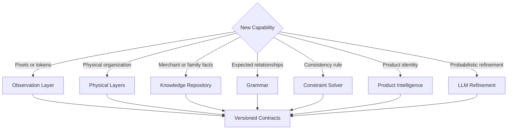

---

## 12. Mandatory architecture rules

| Rule | Requirement |
|---|---|
| AR-001 | Geometry SHALL contain no business semantics. |
| AR-002 | The Receipt DOM SHALL remain the canonical immutable physical AST. |
| AR-003 | DOM node identities SHALL remain stable for the document lifecycle. |
| AR-004 | Future engines SHALL annotate the DOM; they SHALL NOT replace or semantically mutate it. |
| AR-005 | Physical Structure SHALL classify layout only, never business roles. |
| AR-006 | Merchant Intelligence SHALL contain knowledge, not executable parser logic. |
| AR-007 | No generic engine SHALL branch on a hardcoded merchant or family name. |
| AR-008 | Receipt classification SHALL rank families, not assert merchant identity. |
| AR-009 | Grammar SHALL define expectations, not execute OCR or imperative parsing. |
| AR-010 | The Constraint Solver SHALL validate candidates, not fabricate evidence. |
| AR-011 | Learning SHALL propose or update governed metadata, not source code. |
| AR-012 | Production knowledge changes SHALL be versioned, traceable, and reversible. |
| AR-013 | Confidence SHALL identify contributing evidence categories and coverage. |
| AR-014 | LLM output SHALL be treated as an annotation or proposal until validated. |
| AR-015 | Existing extraction behavior SHALL change only through an explicit migration decision. |
| AR-016 | Lower architectural layers SHALL NOT depend on higher semantic layers. |
| AR-017 | Missing knowledge SHALL result in uncertainty, not invented identity. |
| AR-018 | Every conclusion SHALL be traceable to source evidence and processing versions. |
| AR-019 | Debug and sidecar artifacts SHALL NOT influence runtime decisions implicitly. |
| AR-020 | Privacy and retention controls SHALL apply to source, derived, and learning artifacts. |
| AR-021 | Receipt Grammar SHALL remain declarative, versioned, immutable, and non-authoritative until a governed migration grants a downstream contract authority. |
| AR-022 | Receipt Constraint Solver SHALL evaluate immutable supplied hypotheses only and SHALL NOT extract values, generate Business Facts, or influence the current parser implicitly. |
| AR-023 | Product Intelligence SHALL preserve every extracted description and value, add only explainable versioned enrichment, and SHALL NOT mutate parser output or activate learned Product Knowledge without approval. |
| AR-024 | Enterprise Knowledge Graph SHALL be storage-agnostic, preserve evidence and provenance for every relationship, remain non-authoritative, and SHALL be the normalized semantic input boundary for future Learning rather than raw receipts. |
| AR-025 | Cross-Document Intelligence SHALL correlate only supported normalized semantic evidence, preserve every source document reference, remain deterministic and non-authoritative, and SHALL NOT predict, correct sources, act as LLM memory, or write semantic memory automatically. |
| AR-026 | Enterprise Learning SHALL consume only verified normalized semantic evidence or approved feedback, produce immutable pending proposals and audit records, preserve confidence history, and SHALL NOT consume raw OCR or parser guesses, train models, predict, auto-approve, or modify production knowledge. |
| AR-027 | Enterprise Reasoning SHALL orchestrate deterministic evidence before optional LLM synthesis, preserve tool and provenance traces, validate competing hypotheses, remain non-authoritative, and SHALL NOT expose raw OCR or parser guesses to reasoning tools or permit an LLM to bypass enterprise evidence. |

---

## 13. Architectural Decision Records

These records capture the decisions that establish the current architecture.
Future records SHALL be added here or referenced from this section without
renumbering prior decisions.

### ADR-001 — The Receipt DOM is an immutable physical AST

**Status:** Accepted

**Context:** OCR arrays lack durable identity, hierarchy, and relationships.
Business DTOs collapse evidence into one interpretation.

**Decision:** Use an immutable, identity-bearing physical AST as the canonical
in-memory representation.

**Consequences:** Engines can share evidence, annotations can coexist, and
reprocessing is reproducible. Builders and serializers must preserve identity
and provenance.

### ADR-002 — New architecture enters as sidecars

**Status:** Accepted

**Context:** Existing extraction behavior is production-sensitive and cannot be
replaced safely in one step.

**Decision:** Geometry, DOM, structure, knowledge context, and classification
are integrated as request-scoped sidecars before receiving extraction authority.

**Consequences:** Compatibility is preserved and comparisons are measurable.
Sidecars must fail open and remain excluded from existing scoring.

### ADR-003 — Merchant behavior is metadata-driven

**Status:** Accepted

**Context:** Merchant-specific parsers duplicate logic and require deployments
for routine knowledge changes.

**Decision:** Store merchant variation in versioned data consumed by generic
engines.

**Consequences:** Knowledge requires governance, migrations, provenance, and
quality controls. Source code remains merchant-independent.

### ADR-004 — Merchant Blueprint is the knowledge aggregate

**Status:** Accepted

**Context:** Aliases, families, layouts, vocabularies, statistics, and learning
history require a common lifecycle and ownership boundary.

**Decision:** Group merchant-associated knowledge beneath a versioned Blueprint
while allowing multiple receipt families.

**Consequences:** A blueprint is not a detection result. Consumers must request
or receive it explicitly and respect record versions.

### ADR-005 — Receipt family classification precedes merchant detection

**Status:** Accepted

**Context:** Physical family resemblance is useful evidence but insufficient to
establish merchant identity.

**Decision:** Rank receipt families from physical features before any future
merchant detection phase.

**Consequences:** Classification stays text-independent and produces
hypotheses. Future detection must combine, not conflate, independent evidence.

### ADR-006 — LLM refinement occurs last

**Status:** Accepted

**Context:** LLMs are strong at ambiguity resolution but can be nondeterministic
and difficult to audit as primary extractors.

**Decision:** Apply deterministic physical, grammar, and constraint reasoning
before bounded LLM refinement.

**Consequences:** LLM prompts receive structured evidence and constraints.
Outputs remain traceable proposals and cannot overwrite the AST.

### ADR-007 — Learning suggestions require approval

**Status:** Accepted

**Context:** Automatic profile updates risk feedback loops and knowledge
poisoning.

**Decision:** Runtime engines emit learning suggestions; production knowledge is
updated only through governed approval.

**Consequences:** The platform needs review policy, provenance, thresholds, and
append-oriented history.

### ADR-008 — Replace the parser progressively

**Status:** Accepted

**Context:** The current parser carries validated behavior while the target
grammar and constraint architecture is incomplete.

**Decision:** Establish shadow evaluation, parity gates, bounded authority, and
reversible cutover by output domain.

**Consequences:** New merchant-specific logic is prohibited in the legacy
parser. Retirement depends on evidence, not schedule alone.

---

## 14. Evolution strategy

The order of evolution is deliberate. A later phase depends on the evidence
integrity and contracts established by earlier phases.

### Phase 1 — Physical foundation

**Capabilities:** Geometry, Receipt DOM, Physical Structure.

**Architectural outcome:** One coordinate truth, one canonical physical AST, and
generic layout annotations.

**Why first:** Semantic reasoning cannot be reliable if physical evidence is
unstable, duplicated, or tied to OCR order.

### Phase 2 — Knowledge and physical classification

**Capabilities:** Merchant Intelligence Repository and Receipt Family
Classification.

**Architectural outcome:** Versioned knowledge replaces hardcoded merchant
behavior, and physical similarity becomes an explainable ranked hypothesis.

**Why second:** Detection and grammar need durable knowledge. Classification
must remain independent from semantic meaning to provide clean evidence.

### Phase 3 — Semantic expectations

**Capabilities:** Merchant detection evidence, Receipt Grammar, and OCR
Consensus.

**Architectural outcome:** The Receipt Grammar Framework is implemented as the
first Phase 3 sidecar. It compiles declarative expectations and reports
structural compliance and candidate roles. Merchant detection evidence, OCR
Consensus, and authoritative semantic consumption remain future work.

**Entry criteria:** stable physical contracts, representative family profiles,
and measurable classification calibration.

### Phase 4 — Consistency and domain intelligence

**Capabilities:** Constraint Solver and Product Intelligence.

**Architectural outcome:** The Constraint Solver Framework is implemented as a
deterministic sidecar that ranks supplied interpretations through arithmetic,
structural, Grammar, ordering, relationship, transition, cardinality, locality,
confidence, knowledge, and cross-reference constraints. Product Intelligence is
implemented as the next non-authoritative enrichment sidecar. Authoritative
interpretation consumption and Business Fact publication remain future work.

**Entry criteria:** semantic candidates retain provenance and grammar is
declarative rather than embedded in parsers.

### Phase 5 — Enterprise semantic backbone

**Capabilities:** Enterprise Knowledge Graph, Enterprise Ontology, semantic
validation, explainable relationships, and storage-agnostic traversal.

**Architectural outcome:** Product enrichments become reusable canonical
entities and provenance-bearing relationships without graph persistence,
parser feedback, or database coupling.

**Entry criteria:** canonical Product identities and enrichment provenance are
stable, versioned, and explicitly non-authoritative.

### Phase 6 — Longitudinal enterprise context

**Capabilities:** Cross-Document Intelligence, deterministic Enterprise Memory,
entity resolution, timelines, correlations, evidence aggregation, pattern
detection, anomaly diagnostics, and storage-neutral context queries.

**Architectural outcome:** Independent document graphs become explainable
longitudinal context without source mutation, prediction, machine learning, or
LLM memory.

**Entry criteria:** Enterprise Graph identities, relationship evidence,
ontology versions, and document references are stable and provenance-bearing.

### Phase 7 — Governed learning and refinement

**Capabilities:** implemented Enterprise Learning Framework, future LLM
Refinement, and progressive parser retirement.

**Architectural outcome:** Approved feedback improves data-driven behavior,
while AI resolves residual ambiguity within deterministic guardrails.

**Entry criteria:** audit trails, privacy controls, offline evaluation, rollback,
and domain-by-domain parity with current extraction.

### 14.1 Evolution roadmap


### 14.2 Roadmap Status Summary

| Capability | Status | Architecture phase |
|---|---|---|
| Geometry | ✅ Complete | Phase 1 |
| Receipt DOM | ✅ Complete | Phase 1 |
| Physical Structure | ✅ Complete | Phase 1 |
| Merchant Knowledge | ✅ Complete | Phase 2 |
| Receipt Classification | ✅ Complete | Phase 2 |
| Receipt Grammar | ✅ Complete | Phase 3 |
| Constraint Solver | ✅ Complete | Phase 4 |
| Product Intelligence | ✅ Complete | Phase 4 |
| Enterprise Knowledge Graph | ✅ Complete | Phase 5 |
| Cross-Document Intelligence | ✅ Complete | Phase 6 |
| Enterprise Learning | ✅ Complete | Phase 7 |
| Enterprise Reasoning | ✅ Complete | Phase 7 |
| LLM Refinement | 🔄 Next | Phase 7 |
| Predictive Analytics | ⬜ Planned | Phase 7+ |
| Autonomous AI Agents | ⬜ Planned | Phase 7+ |

“Complete” identifies an implemented architecture layer, not the end of
operational improvement. “Next” identifies the next governed implementation
phase. “Planned” identifies a target capability that is not yet authoritative.
OCR Consensus and merchant detection remain separately governed future
capabilities described in Sections 10 and 14; they are not prerequisites for
the next governed Learning Engine phase.

### 14.3 Parser replacement gates

Parser authority SHALL move only when all of the following are demonstrated for
the affected output domain:

- representative offline evaluation;
- no material regression against the production baseline;
- evidence-level explainability;
- contract and schema compatibility;
- monitored shadow operation;
- reversible rollout;
- human-review behavior for uncertain cases;
- architecture approval.

---

## 15. Learning flow and governance

Learning is a controlled lifecycle, not a direct write from inference to truth.

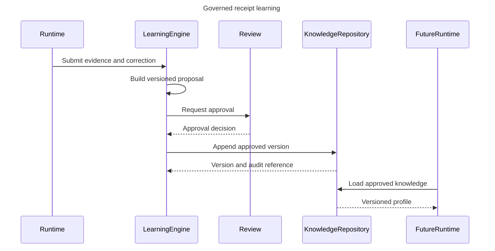

### 15.1 Learning controls

- Training and inference data SHALL retain lawful provenance.
- Sensitive source evidence SHOULD be minimized in durable knowledge.
- A proposal SHALL record the source document, model and contract versions,
  confidence, and approval decision where policy permits.
- Rejected proposals SHALL remain auditable without contaminating active
  profiles.
- Rollback SHALL restore a prior knowledge version without code deployment.
- Automated approval MAY be introduced only for narrowly bounded, measured,
  reversible change classes.

---

## 16. Quality attributes

### 16.1 Scalability

Receipt processing SHOULD scale by independent stage execution and immutable
artifacts. Stateless engines may be replicated. Knowledge reads should support
caching by immutable version. Learning writes are separated from request-time
classification to prevent contention and feedback loops.

### 16.2 Maintainability

Single-purpose layers and explicit contracts localize change. Merchant
variations belong in data. Mandatory ADRs prevent accidental boundary erosion.
The current parser is isolated as a compatibility concern.

### 16.3 Extensibility

New engines implement stable contracts; new merchants and families add knowledge
records. Strategy extension points permit new similarity, grammar, constraint,
OCR, or AI techniques without replacing the canonical evidence model.

### 16.4 Explainability

Every hypothesis and conclusion should identify its source nodes, knowledge
versions, contributing evidence, confidence components, and rejected
alternatives. Explanation is a first-class output, not a debug afterthought.

### 16.5 Auditability

Immutable source references, versioned artifacts, append-oriented learning
history, and ADR traceability SHALL support reproduction of a decision from its
inputs and processing versions.

### 16.6 Privacy

Source images, OCR observations, product vocabularies, and correction events may
contain sensitive information. Data minimization, purpose limitation, access
control, retention, deletion, and jurisdictional policy SHALL apply across both
evidence and knowledge planes. Learning SHALL not turn transaction-specific
content into durable shared knowledge without an approved basis.

### 16.7 Offline capability

Core geometry, DOM construction, physical structure, profile comparison,
grammar, and constraints SHOULD support local deterministic execution. Remote
AI and remote knowledge access may enhance results but SHALL have defined
degraded modes.

### 16.8 Deterministic behavior

Given the same source, configuration, knowledge versions, and deterministic
engine versions, the platform SHOULD reproduce the same pre-LLM artifacts and
decisions. Sources of nondeterminism SHALL be identified in diagnostics.

### 16.9 Learning capability

The architecture supports incremental improvement through statistics,
vocabularies, profile distributions, grammars, and constraints. Learning quality
is measured by approved outcomes and held-out evaluation, not merely by the
volume of observations.

### 16.10 Reliability and resilience

Infrastructure sidecars SHALL fail open while the current parser remains
authoritative. Future authoritative stages SHALL define timeouts, retries,
idempotency, degraded behavior, and human-review thresholds.

---

## 17. Architecture conformance

A design is conformant only if it can answer:

1. Which layer owns the new information?
2. Is the information observation, annotation, hypothesis, knowledge, or
   conclusion?
3. Which stable identities and versions establish provenance?
4. Does the change preserve upstream immutability?
5. Is merchant variation represented as data?
6. Can confidence and rejection reasons be explained?
7. Can the change be replayed, audited, and rolled back?
8. Does it preserve current extraction behavior unless migration authority has
   explicitly changed?
9. Does it introduce a new cross-layer dependency?
10. Which ADR authorizes any deviation from these rules?

Architecture review SHALL reject changes that cannot answer these questions.

---

## 18. Living-document governance

This is the single authoritative enterprise architecture specification for the
Receipt Intelligence Platform.

### 18.1 Update policy

- The 1.0 architecture baseline is frozen. It SHALL change only for a major
  architecture phase, a new or superseding ADR, a material architecture
  contract change, or a correction that preserves architectural intent.
- Every major phase SHALL update this document in the same change set.
- Existing decisions SHALL not be silently rewritten. Superseded decisions
  SHALL retain their history and reference the replacing ADR.
- New layers SHALL receive purpose, input, output, responsibility, allowed
  knowledge, prohibited knowledge, contract, ownership, and quality sections.
- Diagrams SHALL be updated when a boundary, dependency, authority, or knowledge
  flow changes.
- Implementation-only changes that do not affect an architectural contract do
  not require a specification update.

### 18.2 Required change record

Each material update SHALL add:

| Field | Requirement |
|---|---|
| Date | UTC effective date |
| Architecture phase | Phase affected |
| Decision reference | New or superseding ADR |
| Contract impact | Added, additive, breaking, or none |
| Migration impact | Compatibility and rollback statement |
| Reviewer | Architecture approval identity |

### 18.3 Change history

| Date | Phase | Change | Decision references |
|---|---|---|---|
| 2026-07-27 | Phases 1–2 baseline | Established enterprise architecture constitution for physical evidence, knowledge, family classification, and future evolution | ADR-001 through ADR-008 |
| 2026-07-27 | Version 1.0 finalization | Consolidated enterprise repository artifacts, added version and roadmap status summaries, declared deferred scope, and froze the architecture baseline without changing architectural intent | ADR-001 through ADR-008 unchanged |
| 2026-07-27 | Phase 3 Receipt Grammar sidecar | Implemented immutable Grammar models, compilation, repository lifecycle, structural compliance, approval-only learning suggestions, orchestration diagnostics, and developer visualization without changing parser authority | ADR-002, ADR-003, ADR-005, ADR-007, and ADR-008 applied; no ADR changed |
| 2026-07-27 | Phase 4 Constraint Solver sidecar | Implemented immutable constraint models, compilation, family/version repository lifecycle, deterministic candidate evaluation and ranking, arithmetic and structural validation, Grammar consumption, explanations, confidence aggregation, approval-only suggestions, and developer visualization without changing parser authority | ADR-002, ADR-006, ADR-007, and ADR-008 applied; no ADR changed |
| 2026-07-27 | Phase 4 Product Intelligence sidecar | Implemented immutable canonical Product models, governed repository versioning, description normalization, exact/normalized/alias/fuzzy/merchant/historical matching, taxonomy, brand, nutrition and pricing interfaces, confidence, explanations, approval-only suggestions, and developer visualization without replacing extracted items | ADR-002, ADR-007, and ADR-008 applied; AR-023 added; no ADR changed |
| 2026-07-27 | Phase 5 Enterprise Knowledge Graph sidecar | Implemented immutable semantic nodes and relationships, extensible ontology, storage-agnostic in-memory repository contract, graph construction, validation, traversal and domain queries, additive confidence, provenance, explanations, approval-only suggestions, and developer visualization without persistence or parser feedback | ADR-002, ADR-007, and ADR-008 applied; AR-024 added; no ADR changed |
| 2026-07-27 | Phase 6 Cross-Document Intelligence sidecar | Implemented immutable longitudinal context, canonical entity resolution, document linking, timelines, correlations, evidence, similarity, pattern and anomaly diagnostics, deterministic semantic memory, storage-neutral queries, explanations, versioned repository contracts, approval-only suggestions, and developer visualization without document, graph, or parser mutation | ADR-002, ADR-007, and ADR-008 applied; AR-025 added; no ADR changed |
| 2026-07-27 | Phase 7 Enterprise Learning sidecar | Implemented immutable learning events, candidates, evidence, proposals, approvals, decisions, quality, confidence history, governance, audit, explanations, storage-neutral repository contracts, and developer visualization; runtime creates pending proposals only and never mutates production knowledge or parser behavior | ADR-002, ADR-007, and ADR-008 applied; AR-026 added; no ADR changed |
| 2026-07-27 | Phase 7 Enterprise Reasoning sidecar | Implemented immutable requests, plans, steps, evidence, hypotheses, decisions, confidence, explanations, sessions and traces; deterministic tool planning, parallel retrieval, graph traversal, evidence fusion, validation, provenance, optional bounded LLM synthesis, diagnostics, and developer visualization without changing extraction or parser authority | ADR-002, ADR-006, ADR-007, and ADR-008 applied; AR-027 added; no ADR changed |

---

## 19. Architecture summary

The platform's constitutional boundary is simple:

> Geometry knows the page. The DOM knows what physically exists. Structure knows
> how it is arranged. Knowledge knows what has been learned. Classification knows
> what physical families are plausible. Grammar will know what relationships are
> expected. Constraints will know what is consistent. Product Intelligence will
> know product identity. Learning will know how approved evidence changes
> knowledge. LLM refinement will resolve bounded ambiguity. No layer may claim
> another layer's authority.

That separation is the foundation for a platform that can improve continuously
without sacrificing compatibility, explainability, or architectural integrity.

---

## 20. Business Capability Model

The Business Capability Model defines what the Receipt Intelligence Platform
must be able to do, independently of its organization, implementation
technology, or deployment topology. Capabilities remain stable while the
components, algorithms, and enterprise integrations that realize them evolve.

### 20.1 Business capability map

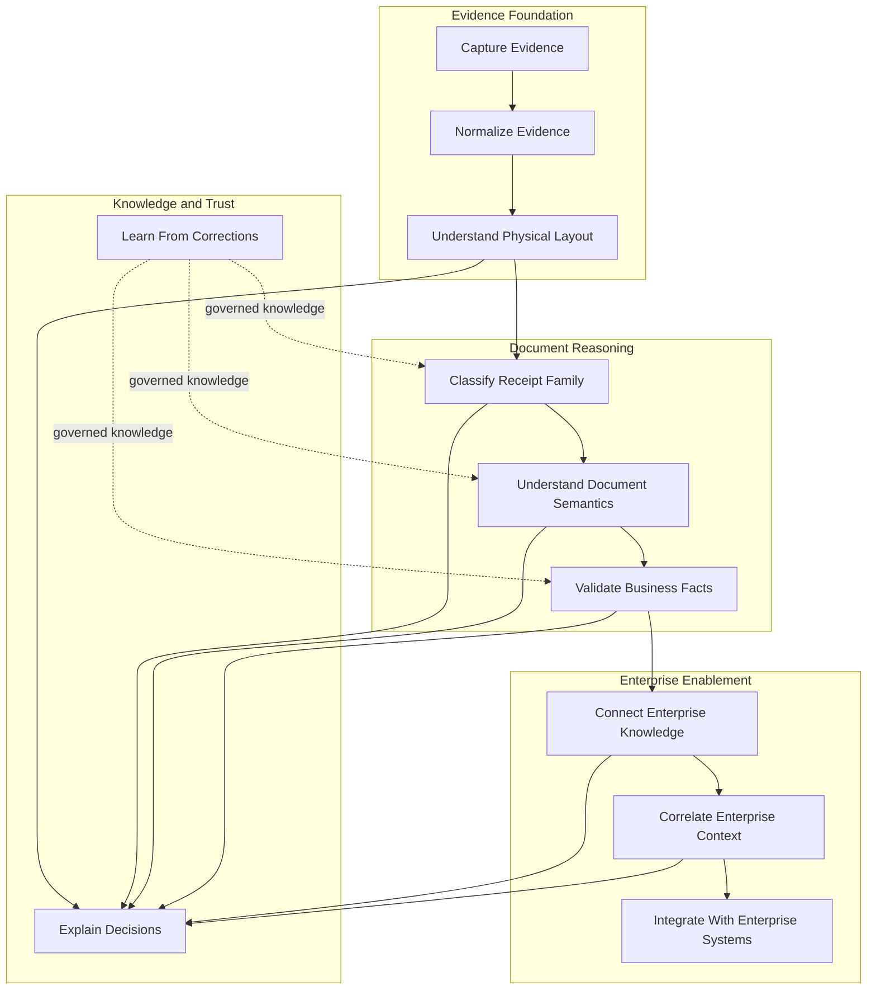

### 20.2 Capability definitions

| Business capability | Purpose | Business outcome | Supporting architecture layers | Primary inputs | Primary outputs |
|---|---|---|---|---|---|
| Capture Evidence | Accept receipt images and related submission context through governed enterprise channels. | Reliable, secure, and traceable receipt intake across interactive and batch use cases. | Enterprise ingress; Receipt API; Receipt Image boundary | Images, submission metadata, channel identity, tenant and policy context | Receipt identity, immutable Receipt Image reference, intake provenance |
| Normalize Evidence | Establish coordinate truth and reconcile source observations into consistent physical evidence. | Downstream engines reason over a stable, comparable representation rather than provider-specific coordinates. | Geometry; future OCR Consensus; provenance contracts | Receipt Image, OCR observations, page dimensions, orientation and quality signals | Geometry, normalized observations, confidence, source lineage |
| Understand Physical Layout | Represent what physically exists and infer generic document structure without assigning business meaning. | Layout understanding is reusable across merchants, receipt families, and future document types. | Receipt DOM; Physical Structure Engine | Geometry, observed text, regions, lines, tokens, spatial relationships | Immutable Receipt Document, Physical Structure, structural annotations |
| Classify Receipt Family | Determine the most plausible learned receipt family from physical characteristics and approved knowledge. | The platform selects relevant expectations without hardcoded merchant parsers. | Enterprise Knowledge Repository through its current Merchant Intelligence Repository implementation; Receipt Classification Engine | Physical Structure, Receipt DOM, approved Merchant Blueprints, family profiles | Ranked Receipt Family hypotheses, confidence, evidence contribution |
| Understand Document Semantics | Apply declarative knowledge and grammar to form candidate business interpretations. | Business roles and relationships are identified without contaminating physical evidence. | Knowledge; Receipt Grammar; Receipt Constraint Solver; Product Intelligence | Physical evidence, family hypotheses, Merchant Blueprint, Grammar | Semantic annotations, candidate entities, candidate relationships, hypotheses |
| Validate Business Facts | Evaluate candidates against deterministic constraints and domain consistency rules. | Accepted facts are internally consistent, auditable, and fit for enterprise use. | Implemented `receipt_constraints` and `product_intelligence` sidecars; future business-fact boundary | Hypotheses, Grammar, Constraints, product knowledge, totals and arithmetic evidence | Non-authoritative ranked and enriched interpretations today; future validated Business Facts after authority gates |
| Connect Enterprise Knowledge | Normalize canonical semantic identities and evidence-bearing relationships across documents and domains. | Receipts, products, merchants, and future enterprise domains share a reusable explainable semantic backbone. | Enterprise Knowledge Graph; Enterprise Ontology; graph validation and storage-neutral query contracts | Product Intelligence, canonical entities, explicit receipt and merchant context, provenance and confidence | Immutable graph nodes, relationships, subgraphs, query results, explanations |
| Correlate Enterprise Context | Resolve and correlate canonical entities, evidence, relationships, and events across documents and time. | Isolated documents become explainable longitudinal enterprise memory without source mutation or prediction. | Cross-Document Intelligence; deterministic Enterprise Memory; timeline, correlation, evidence, pattern, anomaly, and query engines | Enterprise Graph snapshots, approved historical semantic memory, document references, evidence and confidence | Resolved entities, linked documents, timelines, evidence, correlations, similarities, patterns, anomaly diagnostics, explanations |
| Learn From Corrections | Convert reviewed semantic outcomes into governed knowledge proposals. | Accuracy improves without introducing uncontrolled self-modification or executable merchant logic. | Enterprise Knowledge Graph; Cross-Document Intelligence; Enterprise Learning Framework; governance workflow | Verified normalized semantic evidence, approved human feedback, review decisions, repeated confirmations | Immutable Learning Events, pending proposals, approval decisions, confidence history, explanations, and audit records |
| Explain Decisions | Preserve the evidence, knowledge, versions, confidence, tools, hypotheses, and reasoning behind every material conclusion. | Operators, reviewers, auditors, and consuming systems can understand and challenge results. | Enterprise Reasoning Engine; cross-cutting provenance; diagnostics; Debug UI; optional LLM synthesis | Approved semantic stage outputs, knowledge versions, constraint results, graph and longitudinal context, governed learning evidence | Reasoning plan, evidence fusion, validated and rejected hypotheses, decision, tool trace, confidence, explanation, provenance |
| Integrate With Enterprise Systems | Exchange governed receipt facts and processing status with enterprise applications. | Receipt intelligence becomes usable by operational, financial, analytical, and AI-enabled workflows. | Receipt API; enterprise adapters; current parser compatibility boundary | Submissions, processing commands, validated Business Facts, integration policy | Versioned API responses, events, ERP and accounting records, analytics feeds |

### 20.3 Capability governance

- Capability ownership SHALL be independent of individual components and
  vendors.
- Every material platform investment SHALL identify the capability outcome it
  advances.
- A component MAY support several capabilities, but its architecture layer
  ownership and dependency direction SHALL remain unambiguous.
- New capabilities that change authority, information ownership, or trust
  boundaries require architecture review and an ADR.

---

## 21. Capability Traceability Matrix

Capability traceability connects business intent to architecture realization,
governing decisions, and planned evolution. The matrix is the primary review
instrument for proving that implementation work conforms to the target
architecture.

| Business capability | Architecture layer | Implementation package or boundary | Governing Architecture Decision Record | Future roadmap phase |
|---|---|---|---|---|
| Capture Evidence | Enterprise ingress and Receipt Image boundary | Receipt API | ADR-002 — New architecture enters as sidecars | Phase 1 foundation; continuous enterprise integration |
| Normalize Evidence | Geometry and observation normalization | `receipt_geometry`; future `ocr_consensus` | ADR-001 — The Receipt DOM is an immutable physical AST; ADR-002 | Phase 1; OCR Consensus expansion in Phase 3 |
| Understand Physical Layout | Receipt DOM and Physical Structure | `receipt_dom`; `receipt_structure` | ADR-001; ADR-002 | Phase 1 — Physical foundation |
| Classify Receipt Family | Knowledge and Classification | `merchant_intelligence`; `receipt_classification` | ADR-003 — Merchant behavior is metadata-driven; ADR-004 — Merchant Blueprint is the knowledge aggregate; ADR-005 — Receipt family classification precedes merchant detection; ADR-007 — Learning suggestions require approval | Phase 2 — Knowledge and physical classification |
| Understand Document Semantics | Semantic expectations and interpretation | `receipt_grammar` sidecar; future `merchant_detection`; future authoritative semantic interpretation | ADR-002; ADR-003; ADR-004; ADR-005; ADR-007; ADR-008 | Phase 3 — Grammar framework implemented; semantic authority remains future |
| Validate Business Facts | Deterministic validation and domain intelligence | `receipt_constraints` and `product_intelligence` sidecars; future authoritative Business Fact boundary | ADR-002; ADR-006 — LLM refinement occurs last; ADR-007; ADR-008 — Replace the parser progressively | Phase 4 — Constraint and Product Intelligence frameworks implemented; Business Fact authority remains future |
| Connect Enterprise Knowledge | Enterprise semantic graph and ontology | `enterprise_graph`; storage-agnostic repository and query contracts | ADR-002; ADR-007; ADR-008; AR-024 | Phase 5 — Enterprise Knowledge Graph framework implemented |
| Correlate Enterprise Context | Longitudinal context and deterministic semantic memory | `cross_document_intelligence`; storage-neutral memory repository and query contracts | ADR-002; ADR-007; ADR-008; AR-024; AR-025 | Phase 6 — Cross-Document Intelligence implemented |
| Learn From Corrections | Knowledge governance and learning | `cross_document_intelligence`; `enterprise_graph`; `merchant_intelligence`; future `learning_engine` | ADR-003; ADR-004; ADR-007; AR-024; AR-025 | Phase 2 foundation; Phase 7 governed authority over normalized longitudinal semantics |
| Explain Decisions | Cross-cutting provenance, diagnostics, graph and longitudinal evidence, and bounded refinement | diagnostic contracts; `enterprise_graph`; `cross_document_intelligence`; Debug UI; future `llm_refinement` | ADR-001; ADR-006; ADR-007 | All phases; longitudinal context implemented in Phase 6; refinement matures in Phase 7 |
| Integrate With Enterprise Systems | Enterprise API and compatibility | Receipt API; current parser boundary; future enterprise adapters | ADR-002; ADR-008 | All phases; progressive authority migration |

The Architecture Review Board SHALL use this traceability in both directions:
a roadmap initiative must trace to a recognized capability and ADR, and a
capability gap must trace to an owned layer, an implementation boundary, and a
governed roadmap decision.

---

## 22. Enterprise Context View

The Receipt Intelligence Platform is an enterprise system of intelligence
between evidence-producing channels and systems that consume governed business
facts. It accepts receipt evidence from interactive and batch sources, uses
external or local intelligence providers behind controlled boundaries, and
publishes explainable results to operational and analytical systems.

### 22.1 C4 Level 1 enterprise context

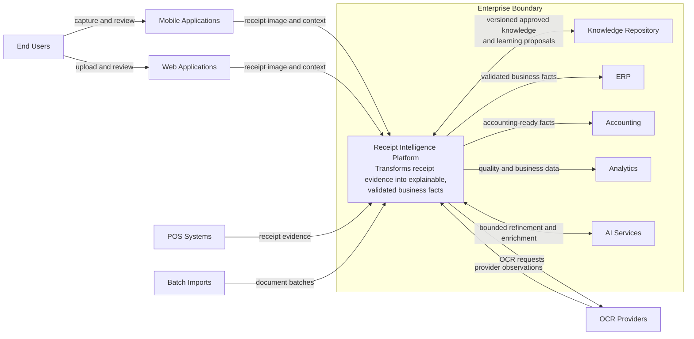

### 22.2 Enterprise actors and responsibilities

| Actor or system | Relationship to the platform |
|---|---|
| End Users | Capture receipts, review uncertain results, and submit corrections through authorized applications. |
| Mobile Applications | Provide interactive image capture, submission status, and review experiences. |
| Web Applications | Provide upload, operational review, administration, and authorized diagnostics. |
| POS Systems | Supply receipt evidence and transaction context through governed integrations. |
| Batch Imports | Submit resumable, idempotent collections from enterprise archives or partner feeds. |
| OCR Providers | Produce source observations; they do not own coordinate truth, semantics, or Business Facts. |
| Knowledge Repository | Owns versioned Merchant Blueprints, Receipt Families, Grammar, Constraints, and governed learning history. |
| ERP | Consumes validated facts for enterprise operational processes. |
| Accounting | Consumes accounting-relevant facts under explicit contracts and confidence policy. |
| Analytics | Consumes privacy-controlled operational, quality, and business measures. |
| AI Services | Provide bounded refinement or enrichment after deterministic evidence and validation controls. |

All external relationships SHALL use explicit, versioned contracts. No
neighboring system may mutate the Receipt DOM or bypass the governed progression
from evidence to Business Facts.

---

## 23. Container Architecture

The container architecture identifies deployable or independently governed
runtime boundaries. A logical architecture component does not have to be a
separate process immediately, but it SHALL preserve its ownership, contract,
and dependency rules when deployed with other components.

### 23.1 C4 Level 2 container view

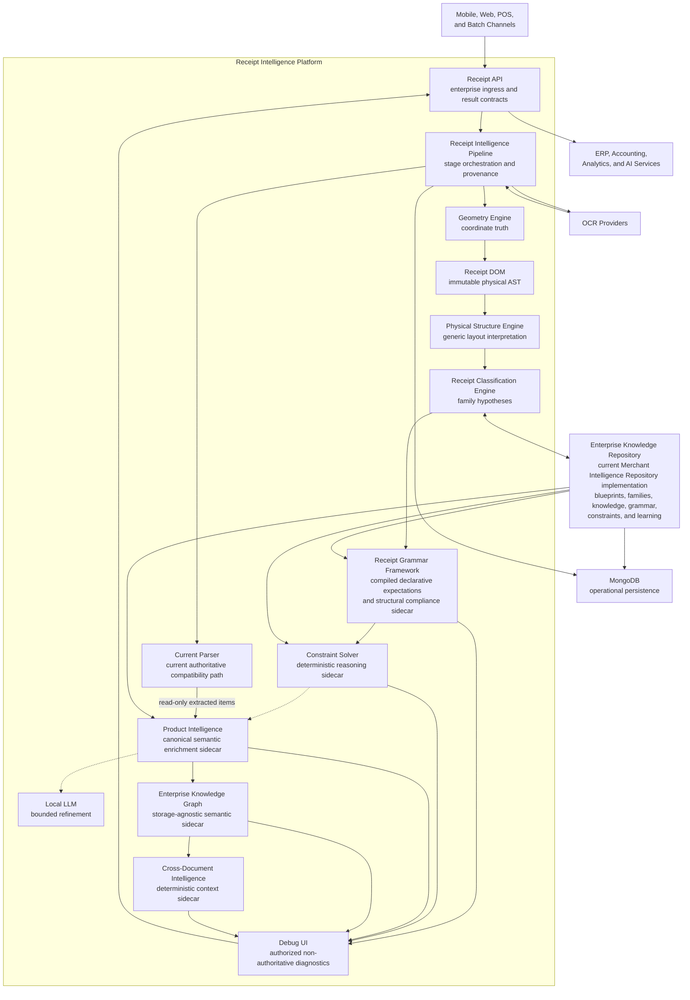

### 23.2 Container responsibilities

| Container | Architectural responsibility |
|---|---|
| Receipt API | Authenticates enterprise callers, establishes request identity, accepts submissions, reports status, and publishes versioned results. |
| Receipt Intelligence Pipeline | Orchestrates stages, preserves correlation and provenance, applies time budgets, and controls current versus future authority. |
| Geometry Engine | Establishes page geometry, coordinate normalization, orientation, and geometric confidence. |
| Receipt DOM | Publishes the canonical immutable physical AST and stable identities referenced by additive annotations. |
| Physical Structure Engine | Derives generic regions, reading relationships, rows, groups, and layout characteristics without business semantics. |
| Enterprise Knowledge Repository | Governs Merchant Blueprints, Receipt Families, approved Knowledge, Grammar, Constraints, and Learning Events. Its current receipt-domain implementation is the Merchant Intelligence Repository. |
| Receipt Classification Engine | Produces evidence-backed, ranked Receipt Family hypotheses from physical characteristics and approved knowledge. |
| Current Parser | Retains current authoritative extraction behavior until parser replacement gates are satisfied. |
| Debug UI | Exposes authorized evidence, provenance, comparisons, and diagnostics; it is never a source of runtime authority. |
| MongoDB | Persists operational artifacts with explicit schema, lifecycle, tenant, retention, and version semantics. |
| OCR Providers | Produce untrusted source observations behind provider adapters and policy controls. |
| Local LLM | Performs bounded, late refinement without overriding evidence or deterministic validation. |
| Receipt Grammar Framework | Loads approved Grammar by classified Receipt Family, compiles declarative definitions, measures structural compliance, and emits candidate role expectations and approval-only suggestions as a sidecar. |
| Receipt Constraint Solver | Compiles versioned deterministic Constraints, evaluates and ranks immutable candidate interpretations, aggregates confidence, and explains every decision as a non-authoritative sidecar. |
| Product Intelligence | Preserves extracted descriptions and adds versioned canonical Product candidates, taxonomy, brand, nutrition and pricing context, confidence, explanations, diagnostics, and approval-only suggestions. |
| Enterprise Knowledge Graph | Builds an immutable request-scoped semantic graph from canonical enrichments using the versioned Enterprise Ontology; validates and explains relationships and exposes storage-neutral queries without runtime persistence. |
| Cross-Document Intelligence | Resolves canonical entities and correlates immutable graph evidence across independent documents and time; produces deterministic memory, timelines, patterns, anomaly diagnostics, and explanations without modifying sources or writing runtime memory. |
| Enterprise Learning | Converts verified semantic evidence and approved feedback into governed pending proposals, confidence history, explanations, and immutable audit facts without production activation. |
| Enterprise Reasoning | Plans and orchestrates deterministic enterprise tools, fuses traceable evidence, validates competing hypotheses, selects explainable non-authoritative decisions, and optionally invokes bounded LLM synthesis after validation. |

### 23.3 Container evolution rules

- New containers enter as observable sidecars before receiving authority.
- Receipt Grammar is implemented as an observable sidecar and is ignored by
  the current parser.
- Receipt Constraint Solver is implemented as an observable sidecar and its
  ranked interpretation is ignored by the current parser.
- Product Intelligence is implemented as an observable sidecar. It consumes a
  copied view of extracted items and cannot replace parser output.
- Enterprise Knowledge Graph is implemented as an observable, storage-agnostic
  sidecar. It performs no graph-database writes and cannot feed parser behavior.
- Cross-Document Intelligence is implemented as an observable deterministic
  sidecar. It reads normalized semantic memory, performs no automatic memory
  write, and cannot modify documents, graphs, Business Facts, or parser output.
- Container co-deployment does not permit package-boundary violations.
- The current parser remains authoritative until the gates in Section 14.3 are
  met.
- External providers SHALL remain replaceable behind platform-owned contracts.
- No Debug UI, OCR provider, database schema, or LLM response becomes an
  implicit architecture contract.

---

## 24. Enterprise Information Architecture

Enterprise information evolves through distinct authority states. Each state
adds governed interpretation while retaining references to the information that
supports it. Later stages do not rewrite earlier evidence.

### 24.1 Information evolution

```mermaid
flowchart LR
    IMAGE["Receipt Image<br/>captured evidence"]
    GEOMETRY["Geometry<br/>coordinate truth"]
    PHYSICAL["Physical Evidence<br/>immutable Receipt DOM"]
    OBSERVATIONS["Observations<br/>provenance-bearing perceptions"]
    KNOWLEDGE["Knowledge<br/>approved reusable expectations"]
    FAMILY["Receipt Family Hypotheses<br/>ranked physical classification"]
    GRAMMAR["Grammar<br/>versioned declarative expectations<br/>and compliance"]
    HYPOTHESES["Hypotheses<br/>candidate interpretations"]
    EVALUATIONS["Constraint Evaluations<br/>ranked interpretations, violations,<br/>penalties, explanations, confidence"]
    PRODUCTS["Product Enrichments<br/>original and normalized description,<br/>canonical candidate and provenance"]
    GRAPH["Enterprise Semantic Graph<br/>canonical entities, evidence-bearing<br/>relationships, ontology version"]
    CONTEXT["Longitudinal Enterprise Context<br/>resolved entities, timelines, evidence,<br/>correlations, patterns, anomalies"]
    FACTS["Business Facts<br/>validated conclusions"]
    RECORDS["Enterprise Records<br/>system-of-record projections"]

    IMAGE --> GEOMETRY
    GEOMETRY --> PHYSICAL
    PHYSICAL --> OBSERVATIONS
    OBSERVATIONS --> FAMILY
    KNOWLEDGE --> GRAMMAR
    FAMILY --> GRAMMAR
    GRAMMAR --> HYPOTHESES
    HYPOTHESES --> EVALUATIONS
    EVALUATIONS --> PRODUCTS
    PRODUCTS --> GRAPH
    GRAPH --> CONTEXT
    CONTEXT -. "future governed acceptance" .-> FACTS
    FACTS --> RECORDS

    IMAGE -. "provenance" .-> FACTS
    GEOMETRY -. "provenance" .-> FACTS
    PHYSICAL -. "provenance" .-> FACTS
    KNOWLEDGE -. "version lineage" .-> FACTS
```

### 24.2 Information ownership

| Information state | Authoritative owner | Ownership rule |
|---|---|---|
| Receipt Image | Receipt intake boundary | Original content and capture metadata are retained according to security, privacy, and retention policy. |
| Geometry | Geometry Engine | Owns coordinate truth and geometric transformations. |
| Physical Evidence | Receipt DOM | Owns the canonical immutable physical AST; other layers reference it by stable identity. |
| Observations | Producing engine or reviewer | Every observation identifies its producer, source, version, confidence, and referenced evidence. |
| Knowledge | Enterprise Knowledge Repository through its current Merchant Intelligence Repository implementation | Only approved, versioned knowledge is eligible for runtime authority. |
| Grammar Expectations and Compliance | Receipt Grammar Framework | Owns immutable Grammar definitions, compilation diagnostics, structural compliance, candidate role expectations, and approval-only suggestions; it owns no detected values or Business Facts. |
| Hypotheses | Classification, Grammar, and reasoning stages | Hypotheses remain candidates and may coexist, compete, or be rejected. |
| Constraint Evaluations and Ranked Interpretations | Receipt Constraint Solver | Owns immutable evaluation outcomes, scores, penalties, violations, explanations, and aggregate confidence; its winning candidate is diagnostic and non-authoritative. |
| Product Enrichments | Product Intelligence Engine | Owns additive canonical candidates, taxonomy, brand, nutrition and pricing context, confidence, explanations, and knowledge provenance while preserving original extracted descriptions. |
| Enterprise Semantic Graph | Enterprise Knowledge Graph Framework | Owns the immutable normalized semantic view, ontology version, canonical node identities, relationship evidence, additive confidence, provenance, explanations, and query results; storage remains an adapter concern. |
| Longitudinal Enterprise Context | Cross-Document Intelligence Framework | Owns additive resolved identity, document links, timelines, correlations, evidence aggregation, similarities, detected patterns, anomaly diagnostics, explanations, and deterministic semantic memory without owning source documents or graph storage. |
| Business Facts | Validation and Business Fact boundary | Facts require accepted evidence and validation under declared versions and policy. |
| Enterprise Records | Consuming enterprise system of record | The consumer owns its projection while retaining platform provenance and contract version. |

### 24.3 Information lifecycle

1. **Capture** creates a receipt identity and immutable source reference.
2. **Normalize** establishes coordinate truth without assigning semantics.
3. **Observe** records physical and structural perceptions with confidence.
4. **Apply Knowledge** selects versioned expectations relevant to the evidence.
5. **Apply Grammar** compiles the selected family Grammar and compares
   declarative expectations with structural evidence as a sidecar.
6. **Form Hypotheses** creates candidate semantic interpretations.
7. **Evaluate Constraints** deterministically ranks supplied candidates,
   recording passes, warnings, violations, penalties, confidence, and reasons
   without producing Business Facts or changing current extraction.
8. **Enrich Products** preserves extracted line items and adds canonical
   semantic candidates from approved Product Knowledge as a sidecar.
9. **Build Semantic Graph** maps canonical entities and relationships under the
   Enterprise Ontology without persisting or changing extraction.
10. **Correlate Context** resolves supported identities and evidence across
    independent document graphs and time without modifying any source.
11. **Publish** projects Business Facts through versioned enterprise contracts.
12. **Learn** consumes governed normalized longitudinal outcomes and records proposals,
   never raw receipts or
   silent mutation.
13. **Retain or Dispose** applies classification-specific retention, deletion,
   residency, and legal requirements.

### 24.4 Immutability and supersession

Receipt Images, Geometry versions, Receipt DOM publications, observations,
knowledge versions, hypotheses, Business Facts, and Learning Events SHALL not be
silently changed after publication. Corrections create a new version,
annotation, reprocessing result, or explicit supersession relationship. A
replayed receipt SHALL identify the evidence, code, policy, and knowledge
versions used.

### 24.5 Provenance

Provenance SHALL make every material conclusion traceable to:

- source Receipt Image and submission context;
- Geometry and Receipt DOM identity;
- producing stage, algorithm, model, and contract version;
- source observations and physical evidence references;
- active Merchant Blueprint, Receipt Family, Grammar, Constraint, and product
  knowledge versions;
- confidence components and validation outcomes;
- human correction, approval, rejection, and supersession history.

### 24.6 Confidence evolution

Confidence is contextual evidence, not a universal probability and not a
substitute for validation. Capture quality and provider confidence begin the
record; geometry, physical coverage, family resemblance, semantic support, and
constraint outcomes add distinct confidence components. The platform SHALL
preserve those components rather than flattening them into an unexplained
score. Confidence may increase, decrease, or remain unresolved as information
evolves.

---

## 25. Enterprise Domain Model

The Enterprise Domain Model defines canonical business concepts and their
relationships. It separates captured evidence, physical representation,
reusable knowledge, candidate interpretation, validated facts, and governed
learning.

### 25.1 Canonical domain relationships

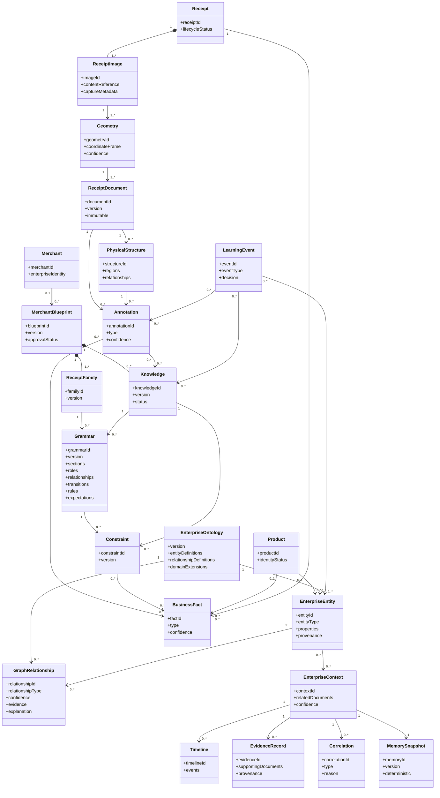

### 25.2 Canonical entity definitions

| Entity | Architectural definition |
|---|---|
| Receipt | Aggregate identity and processing lifecycle for one submitted receipt, independent of any single representation or interpretation. |
| Receipt Image | Captured visual evidence and immutable content reference with source and capture metadata. |
| Geometry | Versioned coordinate truth describing page boundary, dimensions, orientation, transformations, and geometric confidence. |
| Receipt Document | The Receipt DOM: canonical immutable physical AST containing stable identity, hierarchy, observed text, geometry, relationships, confidence, and source references. |
| Physical Structure | Generic layout interpretation such as regions, rows, groups, columns, and reading relationships, without business semantics. |
| Merchant | Governed enterprise identity for an organization; it is distinct from a family classification hypothesis. |
| Merchant Blueprint | Versioned knowledge aggregate containing merchant-associated families, profiles, vocabularies, statistics, and learning metadata. |
| Receipt Family | Versioned knowledge concept grouping receipts with shared learned physical and semantic characteristics. |
| Grammar | Declarative, versioned expectations for allowable document roles, sequences, and relationships. |
| Constraint | Versioned deterministic rule used to evaluate consistency or acceptability of candidates. |
| Product | Governed product identity or candidate referenced by product-related Business Facts. |
| Enterprise Entity | Canonical semantic identity represented as an immutable graph node under the active Enterprise Ontology. |
| Graph Relationship | Directed, typed semantic connection carrying confidence, evidence, provenance, timestamp, version, creation source, and explanation. |
| Enterprise Ontology | Versioned semantic contract defining entity and relationship meanings, inheritance, constraints, metadata, and governed domain extensions. |
| Enterprise Context | Immutable cross-document semantic context containing resolved entities, related document references, relationships, timelines, correlations, evidence, patterns, anomalies, and explanations. |
| Memory Snapshot | Versioned deterministic semantic memory projection; it is neither source-document storage nor LLM memory. |
| Timeline | Chronologically ordered, evidence-referencing semantic events for a canonical subject. |
| Evidence Record | Traceable support for a correlation, including source documents, graph evidence, entities, confidence, reason, timestamp, and version. |
| Correlation | Explainable, confidence-bearing relationship among canonical entities or documents supported by explicit evidence. |
| Annotation | Additive, versioned assertion attached to stable evidence or another governed artifact. |
| Knowledge | Approved, reusable information that informs reasoning without becoming executable merchant-specific logic. |
| Business Fact | Governed business conclusion supported by evidence and validation, with confidence and provenance. |
| Learning Event | Auditable correction, observation, proposal, approval, rejection, activation, or rollback affecting knowledge evolution. |

### 25.3 Relationship rules

- A Receipt MAY have multiple Receipt Images and processing attempts without
  losing aggregate identity.
- A Receipt Document represents physical truth, not merchant identity or
  Business Facts.
- An Annotation references its subject; it does not mutate the subject.
- A Merchant Blueprint aggregates Knowledge but does not execute
  merchant-specific parsing behavior.
- Receipt Family classification precedes merchant detection.
- Grammar proposes structure and meaning; Constraints validate candidates.
- Grammar compliance and candidate roles remain non-authoritative sidecar
  artifacts while the current parser retains extraction authority.
- Business Facts retain provenance to supporting annotations, evidence,
  knowledge versions, and validation outcomes.
- Learning Events change knowledge only through approval and versioned
  activation.

---

## 26. Enterprise Technology Standards

These standards govern architecture contracts and quality expectations. They
state what all conforming implementations must preserve; they do not prescribe
a programming language, framework, cloud, vendor, or delivery tool.

| Standard domain | Enterprise architecture standard |
|---|---|
| API Contracts | APIs SHALL be contract-first, authenticated, explicit about ownership and errors, idempotent where retry is expected, and capable of carrying status, confidence, provenance, and contract version. |
| Versioning | Public contracts, durable artifacts, knowledge, Grammar, Constraints, policies, and model configurations SHALL use explicit versions with defined compatibility semantics. |
| Serialization | Cross-boundary data SHALL use documented, deterministic, language-neutral schemas. Authoritative output, hypotheses, and diagnostics SHALL remain distinguishable. |
| Schema Evolution | Additive evolution is preferred. Breaking evolution requires a major version, impact assessment, coexistence period, migration path, rollback plan, and governed consumer retirement. |
| Logging | Logs SHALL be structured, correlated, severity-classified, access-controlled, and minimized. Secrets and unnecessary receipt content SHALL not be logged. |
| Observability | Each authoritative stage SHALL expose availability, latency, throughput, error, saturation, quality, and confidence-distribution indicators with stage and contract versions. |
| Security | Least privilege, authenticated service identity, encryption in transit and at rest, secret isolation, dependency governance, auditable administration, and explicit trust boundaries are mandatory. |
| Privacy | Data minimization, purpose limitation, redaction, retention, deletion, residency, and provider-use policy SHALL apply to images, observations, diagnostics, knowledge, analytics, and learning. |
| Performance | Service objectives SHALL be declared by channel. Optional expensive stages SHALL respect time budgets and degraded modes without bypassing provenance or validation. |
| Caching | Cached artifacts SHALL have explicit identity, version, tenant scope, policy scope, freshness, and invalidation semantics. Cache state SHALL never become ungoverned architecture authority. |
| Backward Compatibility | Existing consumer and extraction behavior SHALL remain compatible until a governed migration changes authority. Deprecation requires evidence, notice, coexistence, and rollback. |
| Testing | Conformance evidence SHALL include contract, invariant, determinism, calibration, privacy, security, replay, migration, resilience, and representative-family regression tests. |
| Deployment | Deployments SHALL preserve container boundaries, immutable version identity, environment separation, configuration governance, rollback, health verification, and auditable promotion. |

Technology exceptions SHALL identify the violated standard, scope, risk owner,
compensating controls, expiration date, and remediation or ADR. An exception
does not silently redefine the standard.

---

## 27. Enterprise Architecture Repository

The Enterprise Architecture Repository is the governed system of record for
architecture intent, decisions, standards, contracts, views, and evolution.
The authoritative specification remains the constitutional source; extracted
artifacts exist to support independent ownership and lifecycle where needed.

### 27.1 Repository model

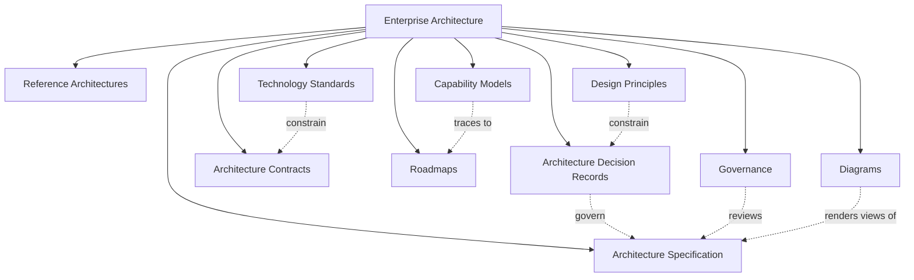

### 27.2 Artifact purposes

| Repository artifact | Purpose |
|---|---|
| Enterprise Architecture | Provides the governed collection, ownership model, status, relationships, and lifecycle of all architecture assets. |
| Architecture Specification | Defines the platform’s constitutional layers, boundaries, responsibilities, rules, current state, and target state. |
| Architecture Decision Records | Preserve the context, decision, alternatives, consequences, status, and supersession history of material architecture choices. |
| Reference Architectures | Define reusable conformant patterns for recurring concerns such as intake, OCR adapters, sidecars, learning, security, and enterprise integration. |
| Capability Models | Describe stable enterprise abilities, outcomes, owners, maturity, and supporting architecture independently of implementation. |
| Technology Standards | Establish mandatory interoperability, security, privacy, quality, lifecycle, and operational expectations. |
| Architecture Contracts | Define allowed cross-boundary information exchange, schemas, ownership, versioning, compatibility, and failure semantics. |
| Roadmaps | Sequence transitions, dependencies, entry criteria, migration gates, investment outcomes, and target-state increments. |
| Governance | Defines review forums, conformance evidence, waivers, risks, approvals, control ownership, and change records. |
| Diagrams | Maintain governed viewpoints for context, containers, information, domains, dependencies, knowledge, deployment, and evolution. |
| Design Principles | State durable decision rules that constrain architecture choices when detailed guidance is absent. |

### 27.3 Repository governance

- Every artifact SHALL identify an owner, status, effective version or date, and
  relationship to the authoritative specification.
- Accepted ADRs and historical approvals SHALL not be silently rewritten.
- Duplicate architecture truth SHALL be avoided; derived artifacts SHALL link
  to their controlling source.
- Diagrams SHALL be reviewed when a material boundary, dependency, information
  owner, or authority changes.
- Repository changes SHALL be traceable to a decision, governance action, or
  documented clarification.

---

## 28. Enterprise Architecture Glossary

| Term | Concise definition |
|---|---|
| Observation | A provenance-bearing account of what an engine or reviewer perceived; it may be uncertain and does not establish business meaning by itself. |
| Physical Evidence | Geometry, nodes, observed text, and generic spatial relationships representing what physically exists in a document. |
| Annotation | An additive, versioned assertion that references stable evidence or another governed artifact without mutating it. |
| Receipt DOM | The canonical immutable physical AST of a receipt, containing identity, hierarchy, geometry, relationships, observed text, confidence, and source references but no business semantics. |
| Receipt Family | A versioned knowledge concept grouping receipts with shared learned characteristics; resemblance does not by itself establish merchant identity. |
| Merchant Blueprint | The versioned aggregate of merchant-associated knowledge, including Receipt Families, profiles, vocabularies, statistics, and learning metadata. |
| Provenance | Lineage identifying source evidence, producing stage and version, transformations, knowledge versions, confidence, and review history. |
| Grammar | Declarative expectations for allowable document roles, sequences, relationships, and structures; it is not an imperative merchant parser. |
| Constraint | A versioned deterministic rule that evaluates candidate consistency or acceptability without creating physical evidence. |
| Knowledge | Approved, versioned, reusable information that informs reasoning across documents without becoming merchant-specific executable logic. |
| Business Fact | A governed business conclusion supported by evidence and validation, with confidence, provenance, and lifecycle. |
| Learning Event | An auditable observation, correction, proposal, approval, rejection, activation, or rollback associated with knowledge evolution. |
| Confidence | A bounded, decomposable expression of support for an observation, hypothesis, or conclusion within a stated context. |
| Classification | The evidence-backed ranking or selection of a governed category, such as Receipt Family, with confidence and provenance. |
| Physical Structure | Generic organization inferred from physical evidence, including regions, rows, groups, columns, and reading relationships, without business meaning. |
| Semantic Structure | Business roles and relationships proposed from physical evidence using approved knowledge and Grammar, subject to validation. |
| Enterprise Knowledge Graph | Storage-agnostic normalized semantic view of canonical enterprise entities and evidence-bearing relationships governed by the Enterprise Ontology. |
| Enterprise Ontology | Versioned contract defining semantic entity and relationship meanings, inheritance, constraints, metadata, and domain extensions. |
| Enterprise Entity | Immutable canonical semantic identity represented as a graph node with typed properties, provenance, and version metadata. |
| Graph Relationship | Typed directed edge whose confidence, evidence, provenance, timestamp, version, creation source, and explanation are explicit. |
| Cross-Document Intelligence | Deterministic correlation of normalized semantic identities, events, relationships, and evidence across independent documents and time. |
| Enterprise Memory | Versioned longitudinal semantic context of entities, relationships, timelines, evidence, correlations, and detected patterns; it is not LLM memory. |
| Timeline Event | Chronologically ordered semantic occurrence that references its original document and evidence. |
| Pattern | Explainable repeated historical structure detected from evidence; it is not a prediction. |
| Anomaly | Diagnostic indication of inconsistency, conflict, duplication, or unexpected variance that performs no automatic correction. |

---

## 29. Enterprise Evolution Beyond Receipts

The platform is a document intelligence architecture whose first governed
domain is receipts. Its durable differentiator is the separation of captured
evidence, coordinate truth, immutable physical representation, generic physical
structure, approved knowledge, semantic hypotheses, deterministic validation,
and Business Facts. Those layers are not receipt-specific.

Invoices, medical bills, purchase orders, bank statements, utility bills,
shipping labels, insurance explanations of benefits, healthcare claims, and
legal documents all present different vocabularies, relationships, policies,
and business outcomes. They still require the same progression from image to
geometry, physical evidence, observations, knowledge-guided hypotheses,
validated facts, and enterprise records.

The physical understanding architecture therefore remains unchanged. New
document domains evolve:

- domain Knowledge and vocabularies;
- document-family profiles and classification policy;
- declarative Grammar for roles, sequences, and relationships;
- deterministic Constraints and acceptance policy;
- product or domain intelligence;
- Enterprise Ontology extensions and canonical graph relationships;
- Business Fact schemas and enterprise integration contracts;
- privacy, retention, review, and regulatory controls.

The Enterprise Knowledge Graph connects these governed domain extensions
through shared semantic identities while leaving domain-specific privacy and
authority explicit. They do not require new hardcoded document parsers, mutation of the physical
model, or a different evidence architecture.

### 29.1 Enterprise evolution roadmap

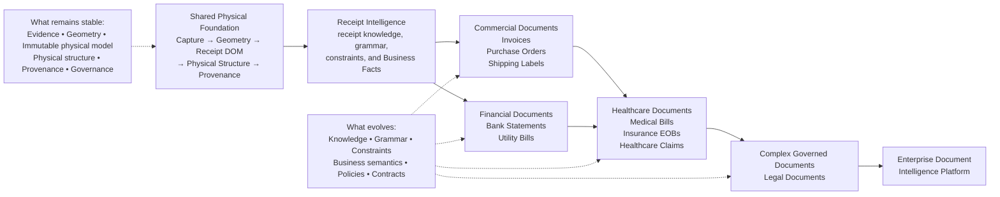

### 29.2 Domain expansion gates

A new document domain SHALL:

1. reuse the shared capture, geometry, physical evidence, provenance, and
   governance contracts;
2. define its capabilities, canonical Business Facts, Knowledge, Grammar,
   Constraints, and system-of-record integrations;
3. establish domain-specific privacy, security, retention, and regulatory
   controls;
4. enter through sidecar observation and comparative evaluation;
5. demonstrate calibration, validation, explainability, and migration evidence
   before becoming authoritative;
6. contribute reusable platform improvements without contaminating the physical
   foundation with domain-specific semantics.

This evolution turns receipt intelligence into enterprise document intelligence
through governed specialization above a stable physical foundation.

---

## 30. Out of Scope

The current authoritative architecture baseline intentionally excludes the
following capabilities from runtime authority:

- merchant detection;
- authoritative Receipt Grammar semantic execution beyond the implemented
  compile-and-compliance sidecar;
- authoritative use of Constraint Solver decisions beyond the implemented
  evaluation-and-ranking sidecar;
- authoritative use of Product Intelligence enrichments or automatic product
  knowledge changes beyond the implemented sidecar;
- domain business-rule execution;
- financial validation beyond current parser compatibility;
- autonomous Learning Engine activation;
- predictive conclusions or automatic corrections from Cross-Document
  Intelligence;
- treating deterministic Enterprise Memory as LLM conversational memory;
- Learning directly from receipt images, OCR, parser output, or isolated
  receipt records rather than governed normalized Enterprise Graph semantics;
- LLM authority over primary evidence, validation, or Business Facts.

Except for LLM authority, these responsibilities belong to the future phases
defined in Sections 10 and 14. They SHALL NOT be pushed into Geometry, the
Receipt DOM, Physical Structure, Receipt Family Classification, the current
Merchant Intelligence Repository, or another existing layer for implementation
convenience.

LLM refinement is a planned bounded capability; LLM authority over primary
evidence or final acceptance remains constitutionally prohibited by AP-08 and
ADR-006.

---

## 31. Architecture North Star

### What are we building?

We are building an enterprise document intelligence platform that transforms
physical evidence into explainable, validated Business Facts. Receipts are the
first domain, not the architectural limit. The platform preserves what was
captured, establishes coordinate truth, represents physical structure
canonically, applies approved knowledge, forms explicit hypotheses, validates
them deterministically, and publishes facts through governed enterprise
contracts.

The result is not merely extracted text. It is a durable chain of evidence,
interpretation, validation, and accountability that enterprise systems can
trust.

### Why is this architecture different from traditional OCR systems?

Traditional OCR-centered systems often treat text extraction as the product and
then embed business interpretation in templates, merchant-specific parsers, or
opaque model responses. This architecture treats OCR as one source of
observations. OCR providers do not own coordinate truth, physical structure,
semantics, or Business Facts.

The Receipt DOM is an immutable physical AST. Physical understanding is
separated from business meaning. Merchant behavior is approved, versioned
knowledge rather than executable merchant code. Receipt Family classification
precedes merchant detection. Grammar expresses expectations declaratively.
Constraints validate candidates deterministically. LLM refinement occurs last
and remains bounded by evidence, provenance, and validation. Learning proposes
governed knowledge changes; it never silently rewrites runtime behavior.

This separation makes the platform explainable, replaceable, progressively
adoptable, and extensible beyond receipts.

### What principles should never be compromised?

1. **Evidence precedes interpretation.** Preserve source evidence and coordinate
   truth before assigning meaning.
2. **Physical truth is immutable.** The Receipt DOM is never mutated to make a
   semantic conclusion appear true.
3. **Semantics are additive.** Observations, hypotheses, and Business Facts
   reference evidence through versioned annotations and provenance.
4. **Knowledge is data, not merchant code.** No return to hardcoded merchant
   parsers, hidden templates, or executable blueprints.
5. **Classification precedes identity.** Physical family resemblance informs
   reasoning without prematurely asserting merchant identity.
6. **Validation precedes authority.** Confidence and AI fluency do not replace
   deterministic consistency, acceptance policy, or migration evidence.
7. **LLMs refine last.** AI services may assist after evidence and constraints;
   they may not override them invisibly.
8. **Learning is governed.** Corrections create auditable Learning Events and
   proposals subject to approval, versioning, activation, and rollback.
9. **Provenance is part of the product.** A Business Fact without traceable
   evidence, versions, and reasoning is incomplete.
10. **Evolution is progressive.** New architecture enters as sidecars, earns
    authority through evidence, and preserves compatibility until migration
    gates are met.
11. **Enterprise qualities are architectural.** Security, privacy,
    explainability, resilience, observability, and auditability are designed
    into every boundary.
12. **The physical foundation remains domain-neutral.** New document types
    evolve Knowledge, Grammar, Constraints, and business semantics rather than
    fragmenting the core architecture.

### How should architects evaluate future design decisions?

Every future decision SHALL be tested against the following questions:

- Does it preserve the progression from evidence to physical understanding,
  hypotheses, validation, and Business Facts?
- Does it keep physical evidence immutable and semantics additive?
- Is the new behavior expressed in the correct architecture layer with a clear
  owner and contract?
- Can every conclusion be traced to source evidence, producing versions,
  approved knowledge, confidence, and validation outcomes?
- Does it add reusable knowledge or capability without introducing
  merchant-specific or document-specific executable logic into the core?
- Can providers, models, databases, and implementations be replaced without
  breaking the enterprise contract?
- Does it preserve backward compatibility and enter through governed,
  observable migration?
- Does it strengthen security, privacy, resilience, explainability,
  auditability, and operational control?
- Does it advance a recognized business capability and trace to an ADR and
  roadmap phase?
- Would the decision remain sound when the platform expands from receipts to
  other document domains?

If a proposal cannot answer these questions clearly, it is not ready for
architecture approval. If it violates the principles above, convenience,
accuracy on a narrow sample, vendor capability, or delivery urgency is not
sufficient justification.

The Architecture North Star is therefore:

> Preserve physical truth. Add meaning through governed knowledge. Validate
> before authority. Explain every decision. Evolve without compromising the
> foundation.
# Receipt Intelligence Snapshot

The Receipt is the business document. The immutable Receipt Intelligence Snapshot is the AI document for one processing execution. This separation preserves parser authority while making enterprise evidence, confidence, diagnostics, explanations, and version history durable.

```text
Receipt -> AI Processing -> Presentation Projection -> Snapshot Builder
                                                    -> Snapshot Repository
                                                    -> Snapshot Projection -> UI
```

Snapshots contain compact sidecar results for Family, Grammar, Constraints, Product Intelligence, Cross-Document Intelligence, Reasoning, and Business Projection. Geometry, Receipt DOM, Knowledge Graph, and Learning data remain owned by their services and are represented by lazy references.

The append-only lifecycle is `Snapshot v1 -> Snapshot v2 -> Snapshot v3`. Tenant retention policy controls latest-only access, keep-last-N, archive, and explicit deletion without changing the Receipt.
# Enterprise review authority

Review decisions are policy-driven outputs of document family, grammar, constraints, projection, reasoning, and resolved quality. Generic parser item heuristics are not enterprise review authority.
