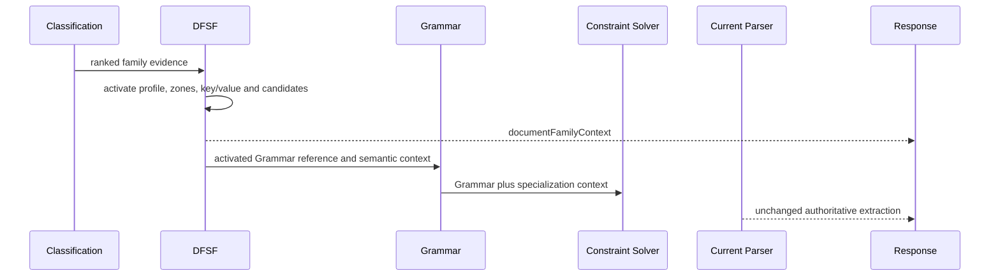

# Document Family Specialization Migration Guide

## Status and compatibility

Document Family Specialization (DFSF) is an additive sidecar inserted after
Receipt Classification and before Receipt Grammar. No endpoint, OCR model,
Geometry contract, Receipt DOM node, Physical Structure artifact,
Classification result, extraction field, or parser input changes. Consumers
that do not read `documentFamilyContext` remain fully compatible.

## Runtime contract

The orchestrator evaluates `DocumentFamilyEngine` with immutable upstream
artifacts and attaches the serialized result as `documentFamilyContext`.
Grammar and Constraint evaluation may consume that context. The current parser
does not receive it.

## Adding a family

1. Add a platform-standard family identifier when required; tenant extensions
   may register a profile without parser changes.
2. Register an immutable `FamilyProfile` with expected sections, semantic
   zones, key/value labels, entity rules, and Grammar/Constraint references.
3. Add generic evidence vocabulary or structural evidence to activation. Do
   not add merchant names or merchant-specific parser branches.
4. Add a golden regression fixture verifying family, zones, candidates,
   financial values, item expectations, and an unchanged parser payload.
5. Review developer diagnostics before enabling the profile in production.

## Rollout and rollback

Roll out by deploying the sidecar and observing family confidence and candidate
diagnostics. A DFSF failure is contained by `safe_evaluate` and cannot change
extraction. Rollback removes or disables profile activation; no stored parser
data requires migration. Any proposal to make DFSF authoritative requires a
separate ADR, compatibility gates, and parser migration plan.
