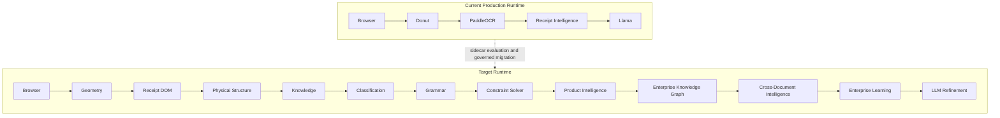
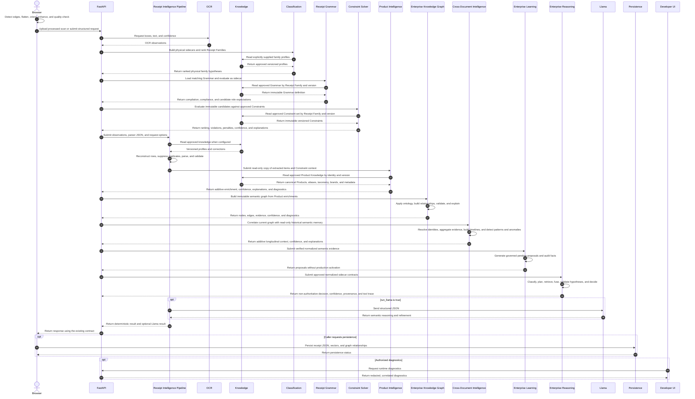
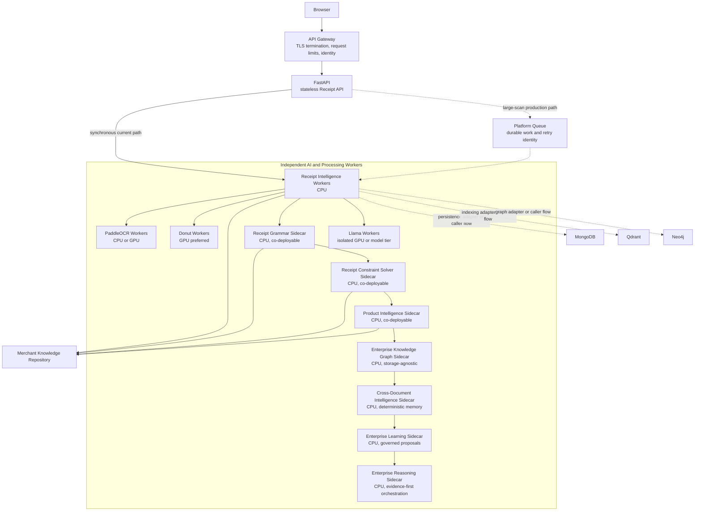
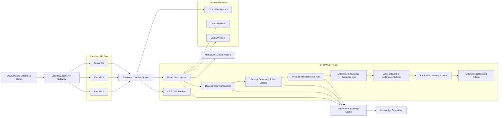
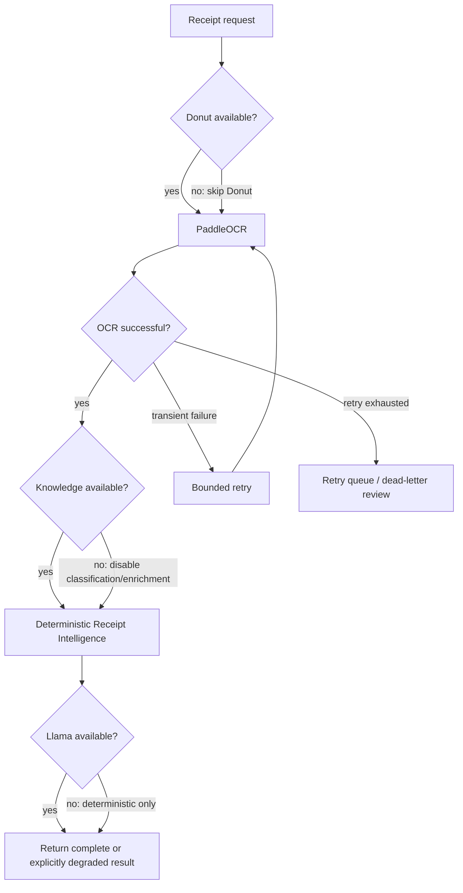

# Receipt Intelligence Solution Architecture

| Document control | Value |
|---|---|
| Status | Authoritative Solution Architecture |
| Solution | OpenGrit Receipt Intelligence Platform |
| Audience | Solution Architects, Technical Leads, Platform Engineers, AI Engineers, DevOps Engineers, SRE Engineers |
| Scope | Production runtime, processing, services, contracts, deployment, operations, security, scalability, recovery, and performance |
| Governing architecture | `docs/Enterprise-Architecture/Receipt-Intelligence-Enterprise-Architecture.md` |
| Change rule | Documentation-only changes SHALL preserve approved APIs, runtime contracts, and architectural decisions unless separately governed |

---

## 1. Overview

This document defines how the OpenGrit Receipt Intelligence Platform is
physically built, deployed, and operated. It describes the production execution
path from browser image preparation through deterministic receipt intelligence,
optional AI reasoning, and persistence integrations.

The Enterprise Architecture Specification defines **why** the platform is
separated into evidence, physical understanding, knowledge, classification,
semantic, validation, learning, and refinement layers. This Solution
Architecture defines **how** the current solution realizes those concerns in
runtime services and how the production topology evolves toward the approved
target architecture.

This document is subordinate to the Enterprise Architecture Specification. It
does not redefine business capabilities, architecture principles, ADRs, or
enterprise information ownership. If this document conflicts with the
Enterprise Architecture Specification, the Enterprise Architecture
Specification governs.

### 1.1 Scope

This Solution Architecture covers:

- browser-side receipt capture and preprocessing;
- FastAPI ingress and current receipt endpoints;
- Donut, PaddleOCR, Receipt Intelligence, and Llama execution;
- knowledge and persistence dependencies;
- deployment topology and service ownership;
- production observability, security, scaling, recovery, and performance
  expectations;
- coexistence between the current production runtime and the target
  architecture.

It does not change API schemas, endpoint behavior, runtime authority, model
selection, or the implementation of any service.

### 1.2 Runtime principles

1. **Stateless services** — API and compute workers SHALL keep durable state in
   governed stores, not process memory.
2. **Immutable processing artifacts** — retries and later stages create new
   outputs or annotations without silently changing source evidence.
3. **Asynchronous learning** — learning does not extend or mutate the
   authoritative request path.
4. **Deterministic before AI** — geometry, OCR reconstruction, parsing, and
   validation establish the deterministic result before optional Llama
   refinement.
5. **Bounded AI authority** — Donut and Llama provide candidates and refinement;
   they do not erase deterministic evidence.
6. **Horizontal scalability** — stateless APIs and workers scale independently
   according to workload and hardware needs.
7. **Retry-safe operations** — queued and persistence operations require stable
   request identity and idempotent effects.
8. **Independent service deployment** — API, OCR, Donut, Llama, knowledge, and
   persistence tiers MAY be deployed and scaled independently without changing
   their contracts.

---

## 2. Runtime Architecture

The current runtime accepts only a browser-processed image for upload. FastAPI
coordinates optional Donut extraction, PaddleOCR observations, deterministic
Receipt Intelligence processing, and optional Llama reasoning. The API returns
the structured result to the caller. The caller currently owns persistence of
receipt JSON, vector payloads, and graph relationships through the applicable
platform APIs and services.

### 2.1 Current runtime component view

```mermaid
flowchart LR
    BROWSER["Browser<br/>React scanner and image preprocessing"]
    API["Receipt API<br/>FastAPI"]
    PIPELINE["Receipt Intelligence Pipeline<br/>deterministic reconstruction and validation"]
    DONUT["Donut<br/>CORD-v2 candidate extraction"]
    OCR["PaddleOCR<br/>boxes, text, and confidence"]
    KNOWLEDGE["Merchant Knowledge Repository<br/>approved receipt-domain knowledge"]
    GEOMETRY["Geometry"]
    DOM["Receipt DOM"]
    STRUCTURE["Physical Structure"]
    CLASSIFICATION["Receipt Classification"]
    FAMILY["Document Family Specialization<br/>non-authoritative semantic activation"]
    GRAMMAR["Receipt Grammar<br/>non-authoritative sidecar"]
    CONSTRAINTS["Receipt Constraint Solver<br/>non-authoritative sidecar"]
    PRODUCTS["Product Intelligence<br/>non-authoritative enrichment sidecar"]
    EKG["Enterprise Knowledge Graph<br/>storage-agnostic semantic sidecar"]
    CDIF["Cross-Document Intelligence<br/>deterministic context sidecar"]
    LEARNING["Enterprise Learning<br/>governed proposal sidecar"]
    REASONING["Enterprise Reasoning<br/>evidence-first orchestration sidecar"]
    PROJECTION["Presentation Projection<br/>UI migration sidecar"]
    LLAMA["Llama<br/>optional semantic reasoning"]
    MONGO["MongoDB<br/>receipt documents"]
    QDRANT["Qdrant<br/>embeddings and retrieval payloads"]
    NEO4J["Neo4j<br/>receipt graph relationships"]

    BROWSER -->|"processed scan or structured request"| API
    API -->|"orchestrates when enabled"| DONUT
    API -->|"requests observations"| OCR
    DONUT -->|"candidate receipt JSON"| PIPELINE
    OCR -->|"blocks, rows, text, confidence"| PIPELINE
    OCR --> GEOMETRY
    GEOMETRY --> DOM
    DOM --> STRUCTURE
    STRUCTURE --> CLASSIFICATION
    KNOWLEDGE --> CLASSIFICATION
    CLASSIFICATION --> FAMILY
    KNOWLEDGE --> FAMILY
    FAMILY --> GRAMMAR
    KNOWLEDGE --> GRAMMAR
    GRAMMAR --> CONSTRAINTS
    KNOWLEDGE --> CONSTRAINTS
    CONSTRAINTS --> PRODUCTS
    KNOWLEDGE --> PRODUCTS
    PIPELINE -->|"read-only extracted item copy"| PRODUCTS
    PRODUCTS --> EKG
    EKG --> CDIF
    KNOWLEDGE -->|"approved profiles and corrections"| PIPELINE
    PIPELINE -->|"structured deterministic JSON"| LLAMA
    LLAMA -->|"optional refined result"| API
    PIPELINE -->|"deterministic result when Llama is disabled"| API
    GRAMMAR -->|"additive receiptGrammar diagnostics"| API
    FAMILY -->|"additive documentFamilyContext metadata"| API
    CONSTRAINTS -->|"additive receiptConstraintResult diagnostics"| API
    PRODUCTS -->|"additive productIntelligence enrichment"| API
    EKG -->|"additive enterpriseKnowledgeGraph context"| API
    CDIF --> LEARNING
    LEARNING --> REASONING
    REASONING --> PROJECTION
    CLASSIFICATION --> PROJECTION
    REASONING -->|"additive enterpriseReasoning decision and trace"| API
    PROJECTION -->|"additive businessProjection Business View"| API
    API -->|"response to caller"| BROWSER
    BROWSER -. "caller-owned persistence flow" .-> MONGO
    BROWSER -. "caller-owned indexing flow" .-> QDRANT
    BROWSER -. "caller-owned graph flow" .-> NEO4J
```



The diagram shows logical runtime participation, not a requirement that every
dependency execute for every endpoint. Donut and Llama are feature-controlled.
Qdrant and Neo4j consume derived payloads through explicit persistence or
indexing flows; they are not prerequisites for deterministic extraction.

### 2.2 Current and target architecture evolution

The production implementation and the approved target architecture coexist
during progressive migration.



The current pipeline remains operational and authoritative according to its
existing contracts. Geometry, Receipt DOM, Physical Structure, Knowledge,
Classification, Receipt Grammar, and Receipt Constraint Solver execute as observable sidecars. Receipt
Grammar is implemented for definition compilation, structural compliance,
candidate role expectations, diagnostics, and approval-only suggestions; it is
ignored by the current parser. The Constraint Solver compiles deterministic
rules and evaluates, ranks, and explains immutable candidate interpretations;
its result is also ignored by the current parser. Product Intelligence
enriches a copied view of extracted items with canonical candidates and is
likewise ignored by the parser. Enterprise Knowledge Graph maps those canonical
enrichments into a request-scoped semantic graph without persistence or parser
feedback. Cross-Document Intelligence correlates that graph with read-only
historical semantic memory and emits longitudinal context without automatic
memory writes. Learning and authoritative LLM Refinement remain future.

---

## 3. Processing Pipeline

### 3.1 Browser processing

The React scanner must not upload raw camera photos. It produces a processed
scan using:

1. grayscale;
2. Gaussian blur;
3. Canny edge detection;
4. contour and quadrilateral detection;
5. perspective transform;
6. orientation correction;
7. adaptive thresholding;
8. denoise and sharpen;
9. OCR readability quality gate.

The accepted processing flow remains:

```text
React scanner
  -> camera frame
  -> OpenCV edge detection
  -> quadrilateral validation
  -> perspective flattening
  -> orientation correction
  -> thermal receipt enhancement
  -> quality gate
  -> processed image only
  -> FastAPI document understanding
  -> Donut CORD-v2 extraction
  -> PaddleOCR boxes/text
  -> ReceiptIntelligencePipeline
  -> Llama semantic reasoning
  -> MongoDB receipt document
  -> Qdrant embeddings
  -> Neo4j receipt graph
```

This is a logical end-to-end flow. The current API returns extraction output to
the caller; downstream storage, vector indexing, and graph persistence remain
caller-orchestrated operations unless a separately governed asynchronous
adapter is introduced.

### 3.2 Runtime sequence



### 3.3 Processing responsibilities

`services/donut_receipt_service.py` lazy-loads
`naver-clova-ix/donut-base-finetuned-cord-v2` only when
`DONUT_RECEIPT_ENABLED=true`.

`services/receipt_intelligence.py` performs OCR line grouping, duplicate
suppression, item parsing, quantity extraction, merchant normalization,
validation, confidence scoring, table reconstruction, and graph generation.

`api/routes.py` exposes deterministic `/receipt/semantic`, JSON-based
`/receipt/document-understanding`, and multipart
`/receipt/document-understanding/upload`.

---

## 4. Service Architecture

### 4.1 Service ownership

| Service | Purpose and responsibility | Inputs | Outputs | Dependencies | Failure behavior |
|---|---|---|---|---|---|
| Browser | Captures, normalizes, validates, and submits processed receipt scans; presents results and initiates caller-owned persistence. | Camera frames, files, user action | Processed image, structured request, persistence commands | OpenCV/browser imaging, Receipt API | Rejects failed quality gates; retains actionable client status; does not upload an unprocessed camera photo. |
| Receipt API | Owns HTTP ingress, request validation, orchestration entry, response contracts, and error translation. | Existing JSON or multipart API contracts | Existing API responses and correlated errors | Pipeline, optional Donut/OCR/Llama integrations | Returns bounded errors or degraded results; does not silently alter a contract. |
| Receipt Intelligence Pipeline | Reconstructs OCR rows, suppresses duplicates, parses items and quantities, normalizes merchants, validates totals, scores confidence, and produces structured artifacts. | Raw text, lines, OCR blocks, parser JSON, OCR variants, Donut candidates | Structured deterministic receipt JSON, validation, confidence, table and graph payloads | Python runtime; optional approved knowledge | Continues with available evidence; records warnings and retry guidance for incomplete inputs. |
| Donut | Produces CORD-v2 receipt candidates when explicitly enabled. | Processed receipt image | Candidate receipt JSON, model warning or status | Model weights, PyTorch, Transformers, Pillow, Accelerate, GPU or CPU runtime | Disabled by default for CPU/local use; failure does not prevent deterministic OCR processing. |
| PaddleOCR | Produces text observations with bounding boxes and confidence. | Processed receipt image | OCR blocks, raw text, reconstructed line inputs | OCR runtime and model assets | Timeout or transient failure follows bounded retry; exhausted failure returns an OCR-stage error or uses other supplied evidence. |
| Merchant Knowledge Repository | Supplies approved merchant, family, vocabulary, correction, and profile knowledge to receipt reasoning. It is the current receipt-domain implementation of the Enterprise Knowledge Repository. | Approved knowledge and version request | Versioned knowledge snapshot | MongoDB or governed repository backing; cache where configured | Classification and knowledge enrichment are disabled or use an explicitly pinned cache; no unapproved fallback knowledge. |
| Receipt Grammar Framework | Loads approved Grammar by the ranked Receipt Family, compiles immutable declarative definitions, compares them with DOM and Physical Structure evidence, and emits sidecar diagnostics. | Receipt DOM, Physical Structure, Receipt Classification, approved Grammar | Compilation diagnostics, compliance, matched and missing rules, violations, candidate role expectations, approval-only suggestions | `receipt_grammar`; Classification; Merchant Knowledge Repository | Missing or invalid Grammar produces diagnostic context; current extraction continues unchanged and the parser never consumes Grammar output. |
| Receipt Constraint Solver | Compiles approved Constraints and deterministically evaluates and ranks supplied semantic candidates without extracting values or creating Business Facts. | Receipt DOM, Physical Structure, Merchant Knowledge, Classification, Receipt Grammar outputs, explicit candidate interpretations | Ranked and rejected candidates, rule outcomes, penalties, violations, confidence breakdown, explanations, diagnostics, approval-only suggestions | `receipt_constraints`; Receipt Grammar; Merchant Knowledge Repository | Missing or invalid Constraints produce explicit sidecar diagnostics; the current parser continues unchanged and never consumes the solver result. |
| Product Intelligence Engine | Enriches a copied view of extracted line items with governed canonical Product candidates and enterprise semantic knowledge. | Original extracted item description and values, Constraint context, merchant key, approved Product Knowledge | Original and normalized descriptions, canonical candidate, taxonomy, brand/manufacturer, nutrition/pricing context, confidence, explanation, diagnostics, approval-only suggestions | `product_intelligence`; Product Repository; optional Constraint result | Missing knowledge leaves items unmatched with explicit diagnostics. Failure omits enrichment and never changes parser output. |
| Enterprise Knowledge Graph Framework | Maps canonical semantic entities and evidence-bearing relationships under a versioned Enterprise Ontology without database coupling. | Product Intelligence result, explicit receipt identity and merchant context, copied receipt metadata | Immutable graph snapshot, validation diagnostics, storage-neutral query model, relationship explanations, approval-only ontology suggestions | `enterprise_graph`; Product Intelligence | Failure returns an empty diagnostic graph. Runtime performs no graph persistence and parser output remains unchanged. |
| Cross-Document Intelligence Framework | Builds deterministic longitudinal enterprise context from immutable semantic graphs and read-only historical memory. | Enterprise Graph context, document reference, approved versioned semantic memory | Resolved entities, linked documents, timelines, evidence, correlations, similarities, patterns, anomaly diagnostics, confidence, explanations | `cross_document_intelligence`; Enterprise Knowledge Graph; storage-neutral memory repository | Failure returns an empty diagnostic context. It performs no document, graph, memory, Business Fact, or parser mutation. |
| Enterprise Learning Framework | Converts verified normalized semantic evidence and approved feedback into governed pending proposals. | Cross-Document Intelligence, Enterprise Graph identities, explicit verified feedback | Immutable candidates, proposals, quality gates, confidence history, explanations, decisions and audit records | `enterprise_learning`; Cross-Document Intelligence; storage-neutral learning repository | Failure returns diagnostic context. Runtime never auto-approves, writes production knowledge, consumes raw OCR/parser guesses, or changes extraction. |
| Enterprise Reasoning Engine | Orchestrates deterministic enterprise reasoning and invokes an LLM only for optional bounded synthesis after hypothesis validation. | Constraint, Product, Graph, Cross-Document, and Learning sidecar contracts; explicit enterprise question | Intent classification, plan, selected tools, fused evidence, validated and rejected hypotheses, non-authoritative decision, confidence, provenance, execution trace, optional synthesis | `enterprise_reasoning`; registered storage-neutral tools; optional `LLMProvider` | Missing tools degrade to available evidence; unsupported hypotheses are rejected; LLM absence returns deterministic output; extraction and parser authority remain unchanged. |
| Llama | Performs optional semantic reasoning over structured JSON rather than noisy flat OCR text. | Structured deterministic receipt JSON | Optional semantic refinement, validation, warnings | Isolated model service and model assets | Pipeline returns deterministic extraction only; Llama failure does not erase deterministic output. |
| MongoDB | Stores receipt documents and operational knowledge under explicit caller or adapter control. | Versioned receipt or knowledge documents | Durable document identity and write status | MongoDB cluster and storage | Retry-safe write path or retry queue; extraction response is not falsely reported as persisted. |
| Qdrant | Stores and searches embeddings and retrieval payloads. | Embeddings, text chunks, metadata and tenant scope | Index status and similarity results | Qdrant cluster and embedding compatibility | Indexing is retried asynchronously; extraction remains available without vector indexing. |
| Neo4j | Stores and queries receipt graph relationships. | Idempotent nodes, edges, and provenance metadata | Graph write status and query results | Neo4j cluster and graph schema | Graph writes enter retry handling; extraction remains available without graph projection. |

### 4.2 Service dependency matrix

| Service | Depends on | Dependency rule |
|---|---|---|
| Receipt API | Receipt Intelligence Pipeline; optional Donut, OCR, and Llama orchestration | API workers remain thin and do not own durable processing state. |
| Receipt Intelligence Pipeline | OCR observations, request data, optional Knowledge | Deterministic processing operates without Llama, Qdrant, or Neo4j. |
| OCR | Processed image and OCR model runtime | Replaceable behind the observation contract. |
| Knowledge | MongoDB or governed repository backing; optional versioned cache | Only approved or explicitly pinned knowledge may influence runtime results. |
| MongoDB | Durable storage and replica availability | Persistence is idempotent and independently observable. |
| Qdrant | Embedding model compatibility and vector collection | Vector indexing is asynchronous or caller-owned and non-blocking to extraction. |
| Neo4j | Graph schema and durable Neo4j service | Graph projection is asynchronous or caller-owned and non-blocking to extraction. |
| Llama | Structured deterministic JSON and isolated model runtime | Optional and late; unavailable Llama produces deterministic-only output. |
| Receipt Grammar | Receipt DOM, Physical Structure, Classification, and approved Knowledge | Executes as a request-scoped sidecar; output is additive `receiptGrammar` context and is not a parser input. |
| Receipt Constraint Solver | Grammar compliance, explicit candidates, physical context, and approved versioned Constraints | Executes as a request-scoped sidecar; output is additive `receiptConstraintResult`, creates no Business Facts, and is not a parser input. |
| Product Intelligence | Read-only extracted item copies, optional Constraint confidence, explicit merchant context, approved Product Knowledge | Executes after Constraint evaluation as a request-scoped sidecar; output is additive `productIntelligence`, preserves original values, and is not a parser input. |
| Enterprise Knowledge Graph | Product Intelligence enrichments, explicit receipt/merchant context, Enterprise Ontology | Executes as a request-scoped storage-agnostic sidecar; output is additive `enterpriseKnowledgeGraph`, performs no persistence, and is not a parser input. |
| Cross-Document Intelligence | Immutable Enterprise Graph, document reference, optional approved historical semantic memory | Executes as a deterministic request sidecar; output is additive `crossDocumentIntelligence`, performs no automatic memory write, and is not a parser input. |
| Enterprise Learning | Cross-Document Intelligence verified semantic evidence and explicit approved feedback | Executes after Cross-Document Intelligence; output is additive `enterpriseLearning`, contains pending proposals only, performs no repository write, and is not a parser input. |
| Enterprise Reasoning | Read-only normalized outputs from Constraint, Product Intelligence, Enterprise Graph, Cross-Document Intelligence, and Enterprise Learning | Executes after Learning as additive `enterpriseReasoning`; deterministic tools execute first, LLM use is optional and evidence-bounded, and output is never a parser input. |

---

## 5. Runtime Contracts

The existing API paths and payloads remain unchanged. Additive contract
evolution requires versioning and compatibility review; this document does not
authorize an API change.

### 5.1 Deterministic semantic processing

`POST /receipt/semantic`

```json
{
  "raw_text": "",
  "lines": [],
  "ocr_blocks": [
    {
      "text": "TOTAL",
      "x": 40,
      "y": 140,
      "width": 60,
      "height": 14,
      "confidence": 0.94
    }
  ],
  "parser_json": {},
  "ocr_engine": "paddleocr",
  "ocr_variants": []
}
```

### 5.2 JSON document understanding

`POST /receipt/document-understanding`

```json
{
  "image_base64": "processed-scan-base64",
  "raw_text": "",
  "lines": [],
  "ocr_blocks": [],
  "parser_json": {},
  "run_llama": true
}
```

### 5.3 Multipart document understanding

`POST /receipt/document-understanding/upload`

The multipart endpoint accepts the existing processed-image upload contract.
It does not authorize raw camera image storage or a different response schema.
The current upload route invokes document understanding with its existing
runtime options, including its current Llama behavior.

### 5.4 Contract invariants

- Correlation identity SHALL accompany a request through all participating
  runtime stages.
- Retries SHALL not create duplicate durable records or graph relationships.
- Optional model unavailability SHALL be represented explicitly.
- Structured deterministic output SHALL remain distinguishable from Donut and
  Llama candidates.
- `receiptGrammar` SHALL remain an additive sidecar contract distinguishable
  from current parser output and SHALL contain no detected business values.
- `receiptConstraintResult` SHALL remain an additive, non-authoritative sidecar
  contract distinguishable from current parser output. It SHALL contain only
  candidate evaluation, ranking, violations, penalties, confidence,
  explanations, diagnostics, and approval-only suggestions; it SHALL create no
  Business Facts.
- `productIntelligence` SHALL remain an additive, non-authoritative enrichment
  contract. Every entry SHALL retain the original extracted description,
  distinguish normalized and canonical values, identify matching strategy and
  knowledge source, and SHALL NOT replace any parser value.
- `enterpriseKnowledgeGraph` SHALL remain an additive, non-authoritative
  semantic graph contract. Nodes and relationships SHALL carry stable semantic
  identity, ontology version, confidence, evidence, provenance, and
  explanations without exposing a graph-database implementation.
- `crossDocumentIntelligence` SHALL remain an additive, non-authoritative
  longitudinal context contract. Every correlation SHALL retain supporting
  documents, evidence, confidence, reason, timestamp, version, and provenance;
  patterns and anomalies SHALL remain detection-only diagnostics.
- Persistence success SHALL not be implied unless the responsible caller or
  adapter receives a confirmed write result.

---

## 6. Deployment Architecture

The recommended production topology separates ingress, orchestration, AI
compute, and persistence. It preserves the current HTTP contracts while
allowing long-running scans to be queued by the platform deployment layer.



### 6.1 Deployment responsibilities

| Deployment unit | Responsibility |
|---|---|
| API Gateway | TLS termination, authenticated ingress, request-size policy, rate limiting, routing, and edge correlation identity. |
| FastAPI | Contract validation, orchestration entry, synchronous response handling, and job acceptance where a queue is enabled. |
| Platform Queue | Durable work identity, backpressure, visibility timeout, retry scheduling, and dead-letter isolation for asynchronous production scans. |
| Receipt Intelligence Workers | CPU-oriented deterministic reconstruction, parsing, validation, and artifact generation. |
| Receipt Grammar Sidecar | CPU-oriented immutable definition loading, compilation, structural compliance, diagnostics, and candidate role expectations; it may co-deploy with orchestration while retaining its package boundary. |
| Receipt Constraint Solver Sidecar | CPU-oriented Constraint compilation, deterministic candidate evaluation and ranking, confidence aggregation, explanations, and diagnostics; it may co-deploy with orchestration while retaining its package boundary and non-authoritative status. |
| Product Intelligence Sidecar | CPU-oriented normalization, approved Product matching, taxonomy and brand enrichment, confidence, explanations, and diagnostics over copied parser items; it may co-deploy while retaining its independent package and non-authoritative status. |
| Enterprise Knowledge Graph Sidecar | CPU-oriented ontology mapping, relationship construction, validation, explanation, and in-memory traversal over request-scoped semantics. It performs no runtime graph-store write and retains a storage-neutral repository boundary. |
| Cross-Document Intelligence Sidecar | CPU-oriented entity resolution, document linking, timelines, correlations, evidence, deterministic pattern and anomaly diagnostics, and storage-neutral context queries. Runtime reads approved semantic memory and never writes it automatically. |
| Enterprise Learning Sidecar | CPU-oriented verified-evidence processing, proposal generation, quality and governance gates, confidence calibration, explanations, and immutable audit facts. Runtime performs no approval or production repository write. |
| Enterprise Reasoning Sidecar | CPU-oriented intent classification, planning, parallel deterministic retrieval, evidence fusion, hypothesis validation, decisions, provenance, explanations, and execution traces. Optional LLM synthesis uses the isolated model tier only after validation. |
| OCR Workers | Independent OCR capacity with bounded concurrency and model lifecycle. |
| Donut Workers | Independently scaled model capacity; disabled where model dependencies are unavailable. |
| Llama Workers | Isolated optional reasoning capacity with explicit time and concurrency budgets. |
| Data Services | Durable document, vector, graph, and knowledge storage with independent backup and recovery policy. |

The queue is a deployment evolution for large production scans, not an implicit
change to the current synchronous API contract. An asynchronous public contract
requires separate API governance.

---

## 7. Operational Architecture

Production operation requires a common telemetry envelope across browser,
gateway, API, processing stages, AI workers, and persistence adapters.

### 7.1 Monitoring and metrics

Each runtime stage SHALL publish:

- request, success, failure, timeout, retry, and degraded-result counts;
- latency distributions by endpoint and processing stage;
- active, queued, and rejected work;
- worker concurrency, CPU, memory, GPU utilization, and model-load status;
- OCR block count and confidence distribution;
- deterministic validation warnings and review rate;
- knowledge version and cache age;
- Grammar version, compilation failures, compliance distribution, missing-rule
  count, and approval-only suggestion count;
- Constraint-set version, compilation failures, candidates evaluated, winning
  and rejected candidate counts, rule outcome distribution, penalties,
  confidence components, and approval-only suggestion count;
- Product repository version, items considered, match strategy distribution,
  unmatched rate, category and brand coverage, confidence distribution, and
  approval-only suggestion count;
- ontology version, graph node and edge counts, entity and relationship type
  distributions, validation failures, dangling-edge count, query latency, and
  approval-only ontology suggestion count;
- documents correlated, entities resolved, correlation type and confidence
  distributions, timeline events, evidence coverage, pattern and anomaly
  counts, memory version, and approval-only suggestion count;
- persistence, indexing, and graph-write lag;
- queue depth, oldest-message age, retry count, and dead-letter count.

Service-level alerts SHALL distinguish customer-impacting extraction failure
from optional enrichment or persistence degradation.

### 7.2 Logging

Logs SHALL be structured and include correlation ID, request or job ID, tenant
scope, endpoint, stage, attempt, duration, outcome, and deployed version.
Receipt images, raw OCR content, structured receipt content, access tokens, and
secrets SHALL not be logged by default. Diagnostic content requires redaction,
authorization, and bounded retention.

### 7.3 Distributed tracing

Trace context SHALL propagate from the API Gateway through FastAPI, queue
messages, workers, model calls, knowledge reads, and persistence operations.
Spans SHALL identify feature-controlled branches such as Donut and Llama and
record whether the result was complete, deterministic-only, or degraded.

### 7.4 Health checks

- **Liveness** confirms that a process can continue serving or polling.
- **Readiness** confirms required contracts and model state for the advertised
  capability.
- **Dependency health** reports MongoDB, Qdrant, Neo4j, knowledge, OCR, Donut,
  and Llama separately.
- **Startup health** distinguishes model loading from a hung process.

Optional dependency failure SHALL not mark deterministic API capacity
unavailable when a valid degraded mode exists.

### 7.5 Diagnostics, retries, and timeouts

Diagnostics SHALL preserve stage versions, timings, warnings, confidence,
feature flags, and dependency outcomes without becoming authoritative business
output. Retries use bounded exponential backoff with jitter and apply only to
retry-safe failures. Every external call has an explicit connection and
execution timeout. The request deadline is propagated so a downstream retry
cannot outlive the caller or job budget.

---

## 8. Security Architecture

Security controls apply at every trust boundary and do not depend on a model or
database being deployed inside the same network.

| Security concern | Architecture guidance |
|---|---|
| Authentication | The API Gateway or Receipt API SHALL authenticate every non-public request using an enterprise-approved identity mechanism. Service-to-service calls use workload identity, not shared user credentials. |
| Authorization | Endpoint, tenant, diagnostic, knowledge-management, and persistence actions SHALL be policy-controlled using least privilege. |
| Tenant isolation | Tenant identity SHALL propagate through requests, queue messages, cache keys, knowledge queries, logs, MongoDB records, Qdrant payloads, and Neo4j graph data. Cross-tenant retrieval is prohibited. |
| Encrypted uploads | Processed images SHALL use TLS in transit. Any temporary or durable copy SHALL use approved encryption at rest. |
| Temporary image storage | Temporary images SHALL be minimized, access-restricted, uniquely identified, excluded from general logs, and deleted at the end of the bounded processing or recovery window. |
| PII protection | Receipt images, OCR observations, payment fragments, addresses, loyalty identifiers, and Business Facts SHALL be classified, minimized, redacted in telemetry, and retained only for approved purposes. |
| Secrets management | Database credentials, API tokens, model-provider keys, and encryption material SHALL come from an approved secrets manager with rotation and audit; they SHALL NOT reside in source or images. |
| Model isolation | Donut, OCR, and Llama workers SHALL run with restricted network, filesystem, identity, and resource permissions appropriate to their function. Model input and output are untrusted at service boundaries. |
| Knowledge protection | Only approved identities may propose, review, activate, or roll back knowledge. Runtime workers receive read-only access to approved versions. |
| Grammar protection | Runtime Grammar access is read-only. Save, version, archive, and approval actions require separate privileged identities and immutable audit history. |
| Constraint protection | Runtime Constraint access is read-only. Constraint save, version, archive, weight adjustment, and approval actions require separate privileged identities and immutable audit history. Candidate explanations must follow the same receipt-data redaction policy as their source evidence. |
| Product Knowledge protection | Runtime Product Knowledge access is read-only. Canonical Product, alias, taxonomy, brand, nutrition, pricing-history, version, archive, and approval actions require privileged identities and immutable audit history. |
| Enterprise Graph protection | Request graphs inherit tenant and receipt-data classification. Runtime graph construction performs no persistence. Future graph adapters require tenant isolation, read/write separation, ontology authorization, provenance retention, and immutable audit events. |
| Cross-document memory protection | Historical semantic memory is tenant-scoped, versioned, read-only to runtime workers, provenance-preserving, retention-controlled, and separately authorized from source documents. It must not be exposed as LLM conversational memory. |
| Audit logging | Authentication, authorization failures, diagnostic access, knowledge changes, retention actions, administrative changes, and sensitive data access SHALL generate immutable audit events. |

Uploaded content and all model-generated content SHALL be treated as untrusted
data. It SHALL not be interpreted as executable instructions, configuration, or
authorization.

---

## 9. Scalability Architecture

The solution scales by separating lightweight ingress from CPU processing, GPU
models, and stateful data services.



### 9.1 Scaling rules

- FastAPI instances remain stateless and scale horizontally behind the gateway.
- Receipt Intelligence, OCR, Donut, and Llama workers use independent queues or
  workload classes so one resource profile cannot starve another.
- Receipt Grammar is stateless, CPU-bound, and horizontally scalable with the
  orchestration worker; approved Grammar definitions use the versioned
  Knowledge cache.
- Receipt Constraint Solver is stateless and CPU-bound. Workers compile and
  cache approved Constraint sets by tenant, Receipt Family, and version while
  keeping request candidates and evaluation results request-scoped.
- Product Intelligence is stateless and CPU-bound. Approved Product Knowledge
  is cached by tenant and version; extracted descriptions and enrichment
  results remain request-scoped.
- Enterprise Knowledge Graph construction and queries are stateless and
  CPU-bound for request graphs. A future distributed graph adapter scales
  independently behind the same repository and query contracts.
- Cross-Document Intelligence workers are stateless for request evaluation.
  Approved memory snapshots are read through a versioned tenant-scoped cache or
  repository; memory writes remain a separate governed workflow.
- GPU workers scale by queue age, GPU utilization, model concurrency, and
  model-load cost; CPU workers scale by queue age, CPU saturation, and
  throughput.
- Queue partitions preserve tenant fairness and prevent a single batch from
  exhausting interactive capacity.
- The Knowledge cache is keyed by tenant, knowledge version, policy, and
  document domain. Stale or unversioned cache entries cannot become authority.
- MongoDB, Qdrant, and Neo4j scale according to their independent write, query,
  storage, replication, backup, and recovery profiles.
- Backpressure begins at ingress before worker or database saturation causes
  uncontrolled failure.
- Future distributed deployment preserves the same runtime contracts and
  correlation identity across regions or clusters.

---

## 10. Failure Recovery

Failure handling favors explicit degradation and replay over hidden fallback.



| Failure | Recovery and degradation behavior |
|---|---|
| Donut unavailable or disabled | Skip Donut candidate extraction and continue with PaddleOCR and deterministic Receipt Intelligence. Record the branch and warning. |
| PaddleOCR timeout | Retry only within the propagated deadline and retry budget. Use supplied OCR evidence where contractually available; otherwise return an OCR-stage error or enqueue recoverable work. |
| Knowledge unavailable | Disable knowledge-dependent classification and enrichment, or use an explicitly pinned valid cache. Never substitute unapproved knowledge. |
| Grammar unavailable or invalid | Attach non-authoritative diagnostics and continue the current parser unchanged. Do not invent a default Grammar or activate a learning suggestion. |
| Constraints unavailable, invalid, or unevaluable | Attach non-authoritative diagnostics, omit a winning candidate when none can be evaluated, and continue the current parser unchanged. Never invent a Constraint set, manufacture a candidate, or activate a learning suggestion. |
| Product Knowledge unavailable or Product Intelligence failure | Preserve and return current extraction unchanged. Attach non-authoritative diagnostics, leave canonical identity unmatched, and never activate a learning suggestion or substitute unapproved knowledge. |
| Enterprise graph construction, validation, or future adapter unavailable | Return current extraction and Product Intelligence unchanged with an empty or diagnostic request graph. Do not persist partial relationships, bypass ontology validation, or feed graph failure into parser scoring. |
| Historical memory unavailable or cross-document evaluation fails | Return extraction, Product Intelligence, and Enterprise Graph unchanged with an empty or current-document-only diagnostic context. Do not infer history, write memory, correct anomalies, or alter parser scoring. |
| Llama unavailable | Return deterministic extraction only and record that optional reasoning was unavailable. |
| MongoDB unavailable | Do not claim persistence. Retry through an idempotent persistence path or durable retry queue; isolate exhausted work for operator review. |
| Qdrant unavailable | Defer vector indexing. Extraction and MongoDB persistence remain independently available. |
| Neo4j unavailable | Defer graph projection. Extraction and other persistence remain independently available. |
| Queue unavailable | Preserve the current bounded synchronous path where safe, or reject new asynchronous work before accepting responsibility for it. |
| Worker crash | Queue visibility timeout makes the stable job identity eligible for retry; idempotency prevents duplicate effects. |

Recovery requires:

- stable request and artifact identity;
- immutable input and intermediate artifacts where retained;
- idempotent writes and graph upserts;
- bounded attempts and dead-letter handling;
- deployment and knowledge version capture;
- operator-visible reason, last error, and replay controls.

---

## 11. Performance Targets

The following are solution-level planning targets for normal single-receipt
processing. They are not measured production guarantees. Platform Engineering
and SRE SHALL replace them with baselined service-level objectives after load
and production telemetry are available.

| Stage | Target latency | Budget notes |
|---|---:|---|
| Browser preprocessing | ≤ 750 ms | Excludes user capture time; measured on supported client profiles. |
| API validation and ingress | ≤ 100 ms | Excludes upload transfer time. |
| Geometry and image preparation | ≤ 250 ms | CPU target after receipt upload. |
| Donut | ≤ 3,000 ms | Optional; isolated concurrency and model-warm target. |
| PaddleOCR | ≤ 2,500 ms | Target for a normal single-page processed receipt. |
| Receipt Intelligence | ≤ 750 ms | Deterministic row reconstruction, parsing, validation, and artifact generation. |
| Knowledge lookup | ≤ 150 ms | Versioned cache target; repository miss is measured separately. |
| Receipt Grammar and Constraint sidecars | ≤ 250 ms | CPU target for cached family/version definitions and a bounded candidate set; excluded from parser authority. |
| Product Intelligence sidecar | ≤ 150 ms | CPU target for cached Product Knowledge and a normal single-receipt item count; embedding matching is not included. |
| Enterprise Knowledge Graph sidecar | ≤ 150 ms | CPU target for request-scoped construction, validation, and bounded in-memory traversal; excludes future durable graph adapters. |
| Cross-Document Intelligence sidecar | ≤ 250 ms | CPU target for current graph plus a bounded, cached semantic-memory window; excludes repository transfer and future embeddings. |
| Llama | ≤ 4,000 ms | Optional bounded refinement with structured JSON input. |
| Persistence acknowledgement | ≤ 750 ms | Per caller or adapter transaction; vector and graph projections may complete asynchronously. |
| Deterministic end-to-end | ≤ 5,000 ms | Assumes warm workers and excludes optional Donut/Llama where not required. |
| AI-enriched end-to-end | ≤ 10,000 ms | Assumes warm workers, bounded model concurrency, and parallelizable work where supported. |

### 11.1 Throughput and capacity

- Interactive traffic SHALL have a separate capacity class from batch imports.
- API capacity is measured in accepted requests per second; processing capacity
  is measured in completed receipts per minute by workload class.
- Each worker pool SHALL publish sustainable throughput at its configured CPU,
  GPU, memory, model, image-size, and concurrency profile.
- The production baseline SHALL include warm and cold model behavior, p50, p95,
  and p99 latency, timeout rate, retry rate, and degraded-result rate.
- Capacity plans SHALL preserve at least 30 percent headroom under forecast
  peak load and identify scale-out and backpressure thresholds.

---

## 12. Operational Guidelines

### 12.1 Model deployment

For CPU or local development, Donut remains disabled and the backend still
imports cleanly.

For GPU model containers:

```text
DONUT_RECEIPT_ENABLED=true
DONUT_RECEIPT_MODEL=naver-clova-ix/donut-base-finetuned-cord-v2
DONUT_RECEIPT_MAX_CONCURRENCY=2
DONUT_RECEIPT_MAX_NEW_TOKENS=768
```

Install model dependencies in the AI image:

```text
torch
transformers
Pillow
accelerate
```

Scale Donut separately from Llama and OCR workers when GPU demand grows. Keep
FastAPI request workers thin. Queue large production scans through the platform
queue and persist intermediate artifacts required for retry and authorized
debugging.

### 12.2 Production readiness

Before a runtime capability receives production traffic:

- its contract, ownership, timeout, retry, and degraded mode are documented;
- readiness and liveness checks are verified;
- dashboards and actionable alerts exist;
- tenant isolation and least-privilege access are tested;
- secrets, encryption, retention, and audit controls are enabled;
- load, failure, recovery, replay, and idempotency tests pass;
- model and knowledge versions are observable;
- rollback and worker-drain procedures are rehearsed;
- backup and restore objectives are verified for stateful services;
- on-call ownership and escalation paths are assigned.

### 12.3 Change and release guidance

- API and runtime contracts remain backward compatible unless a separately
  approved change provides versioning and migration.
- AI model, prompt, threshold, knowledge, and dependency changes are versioned
  deployment inputs and require comparative evaluation.
- Deployments use immutable artifacts, progressive rollout, automated health
  verification, and rollback.
- Queue consumers drain or transfer work safely during deployment.
- Diagnostic modes remain access-controlled, redacted, rate-limited, and
  non-authoritative.
- New target-architecture stages enter beside the current runtime before any
  governed transfer of authority.

This Solution Architecture complements the Enterprise Architecture
Specification by making its approved direction deployable and operable without
changing current receipt APIs or runtime behavior.
# Snapshot Lifecycle and Runtime

```text
Receipt Image
 -> Geometry -> DOM -> Structure -> Merchant Knowledge -> Classification
 -> Document Family -> Grammar -> Constraint Solver -> Product Intelligence
 -> Enterprise Graph -> Cross-Document -> Learning -> Reasoning
 -> Presentation Projection
 -> Snapshot Builder -> Immutable Snapshot Repository
 -> Snapshot Projection -> Business UI / Developer Diagnostics
```

Reprocessing appends a new snapshot version. History and comparison are read models over immutable versions. Snapshot references prevent duplication of Geometry, DOM, Graph, and Learning artifacts. The current parser remains authoritative and is outside snapshot mutation authority.
