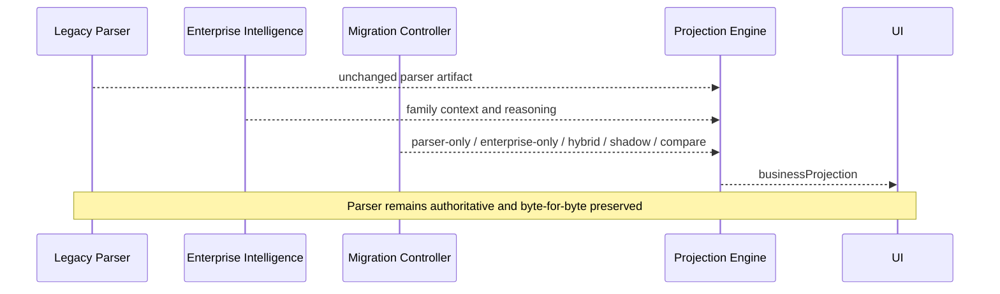

# Presentation Projection Migration Guide

## Processing readiness

`receiptProcessing` is the presentation-readiness sidecar for receipt consumers. Business interfaces render Business Projection when its configured processing state is `completed`; otherwise they render the processing explanation and recommendations. This does not change projection construction, values, provenance, migration modes, or parser preservation.

## Purpose

Presentation Projection moves UI rendering from direct parser fields to an
immutable `businessProjection` without changing extraction authority. Each
field contains parser, enterprise, and displayed values with provenance,
confidence, evidence, decision, and explanation.

## Runtime

The default mode is `hybrid`, configurable with
`PRESENTATION_PROJECTION_MODE`. Tenant, document-family, feature-flag, and user
preference overrides are resolved by `ProjectionMigrationController`.

## Mode behavior

| Mode | UI display | Comparison metadata |
|---|---|---|
| Parser Only | Parser | Preserved |
| Enterprise Only | Enterprise | Preserved |
| Hybrid | Strongest family-aware value | Preserved |
| Shadow | Parser | Enterprise evaluated invisibly |
| Compare | Hybrid result | Parser, enterprise, differences displayed |

## Adding a Business View

Register one immutable projection profile containing its family, view name,
section order, preferred enterprise fields, and item expectation. Add golden
tests for selection, conflicts, confidence, parser preservation, and UI
rendering. Do not modify the parser, OCR, Grammar, Constraints, Graph, Learning,
or Enterprise Reasoning.

## Rollback

Set the migration mode to `parser_only` or `shadow`. Stored parser fields and
API contracts require no migration because projection is additive.
