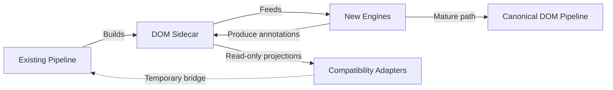

# Receipt DOM Migration Guide

## Current compatibility phase

The existing pipeline remains authoritative. It continues receiving the same
raw text, lines, OCR blocks, parser JSON, and image variants. Receipt DOM is
built alongside those values and returned as `receiptDocument` only for
infrastructure and developer inspection.

No existing consumer must migrate during this phase.

## New-engine rule

New receipt-intelligence engines must accept:

```python
def analyze(document: ReceiptDocument, annotations: AnnotationSet) -> AnnotationSet:
    ...
```

They must not accept raw OCR blocks, parser JSON, or mutable dictionaries as
their document input. Annotation types are future work; engines may be designed
against this boundary but should not introduce annotations into the DOM package.

## Incremental migration



1. Build and observe the DOM sidecar without affecting extraction.
2. Implement new engines exclusively against `ReceiptDocument`.
3. Store future annotations separately using document/node IDs.
4. Introduce read-only adapters only where legacy code must consume a new
   annotation.
5. Retire direct raw-artifact consumption after parity validation.

## Prohibited migration patterns

- Adding interpretation fields to physical nodes
- Replacing a `ReceiptDocument` after an engine pass
- Mutating nodes to attach an engine result
- Depending on OCR list order
- Copying coordinate-conversion logic into consumers
- Feeding DOM output back into current scoring or parsing during the sidecar phase

## Versioning

The initial metadata version is `receipt-dom-v1`. Additive serializer fields may
remain within v1. Ownership changes, node identity changes, coordinate semantics,
or hierarchy changes require a new DOM version and an explicit migration.
