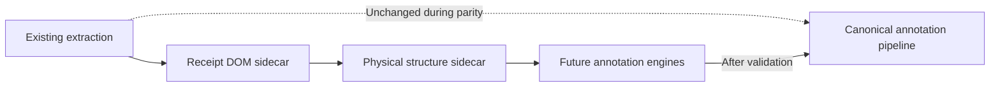

# Receipt Physical Structure Migration

## Current sidecar phase

`ReceiptPhysicalStructure` is infrastructure-only. The orchestrator builds it
after the Receipt DOM and returns it under `receiptStructure` for developer
inspection. Existing extraction continues with the exact legacy values.

No current parser consumer must migrate.

## Ownership

```text
Request-scoped attempt
├── ReceiptDocument
└── ReceiptPhysicalStructure
    ├── document_id -> ReceiptDocument.id
    └── annotation node IDs -> immutable DOM node IDs
```

This is the meaning of attaching structure to the request-scoped document. The
attachment is an immutable companion graph, not a field mutation on
`ReceiptDocument`.

## New consumer contract

New physical or later interpretation engines should accept:

```python
def analyze(
    document: ReceiptDocument,
    physical_structure: ReceiptPhysicalStructure,
) -> FutureAnnotations:
    ...
```

They must not receive raw OCR arrays or recompute reading order, coordinate
conversion, density, table geometry, or whitespace independently.

## Migration stages



1. Observe physical annotations in debug output.
2. Validate structure confidence against representative images.
3. Build new engines against DOM identity and structure annotations.
4. Keep future results in separate annotation graphs.
5. Migrate legacy consumers only after explicit parity validation.

## Prohibited changes

- Mutating a DOM node to add physical metadata
- Replacing the DOM after structure analysis
- Assigning purchase or monetary meaning to table columns or regions
- Feeding structure annotations into current scoring or parsing
- Trusting source OCR order over DOM reading order
- Duplicating coordinate or reading-order logic in future consumers

## Versioning

The initial schema is `receipt-physical-structure-v1`. Changes to annotation
identity, confidence meaning, region positioning thresholds, table criteria, or
serialized ownership require explicit compatibility review.
