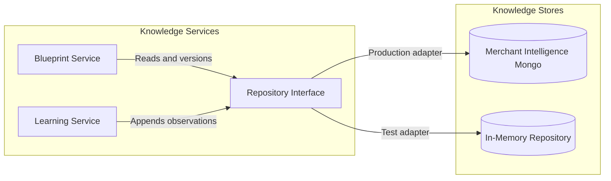
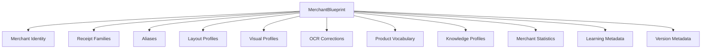
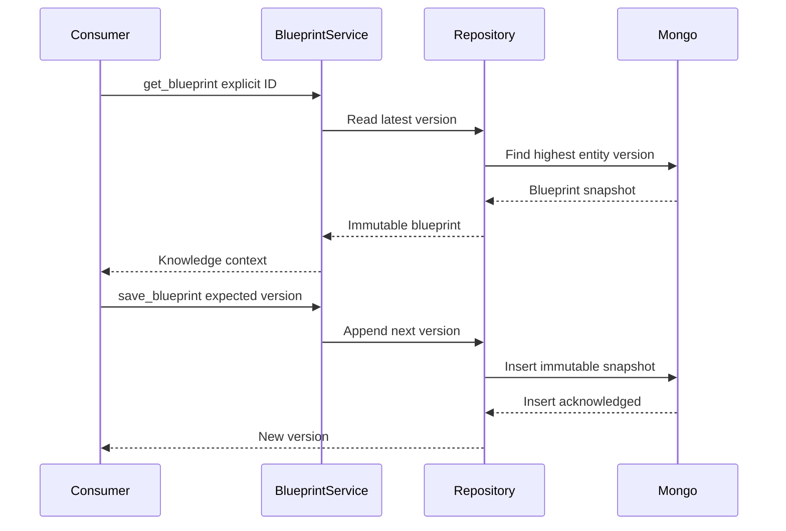
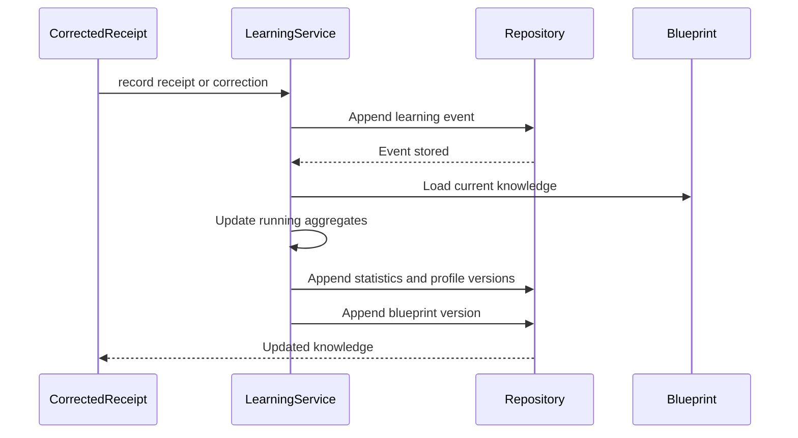

# Merchant Intelligence Repository

The Merchant Intelligence Repository is OpenGrit's versioned, continuously
evolving merchant knowledge base. It stores knowledge; it does not identify a
merchant, parse a receipt, classify a product, or influence extraction.

All merchant behavior is represented as data. Adding a merchant or receipt
family requires records, not Python branches.

## Package

| Module | Responsibility |
|---|---|
| `models.py` | Immutable blueprint, family, profile, vocabulary, statistics, observation, and correction schemas |
| `repository.py` | Repository contract plus in-memory and append-only Mongo adapters |
| `service.py` | Blueprint management and explicit-key context loading |
| `learning.py` | Incremental statistics, vocabulary, profile, family, and correction updates |
| `serialization.py` | JSON-safe serialization and blueprint reconstruction |
| `schemas.py` | Mongo validators, collection names, and index definitions |
| `migrations.py` | Idempotent validator/index installation |

## Architecture



The Mongo client is not created at API import time. Production code explicitly
injects a database or calls `MongoMerchantIntelligenceRepository.from_uri()`.
Receipt processing therefore never acquires a hidden database dependency.

## Blueprint object



Knowledge profiles cover receipt patterns and layout descriptions for tax,
coupon, payment, and footer areas. These are stored observations only. No
executable parsing rules live in a blueprint.

## Collections

| Collection | Schema | Purpose |
|---|---|---|
| `merchant_blueprints` | `merchant-blueprint-v1` | Canonical aggregate snapshots and history |
| `receipt_families` | `receipt-family-v1` | Multiple evolving families per merchant |
| `merchant_aliases` | `merchant-alias-v1` | Normalized alternate identity strings |
| `merchant_layout_profiles` | `merchant-layout-profile-v1` | Learned layout measurements |
| `merchant_statistics` | `merchant-statistics-v1` | Versioned running aggregates |
| `merchant_learning` | Event-specific v1 | Append-only observations and corrections |
| `merchant_receipt_patterns` | `merchant-knowledge-profile-v1` | Generic learned pattern metadata |
| `merchant_visual_profiles` | `merchant-visual-profile-v1` | Assets, colors, dimensions, image statistics |
| `merchant_product_catalog` | `merchant-product-vocabulary-v1` | Vocabulary, aliases, OCR errors, units, categories |
| `merchant_tax_profiles` | `merchant-knowledge-profile-v1` | Stored tax-layout descriptions |
| `merchant_coupon_profiles` | `merchant-knowledge-profile-v1` | Stored coupon-layout descriptions |
| `merchant_payment_profiles` | `merchant-knowledge-profile-v1` | Stored payment-layout descriptions |

Every collection requires `schema_version` and `merchant_id`. Versioned records
also carry `entity_version`, `created_at`, and `updated_at`. Validators and
indexes are defined in `schemas.py`.

## Blueprint lifecycle



Optimistic version checks prevent stale writers from silently overwriting newer
knowledge. Saving creates a new snapshot with `supersedes_version`; historical
snapshots are retained.

## Learning lifecycle



Learning uses online averages and append-first events. It requires no model
training. Receipt observations may explicitly provide measurements, vocabulary,
and a family ID. Corrections may explicitly update OCR vocabulary. The service
does not infer a merchant or interpret receipt content.

## Repository API

```python
repository.get_blueprint(merchant_id, version=None)
repository.save_blueprint(blueprint, expected_version=None)
repository.blueprint_history(merchant_id)
repository.update_statistics(statistics)
repository.record_receipt(observation)
repository.record_correction(correction)
repository.find_receipt_families(merchant_id)
repository.find_aliases(value="", merchant_id="")
repository.update_layout_profile(profile)
repository.update_vocabulary(entry)
```

`MerchantBlueprintService` provides aggregate-level operations. The repository
contract remains storage-oriented and contains no detection behavior.

## Orchestrator integration

The orchestrator accepts an optional `merchant_knowledge_key`. A lookup happens
only when a `MerchantBlueprintService` is injected. The key is never derived
from OCR, parser output, merchant reconciliation, or LLM output.

The resulting `merchantIntelligence` response is request context only:

```json
{
  "merchant_key": "explicit-key",
  "loaded": true,
  "blueprint": {},
  "diagnostics": {
    "lookupMode": "explicit_key_only",
    "detectionPerformed": false,
    "affectsExtraction": false
  }
}
```

Nothing in this context enters scoring or parsing.

## Future integration

Future merchant identification can query aliases, receipt families, layouts,
visual profiles, and statistics through the repository. Grammar and constraint
engines can consume an already-selected blueprint. Those future engines must
remain separate from repository and learning code.
