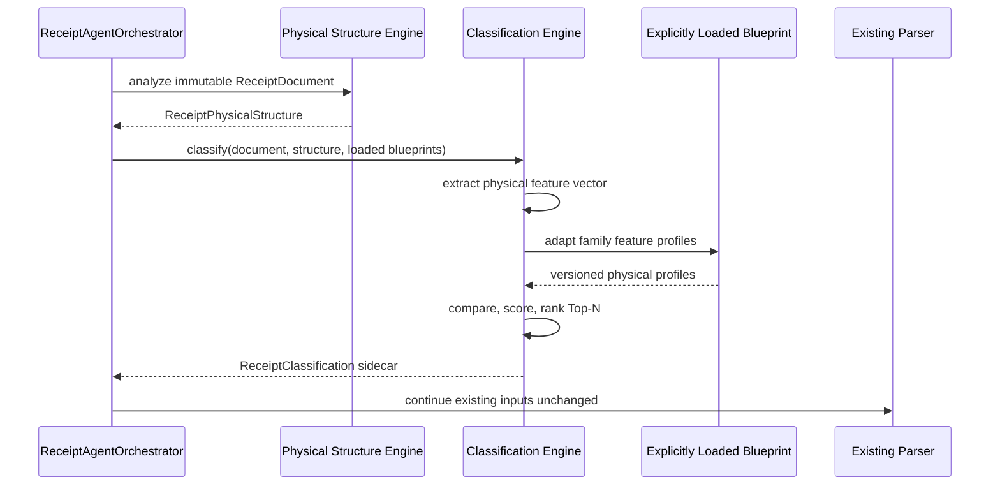
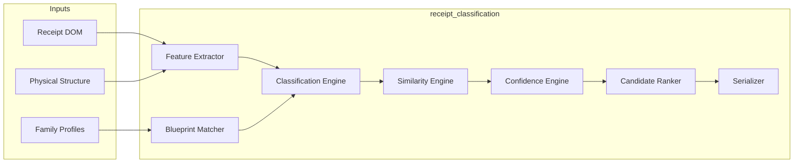
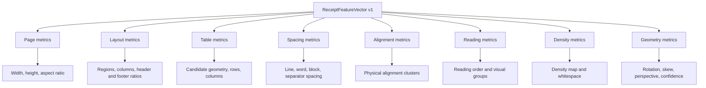
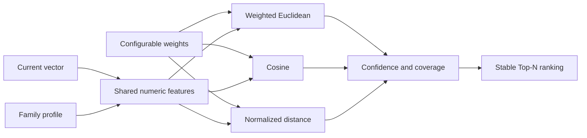
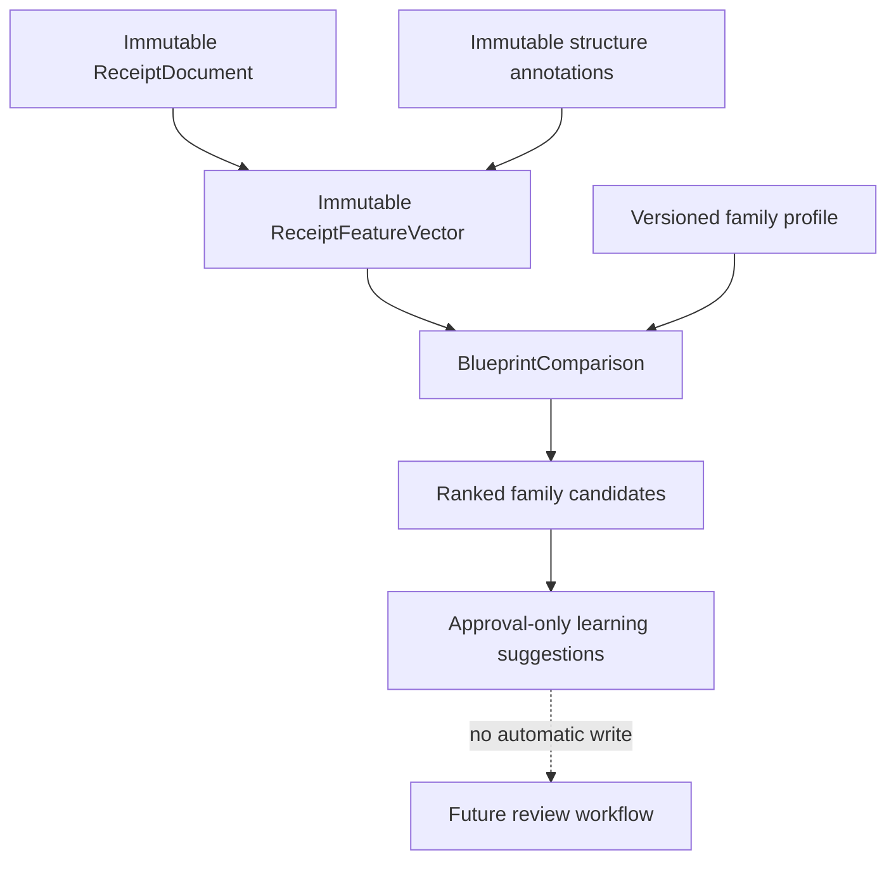

# Receipt Classification Engine

The Receipt Classification Engine ranks learned receipt families by physical
similarity. It is an immutable, request-scoped sidecar over the Receipt DOM and
Receipt Physical Structure. It does not read OCR text, infer merchant identity,
parse fields, or alter extraction.

## Responsibilities and ownership

- `ReceiptFeatureExtractor` owns deterministic physical measurement.
- `ReceiptBlueprintMatcher` adapts versioned repository family profiles.
- `ReceiptSimilarityEngine` owns pluggable similarity strategies.
- `ReceiptConfidenceEngine` combines similarity, coverage, strategy agreement,
  and profile confidence.
- `ReceiptCandidateRanker` applies stable Top-N ordering and explanations.
- `ReceiptClassificationEngine` coordinates these services and creates
  approval-only learning suggestions.
- `ReceiptClassificationSerializer` provides JSON, debug, pretty, Mongo-friendly,
  and graph projections.

The Receipt DOM and physical structure remain owned by their existing systems.
Classification never mutates them. Merchant Intelligence remains the owner of
blueprints and version history; suggestions do not write to it.

## Runtime sequence



When no blueprint was explicitly loaded, the engine still returns the feature
vector and an empty candidate list. It never searches aliases or derives a
merchant key.

## Package architecture



## Feature model

`ReceiptFeatureVector` is frozen, versioned, serializable, and divided into
stable namespaces:



No node text or semantic label is part of the vector.

## Similarity architecture



Strategies implement the `SimilarityStrategy` protocol, so future algorithms
can be injected without changing the engine or profile schema. Missing features
reduce coverage rather than being treated as zeros.

## Object lifecycle



Future merchant detection may consume ranked family candidates as evidence. It
must remain a separate engine and must not reinterpret classification as a
detected merchant.

## Blueprint physical profile

A `ReceiptFamily.attributes` entry may use `feature_vector`,
`physical_features`, or `feature_profile`. Values are nested physical numeric
metrics matching the vector namespaces. Optional `feature_weights` use flattened
keys such as `layout.reading_column_count`.

```json
{
  "physical_features": {
    "page": {"width": 400, "height": 800},
    "layout": {"reading_column_count": 2},
    "density": {"whitespace_percentage": 0.31}
  },
  "feature_weights": {
    "layout.reading_column_count": 2.0
  }
}
```

Layout profiles and physical aggregate statistics are also adapted when
available. Textual vocabulary, aliases, OCR corrections, and business profiles
are never consumed.
