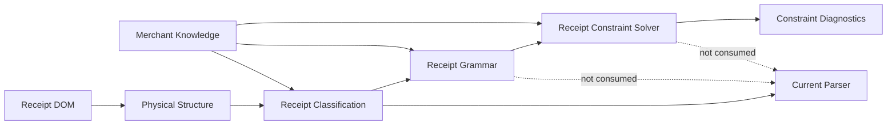

# Receipt Constraint Solver Framework

The Receipt Constraint Solver is a deterministic reasoning sidecar that
evaluates and ranks competing semantic hypotheses. It does not parse receipts,
extract arithmetic values, create Business Facts, or replace the current
parser.

## Runtime position

The orchestrator attaches `receiptConstraintResult` after Grammar evaluation.
It never adds that result to parser JSON, semantic extraction inputs, scoring,
or Llama inputs.

## Package ownership

- `models/` owns immutable constraints, candidates, evaluations, scores,
  decisions, explanations, confidence, diagnostics, and suggestions.
- `constraint_compiler.py` validates references, dependencies, groups, weights,
  penalties, conflicts, duplicates, and dependency cycles.
- `constraint_repository.py` owns append-only family/version lifecycle.
- `candidate_generator.py` creates multiple hypotheses without selecting one.
- `arithmetic_validator.py` evaluates only supplied numeric hypotheses.
- `structural_validator.py` evaluates supplied semantic structure and immutable
  physical boundaries.
- `grammar_validator.py` consumes Receipt Grammar compliance without
  reimplementing Grammar logic.
- `rule_evaluator.py` routes independently extensible categories.
- `candidate_ranker.py` calculates constraint, category, penalty, and overall
  scores.
- `confidence_engine.py` aggregates upstream confidence without overwriting it.
- `explanation_engine.py` selects and explains the highest-ranked sidecar
  interpretation.
- `constraint_learning.py` creates approval-only proposals.

## Candidate boundary

The generator accepts explicitly supplied interpretations from a future
governed semantic-candidate producer. When none are supplied, it creates one
structural candidate using only Grammar matched sections and candidate role
expectations. It never reads OCR text or current parser results to manufacture
subtotal, tax, total, product, merchant, or payment candidates.

## Supported categories

Arithmetic, Structural, Grammar, Ordering, Relationship, Transition,
Cardinality, Locality, Confidence, Knowledge, CrossReference, FutureProduct,
FutureMerchant, and Unknown are stable category contracts. Evaluators are
replaceable by category without adding merchant or family branches.

## Repository lifecycle

`ReceiptConstraintRepository` provides snake-case methods and architecture
contract aliases:

- `load_constraints()` / `loadConstraints()`;
- `save_constraints()` / `saveConstraints()`;
- `version_constraints()` / `versionConstraints()`;
- `archive_constraints()` / `archiveConstraints()`;
- `list_constraint_sets()` / `listConstraintSets()`;
- `compare_constraint_versions()` / `compareConstraintVersions()`.

Constraint learning never calls these write methods. Suggestions require
separate review, approval, versioning, and activation.

## Prohibited behavior

The framework must not modify OCR, Geometry, Receipt DOM, Physical Structure,
Merchant Knowledge, Classification, Grammar, parser behavior, extraction
output, or Business Facts. Its selected candidate is a deterministic sidecar
decision, not an authoritative extraction result.

