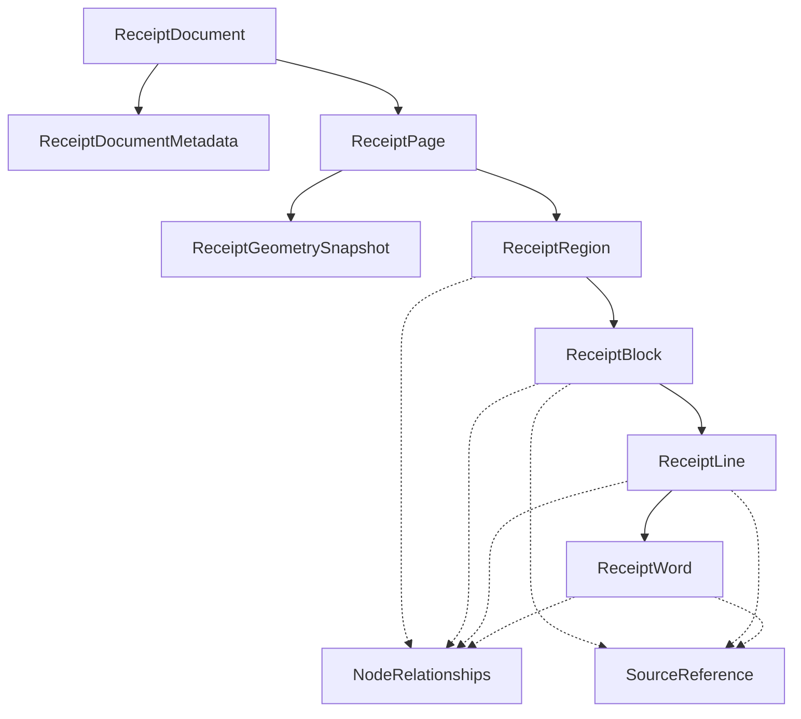
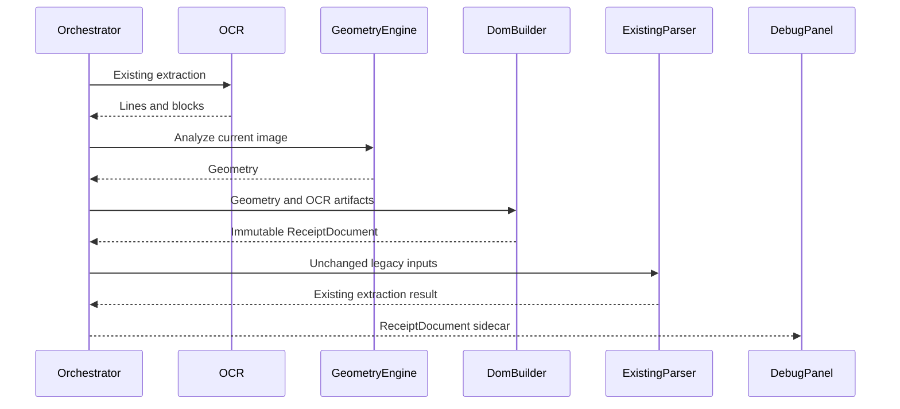
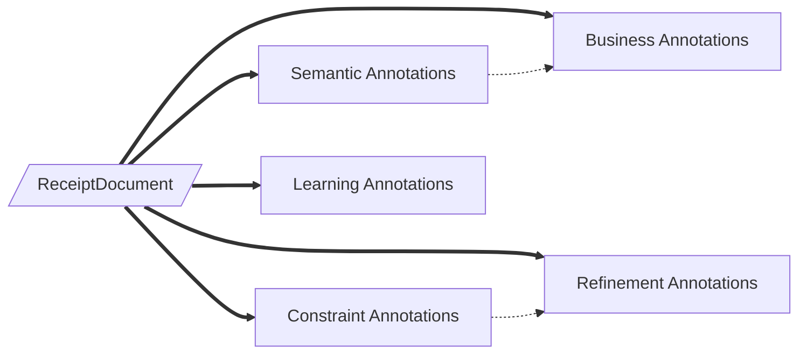

# Receipt Document Object Model

The Receipt DOM is OpenGrit's immutable physical-document AST. It is an object
graph, not a transfer DTO. Every node has stable identity, ownership, geometry,
reading order, source provenance, and spatial relationships.

The DOM answers only: **what physically exists on the paper, and where?**
Business interpretation is intentionally absent.

## Package

| Module | Responsibility |
|---|---|
| `nodes.py` | Immutable document, page, region, block, line, word, metadata, identity, and relationships |
| `geometry.py` | Phase 1 geometry snapshot and centralized coordinate conversion |
| `reading_order.py` | Geometry-derived ordering and spatial neighbors |
| `builder.py` | Existing geometry/OCR artifact adapter into the physical AST |
| `serializer.py` | JSON, debug JSON, pretty tree, visualization tree, and graph projection |

## Class hierarchy



Character nodes are deliberately deferred. A later version may add them under
`ReceiptWord` without changing current ownership.

## Ownership and identity

```text
ReceiptDocument
└── ReceiptPage[]
    ├── ReceiptGeometrySnapshot
    └── ReceiptRegion[]
        └── ReceiptBlock[]
            └── ReceiptLine[]
                └── ReceiptWord[]
```

Rules:

1. The document owns pages; pages own regions; regions own blocks; blocks own
   lines; lines own words.
2. Nodes are frozen dataclasses. Child collections are tuples.
3. Relationships refer to stable node IDs. This avoids mutable object cycles
   while preserving graph identity.
4. `parent_id` is authoritative ownership. Previous/next siblings and
   above/below/left/right/nearest neighbors are secondary geometric edges.
5. Source references identify the originating OCR artifact. They never become
   meaning or authority over reading order.
6. Future engines add external annotations keyed by document and node IDs. They
   never replace or mutate the physical DOM.

## Physical vocabulary

Allowed region types are `unknown`, `text_region`, `image_region`,
`table_region`, `whitespace_region`, and `detected_region`.

Allowed block types are `unknown`, `paragraph`, `table_block`, `text_block`,
`image_block`, and `mixed_block`.

These labels describe physical layout only. The package contains no purchase,
party, product, monetary, or payment fields.

## Build lifecycle



DOM construction occurs after OCR artifacts are available and before existing
consolidation and parsing. Builder failure is isolated and returns no sidecar;
it does not alter retry selection, scoring, parser inputs, or extraction output.

## Reading order and relationships

`ReadingOrderEngine` ignores input list order. It orders nodes by geometric row
and horizontal position, handles column layouts through spatial grouping, and
uses stable geometry keys for overlaps.

For each sibling set it computes:

- previous and next sibling
- nearest above and below node with horizontal overlap
- nearest left and right node with vertical overlap
- up to four Euclidean nearest neighbors

The engine attaches an integer reading order to every region, block, line, and
word. Page reading order stores ordered region IDs.

## Coordinate systems

Every node bounding box declares exactly one coordinate space:

- `original_image`
- `corrected_image`
- `normalized_page`

`CoordinateSystem.convert()` is the only supported conversion API. Original to
corrected conversion uses the Phase 1 perspective matrix; corrected to original
uses its inverse; normalized conversion uses corrected page dimensions.

Future consumers must not perform coordinate arithmetic directly.

## Phase 1 integration

The Geometry Engine is unchanged. The builder creates an immutable
`ReceiptGeometrySnapshot` from its `Geometry` result and places that snapshot on
`ReceiptPage`. This protects DOM lifecycle guarantees without changing Phase 1
algorithms or public APIs.

## Serialization and persistence

```python
serializer = ReceiptDomSerializer()

payload = serializer.to_dict(document)
debug_payload = serializer.to_dict(document, debug=True)
json_text = serializer.to_json(document, pretty=True)
tree_text = serializer.pretty_print(document)
tree = serializer.tree_visualization(document)
graph = serializer.graph_projection(document)
```

The regular payload omits diagnostics. Debug JSON preserves diagnostics and
source relationships. All outputs are plain JSON-compatible structures suitable
for future Mongo documents. `graph_projection()` provides node/edge records for
future graph persistence without making graph storage part of the DOM.

## Annotation lifecycle



The thick edges indicate the immutable source of truth. Annotation stores use
`document_id` and node IDs as attachment points. They may refer to each other,
but cannot write into the physical object graph.

## Developer UI

The Receipt Debug Panel includes a **Receipt DOM** tab when a `receiptDocument`
sidecar is present. It renders:

- document identity and version
- the page/region/block/line/word tree
- node geometry and reading order
- parent identity
- page dimensions, rotation, skew, and confidence
- complete debug JSON

The tab is diagnostic only.
