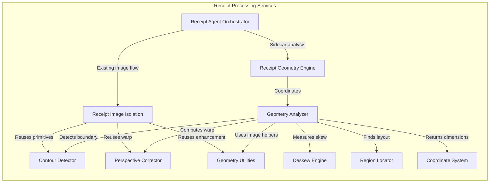
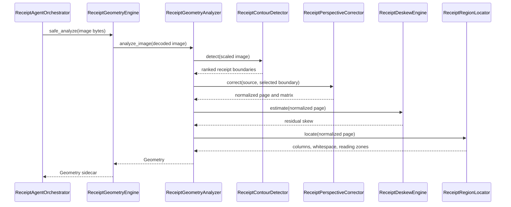

# Receipt Geometry Engine

The Receipt Geometry Engine is the shared, OCR-independent geometry layer for
OpenGrit receipt intelligence. It detects the physical receipt, describes its
coordinate space and layout, and exposes correction primitives without reading
or interpreting any text.

## Public API

```python
from services.receipt_geometry import ReceiptGeometryEngine

geometry = ReceiptGeometryEngine().analyze(image_bytes)
payload = geometry.to_dict()
```

`Geometry` contains:

- `receipt_boundary`: ordered top-left, top-right, bottom-right, bottom-left points
- `page_dimensions` and `source_dimensions`
- `rotation` of the physical page and residual `skew` of ink lines, in degrees
- the 3 by 3 `perspective_matrix`
- projection-derived `detected_columns`, `whitespace_map`, and `estimated_reading_zones`
- normalized `geometric_confidence`
- contour diagnostics useful for observability

The engine imports OpenCV lazily. `analyze()` raises a clear error for missing
or invalid input; `safe_analyze()` is the non-throwing integration API.

## Components

- `ReceiptGeometryEngine`: stable public facade
- `ReceiptGeometryAnalyzer`: coordinates the analysis pipeline
- `ReceiptContourDetector`: existing bright-paper and edge-contour algorithms
- `ReceiptDeskewEngine`: estimates and optionally corrects line rotation
- `ReceiptPerspectiveCorrector`: computes and applies the existing page warp
- `ReceiptRegionLocator`: projection-based columns, whitespace, and reading zones
- `ReceiptCoordinateSystem`: pixel/normalized coordinate conversion
- `GeometryUtilities`: shared decoding, scaling, quad, enhancement, and encoding

`ReceiptImageIsolationService` remains the compatibility facade used by the
existing extraction pipeline. Its contour, perspective, scaling, quad, and
enhancement work now delegates to these components. Its output policy, strategy
names, source ordering, and image cleanup remain unchanged.

`ReceiptAgentOrchestrator` runs `safe_analyze()` on the uploaded image and adds
the resulting object only under isolation diagnostics as `geometry`. Geometry
does not select attempts, alter pixels, invoke OCR, or affect receipt scoring.

## Architecture



## Analysis sequence



## Testing

Run:

```bash
pytest -q tests/test_receipt_geometry.py \
  tests/test_receipt_geometry_orchestrator_integration.py \
  tests/test_receipt_image_isolation.py
```

The tests use synthetic images and never invoke OCR, parsers, models, merchant
logic, network services, or LLMs.
# Validation boundary

`ReceiptGeometryEngine` publishes observations. Consumers that make blocking quality decisions must pass those observations through `services.geometry_validation.GeometryValidationEngine`. Raw contour coordinates and perspective matrices are not authoritative until validated.
