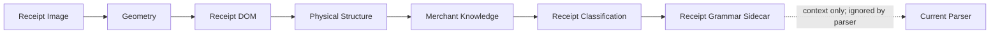

# Receipt Grammar Framework

The Receipt Grammar Framework describes the expected semantic organization of
a classified receipt. It is a declarative receipt-language framework, not a
parser, detector, OCR engine, or business-rule engine.

## Runtime position

The current parser remains authoritative. The orchestrator attaches the
request-scoped `receiptGrammar` context only after a family classification is
available. Grammar output is never added to parser JSON, deterministic semantic
inputs, OCR inputs, or Llama inputs.

## Package ownership

- `models/` owns immutable grammar definitions, compilation diagnostics,
  compliance, candidate role expectations, version comparisons, and learning
  proposals.
- `grammar_loader.py` converts declarative JSON or mappings into frozen models.
- `grammar_compiler.py` validates identifiers, references, transitions,
  relationships, occurrence declarations, rule conflicts, and cycles.
- `grammar_repository.py` owns append-only, receipt-family and version keyed
  grammar lifecycle.
- `grammar_validator.py` compares a compiled grammar with Receipt DOM and
  Physical Structure evidence.
- `grammar_learning.py` creates approval-only suggestions.
- `grammar_engine.py` coordinates classification-based loading, compilation,
  compliance, and suggestions.
- `grammar_serializer.py` publishes JSON-safe debug and persistence payloads.
- `grammar_diagnostics.py` creates typed errors, warnings, and information.

## Boundaries

The framework MAY:

- load the grammar for the highest-ranked classified Receipt Family;
- model sections, roles, transitions, relationships, rules, and expectations;
- use generic header, body, footer, and table-candidate structural evidence;
- report compliance, warnings, violations, and candidate role expectations;
- suggest possible grammar changes for review.

The framework MUST NOT:

- parse receipt values;
- detect a merchant;
- detect or resolve a product;
- identify totals, taxes, payments, or other business facts;
- validate arithmetic;
- read or change OCR;
- mutate Geometry, Receipt DOM, Physical Structure, Classification, Knowledge,
  or the current parser;
- write a production grammar automatically.

Candidate roles are expectations attached to compatible physical references.
They contain no detected value and establish no business conclusion.

## Repository lifecycle

`ReceiptGrammarRepository` supports snake-case Python methods and the
architecture contract aliases:

- `load_grammar()` / `loadGrammar()`;
- `save_grammar()` / `saveGrammar()`;
- `version_grammar()` / `versionGrammar()`;
- `archive_grammar()` / `archiveGrammar()`;
- `list_grammars()` / `listGrammars()`;
- `compare_grammar_versions()` / `compareGrammarVersions()`.

All changes create or address explicit versions. Archival retains history.
Learning proposals require approval and do not call repository write methods.

