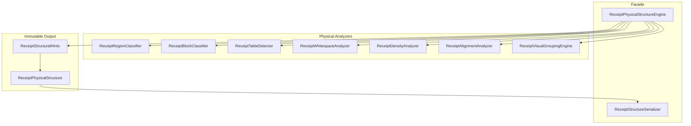
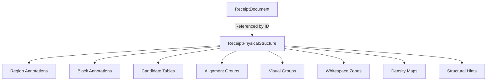
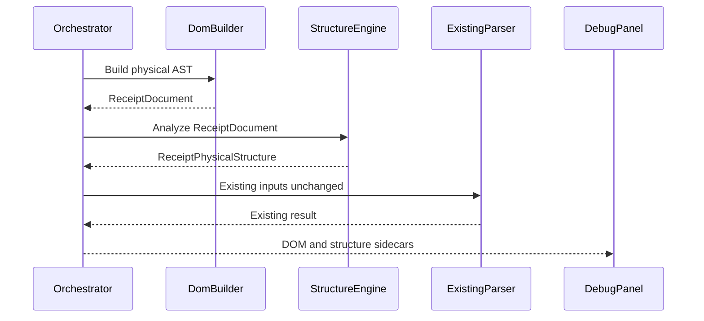
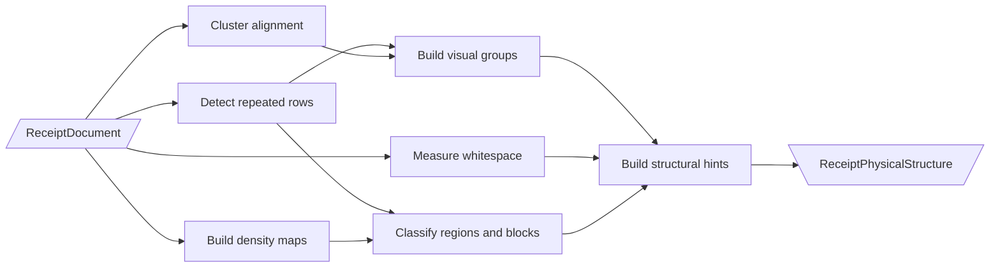

# Receipt Physical Structure Engine

The Receipt Physical Structure Engine adds immutable layout annotations to the
Receipt DOM. It describes page organization, visual grouping, alignment,
density, whitespace, separators, and table-like geometry. It assigns no business
meaning and never mutates DOM nodes.

## Responsibility boundary

The engine may answer:

- whether a region is physically near the page header, body, or footer
- whether an area is dense, sparse, whitespace, image-like, mixed, or table-like
- which nodes align or form visual groups
- whether repeated rows and columns form a candidate table
- where margins, gutters, and spacing zones occur

The engine does not interpret the content of those structures. Numeric glyph
shape may contribute to column alignment, but no monetary or purchase meaning is
assigned.

## Package diagram



## Component responsibilities

| Component | Physical responsibility |
|---|---|
| `ReceiptRegionClassifier` | Header/body/footer position and generic region density/type |
| `ReceiptBlockClassifier` | Paragraph/table/image/mixed/separator/whitespace/text block annotations |
| `ReceiptTableDetector` | Repeated row spacing, heights, indentation, and column alignment |
| `ReceiptWhitespaceAnalyzer` | Margins, gutters, row/paragraph/section spacing, separator gaps |
| `ReceiptDensityAnalyzer` | Character, word, line, block, whitespace metrics and page heat maps |
| `ReceiptAlignmentAnalyzer` | Left, center, right, justified, mixed clusters |
| `ReceiptVisualGroupingEngine` | Word, multiline, paragraph, table, and caption groups |
| `ReceiptStructuralHintsBuilder` | Stable references summarizing likely physical structures |
| `ReceiptStructureSerializer` | JSON, debug JSON, pretty output, Mongo-safe dicts, graph projection |

## Object diagram



`ReceiptPhysicalStructure.document_id` attaches the annotation graph to one
immutable document. Region and block annotations use existing node IDs. Table
rows and visual/alignment groups use existing line or word IDs. No DOM object is
copied, replaced, or changed.

## Lifecycle



The engine is invoked immediately after `ReceiptDomBuilder`. `safe_analyze`
isolates infrastructure failure. Structure output is never passed to current
consolidation, semantic parsing, scoring, OCR, or LLM paths.

## Detection pipeline



## Table candidates

A candidate requires at least three geometrically adjacent rows and at least two
recurring x-position clusters. Confidence combines:

- row gap consistency
- row height consistency
- multi-column occupancy
- recurring column count

Columns include x position, average width, physical alignment, and confidence.
Rows and blocks are referenced by DOM identity. Detection does not label what
the cells represent.

## Reading order ownership

The structure engine consumes the `reading_order` already attached by the DOM
`ReadingOrderEngine`. It does not reorder the DOM and does not implement a
second reading-order algorithm. Grouping sorts only by those existing order
values.

## Serialization and persistence

```python
structure = ReceiptPhysicalStructureEngine().analyze(document)
serializer = ReceiptStructureSerializer()

payload = serializer.to_dict(structure)
debug_payload = serializer.to_dict(structure, debug=True)
pretty = serializer.pretty_print(structure)
graph = serializer.graph_projection(structure)
```

The ordinary JSON form omits diagnostics and density-cell node lists. Debug JSON
retains them. Both forms are plain JSON-compatible structures suitable for
future Mongo persistence. Graph projection emits annotation nodes and
`ANNOTATES` edges for future graph storage.

## Future integration

Future engines consume `ReceiptDocument` plus this immutable physical annotation
graph. They may create additional annotation layers keyed by the same node IDs.
They must not add interpretation fields to either the physical DOM or this
structure model.
